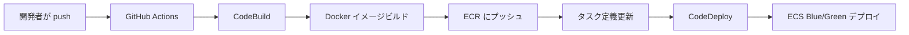
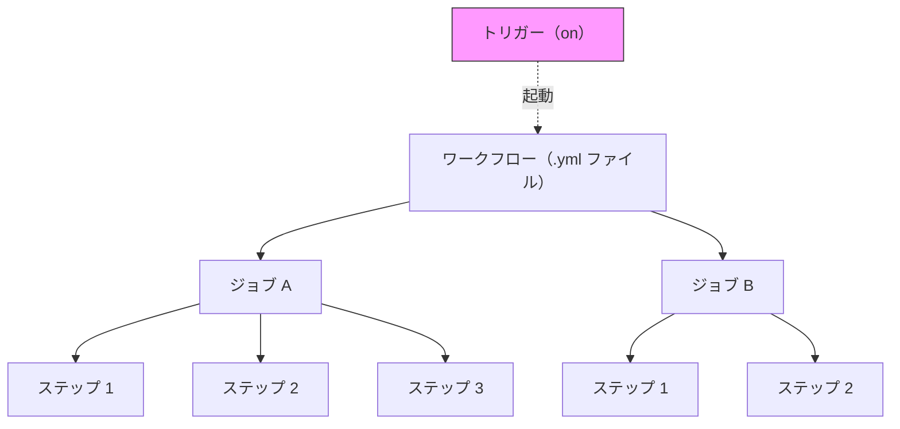
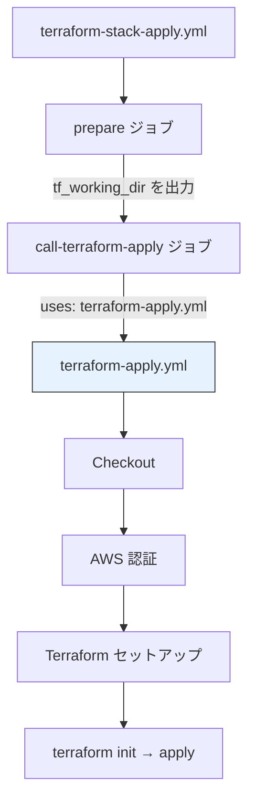
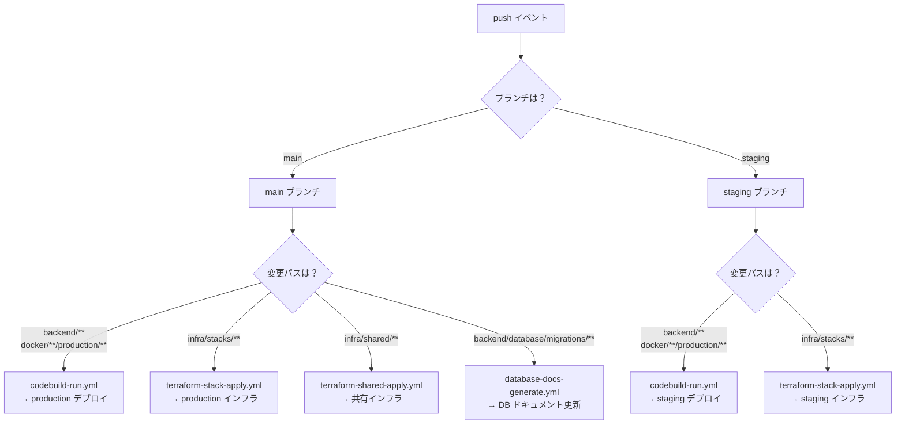

# 5-3-1 GitHub Actions の仕組みと LMS のワークフロー

この Chapter「CI/CD パイプライン」は以下の 3 セクションで構成されます。

| セクション | テーマ | 種類 |
|---|---|---|
| 5-3-1 | GitHub Actions の仕組みと LMS のワークフロー | 概念 |
| 5-3-2 | CodeBuild と CodeDeploy | 概念 |
| 5-3-3 | 環境管理とモニタリング | 概念 |

**Chapter ゴール**: GitHub Actions・CodeBuild・CodeDeploy によるデプロイ自動化の全体像を理解する

📖 まず本セクションで GitHub Actions の基本概念と LMS の 7 ワークフローの役割を把握します。次にセクション 5-3-2 で CodeBuild による Docker イメージビルドと CodeDeploy による Blue/Green デプロイの仕組みを学びます。最後にセクション 5-3-3 で環境管理と CloudWatch によるモニタリングを理解します。3 つのセクションを通して、コードを push してから本番に反映されるまでの CI/CD パイプライン全体が見えるようになります。

## 🎯 このセクションで学ぶこと

- **CI/CD** の概念と、手動デプロイに対するメリットを理解する
- GitHub Actions の **4 階層**（ワークフロー・ジョブ・ステップ・トリガー）を理解する
- LMS の **7 つのワークフロー** の役割とカテゴリを把握する
- **再利用可能ワークフロー**（workflow_call）の仕組みを理解する

CI/CD の必要性から出発し、GitHub Actions の基本構造を把握した後、LMS の実際のワークフローを 1 つずつ読み解いていきます。

---

## 導入: コードを push したら自動でデプロイが走る、その裏側

Chapter 5-1 で学んだ AWS サービス群に、Chapter 5-2 で学んだ Terraform でインフラを構築しました。では、アプリケーションのコードを変更したとき、それを本番環境に届ける作業は誰が行っているのでしょうか。

手動デプロイを想像してみてください。コードを変更したら、SSH でサーバーにログインし、`git pull` でコードを取得し、Docker イメージをビルドし、ECR にプッシュし、ECS のタスク定義を更新し、データベースのマイグレーションを実行する。この一連の手順を毎回手動で行うとどうなるでしょうか。

- **ヒューマンエラー**: 手順の 1 つを飛ばす、環境変数の設定を忘れる
- **時間の浪費**: 毎回同じ作業を手動で繰り返す
- **属人化**: 「デプロイできるのは○○さんだけ」という状態になる

こうした課題を解決するのが **CI/CD**（継続的インテグレーション/継続的デリバリー）であり、LMS ではその実行基盤として **GitHub Actions** を採用しています。

### 🧠 先輩エンジニアはこう考える

> 以前は手動デプロイだった時期がありました。デプロイ手順書を作って運用していたのですが、手順書の更新漏れやステップの実行忘れに苦しみました。特に深夜のデプロイで疲労が溜まっていると、ミスが起きやすい。CI/CD を導入してからは push するだけで自動的にテスト・ビルド・デプロイが走り、安心感が全く違います。「コードを書いたら push する、あとは自動で本番に届く」この流れが当たり前になると、手動デプロイには戻れません。

---

## CI/CD とは

**CI/CD** は、ソフトウェアの変更をリポジトリに統合してから本番環境に届けるまでのプロセスを自動化する手法です。大きく 2 つのフェーズに分かれます。

### CI（継続的インテグレーション）

**CI**（Continuous Integration）は、コードの統合を自動化するフェーズです。開発者がコードを push するたびに、以下のような処理を自動で実行します。

- **テスト**: ユニットテストやフィーチャーテストの実行
- **リント**: コードスタイルの検証（ESLint、PHP-CS-Fixer 等）
- **ビルド**: コンパイルやバンドルの生成

CI の目的は「壊れたコードがメインブランチに入り込まないようにする」ことです。PR を出したときにテストが自動で走り、失敗したらマージをブロックする仕組みは、Laravel の PHPUnit テストで経験があるかもしれません。

### CD（継続的デリバリー/デプロイ）

**CD** には 2 つの意味があります。

- **継続的デリバリー**（Continuous Delivery）: 本番環境にデプロイ可能な状態まで自動で準備する。最終的なデプロイは人が判断して実行する
- **継続的デプロイ**（Continuous Deployment）: 本番環境へのデプロイまで完全に自動化する

LMS では main ブランチへの push をトリガーに、ビルドからデプロイまで自動で行う **継続的デプロイ** を採用しています。

### LMS の CI/CD パイプライン全体像

LMS のデプロイパイプラインは、GitHub Actions から始まり、AWS の CodeBuild・CodeDeploy を経て ECS に到達します。



GitHub Actions は、このパイプライン全体の **起点** として機能します。コードの変更を検知し、適切な処理を起動する「指揮者」のような役割です。CodeBuild と CodeDeploy の詳細はセクション 5-3-2 で学びます。

---

## GitHub Actions の基本概念

**GitHub Actions** は、GitHub が提供する CI/CD プラットフォームです。リポジトリ内の `.github/workflows/` ディレクトリに YAML ファイルを配置することで、さまざまな自動化処理を定義できます。

### 4 階層の構造

GitHub Actions は 4 つの階層で構成されています。Laravel で例えるなら、ルーティング（トリガー）がリクエストを受け取り、コントローラー（ワークフロー）がアクション（ジョブ）のメソッド（ステップ）を実行するイメージです。



それぞれの階層を見ていきましょう。

**ワークフロー**（Workflow）は CI/CD の処理全体を定義する YAML ファイルです。`.github/workflows/` ディレクトリに配置します。1 つのリポジトリに複数のワークフローを持つことができ、LMS には 7 つのワークフローがあります。

**ジョブ**（Job）はワークフロー内の実行単位です。デフォルトでは複数のジョブは並列に実行されますが、`needs` キーワードで依存関係を定義すると直列に実行できます。各ジョブは独立した仮想マシン（ランナー）上で実行されるため、ジョブ間でファイルを共有するにはアーティファクトや出力変数を使います。

**ステップ**（Step）はジョブ内の個別タスクです。ステップは上から順に直列で実行されます。各ステップでは、既製のアクション（`uses`）を使うか、シェルコマンド（`run`）を直接実行できます。

**トリガー**（Trigger）はワークフローを起動する条件です。YAML の `on` キーワードで定義します。

### 主要なトリガー

GitHub Actions では多数のトリガーが用意されていますが、LMS で使われている主なものを紹介します。

| トリガー | 説明 | LMS での使用例 |
|---|---|---|
| `push` | 特定ブランチへの push 時に起動 | `codebuild-run.yml`（main/staging ブランチ） |
| `pull_request` | PR の作成・更新時に起動 | `auto-label-pr.yml` |
| `workflow_dispatch` | GitHub の UI から手動で実行 | `database-docs-generate.yml` |
| `workflow_call` | 他のワークフローから呼び出される | `terraform-apply.yml` |

`push` トリガーには **paths フィルター** を組み合わせることができます。これにより「特定のディレクトリ内のファイルが変更されたときだけ起動する」という条件を設定できます。たとえば、バックエンドのコードが変わったときだけデプロイを走らせ、ドキュメントの修正ではデプロイをスキップする、といった制御が可能です。

### YAML 構文の基本

GitHub Actions のワークフローファイルは YAML で記述します。主要なキーワードを整理しましょう。

| キーワード | 役割 | 例 |
|---|---|---|
| `name` | ワークフロー/ステップの名前 | `name: Trigger CodeBuild` |
| `on` | トリガー条件の定義 | `on: push:` |
| `jobs` | ジョブの定義 | `jobs: build:` |
| `runs-on` | ジョブの実行環境 | `runs-on: ubuntu-latest` |
| `steps` | ステップの定義 | `steps: - name: Checkout` |
| `uses` | 既製アクションの利用 | `uses: actions/checkout@v4` |
| `run` | シェルコマンドの実行 | `run: echo "Hello"` |
| `env` | 環境変数の設定 | `env: NODE_ENV: production` |
| `secrets` | シークレット（秘密情報）の参照 | `${{ secrets.AWS_ACCESS_KEY_ID }}` |
| `needs` | ジョブの依存関係 | `needs: prepare` |
| `if` | 条件付き実行 | `if: github.ref == 'refs/heads/main'` |

💡 **`uses` と `run` の違い**: `uses` は GitHub Marketplace で公開されているアクション（他の人が作った再利用可能な処理）を利用します。`run` は自分でシェルコマンドを直接書きます。Laravel でいえば、`uses` は Composer パッケージの利用、`run` は Artisan コマンドの実行に近いイメージです。

### LMS の codebuild-run.yml で構文を読み解く

実際の LMS ワークフローを読んでみましょう。最もシンプルな `codebuild-run.yml` を例に、各構文要素を確認します。

```yaml
# .github/workflows/codebuild-run.yml
name: Trigger CodeBuild

on:
  push:
    branches:
      - main
      - staging
    paths:
      - backend/**
      - docker/**/production/**

jobs:
  start-codebuild:
    runs-on: ubuntu-latest

    steps:
      - name: Checkout
        uses: actions/checkout@v4

      - name: Set STACK_NAME
        run: |
          if [ "${{ github.ref }}" = "refs/heads/main" ]; then
            echo "STACK_NAME=production" >> $GITHUB_ENV
          elif [ "${{ github.ref }}" = "refs/heads/staging" ]; then
            echo "STACK_NAME=staging" >> $GITHUB_ENV
          fi

      - name: Configure AWS credentials
        uses: aws-actions/configure-aws-credentials@v4
        with:
          aws-access-key-id: ${{ secrets.AWS_ACCESS_KEY_ID }}
          aws-secret-access-key: ${{ secrets.AWS_SECRET_ACCESS_KEY }}
          aws-region: ap-northeast-1

      - name: Start CodeBuild
        run: |
          aws codebuild start-build \
            --project-name lms-"$STACK_NAME"-new-ecs-image-build \
            --region ap-northeast-1
```

このワークフローを上から順に読み解きます。

1. `name: Trigger CodeBuild` で、GitHub の Actions タブに表示される名前を定義しています
2. `on: push:` で、push イベントをトリガーに設定しています。`branches` で main と staging ブランチに限定し、`paths` で `backend/**` または `docker/**/production/**` 配下のファイルが変更されたときだけ起動するようフィルターしています
3. `jobs:` の下に `start-codebuild` という名前のジョブを 1 つ定義しています。`runs-on: ubuntu-latest` で Ubuntu の仮想マシン上で実行されます
4. `steps:` に 4 つのステップを定義しています
   - **Checkout**: `actions/checkout@v4` でリポジトリのコードをランナーに取得します。ほぼ全てのワークフローで最初に行う定型処理です
   - **Set STACK_NAME**: シェルスクリプトで、push 先のブランチに応じて環境変数 `STACK_NAME` を設定します。`${{ github.ref }}` はブランチ名を参照する GitHub Actions の式構文です。`$GITHUB_ENV` に書き込むと、後続のステップで環境変数として使えます
   - **Configure AWS credentials**: AWS の認証情報を設定するアクションです。`secrets.AWS_ACCESS_KEY_ID` のように、GitHub リポジトリに保存したシークレットを参照しています
   - **Start CodeBuild**: AWS CLI で CodeBuild のビルドを開始します。`STACK_NAME` 変数により、ブランチに応じた CodeBuild プロジェクト（`lms-production-new-...` または `lms-staging-new-...`）が選択されます

🔑 ここで注目すべきは **ブランチによる環境の判定** です。main ブランチへの push は production 環境へ、staging ブランチへの push は staging 環境へデプロイされます。このパターンは LMS の他のワークフローでも繰り返し登場します。

---

## LMS の 7 ワークフロー

LMS のリポジトリには 7 つのワークフローが定義されています。大きく **デプロイ系**（4 つ）と **開発支援系**（3 つ）に分類できます。

### 全体一覧

| ワークフロー | トリガー | 用途 | カテゴリ |
|---|---|---|---|
| `codebuild-run.yml` | push（main/staging） | CodeBuild でイメージビルドを起動 | デプロイ |
| `terraform-stack-apply.yml` | push（main/staging） | 環境固有の Terraform を apply | デプロイ |
| `terraform-shared-apply.yml` | push（main） | 共有インフラの Terraform を apply | デプロイ |
| `terraform-apply.yml` | workflow_call | Terraform init → apply を実行 | デプロイ |
| `auto-label-pr.yml` | pull_request | PR にマージ先ラベルを自動付与 | 開発支援 |
| `database-docs-generate.yml` | push（main）/ 手動 | DBML 生成と dbdocs デプロイ | 開発支援 |
| `codex-review.yml` | pull_request（labeled）/ workflow_call | AI コードレビューをリクエスト | 開発支援 |

### デプロイ系ワークフロー（4 つ）

#### 1. codebuild-run.yml: アプリケーションデプロイの起点

先ほど詳しく読んだワークフローです。`backend/**` または `docker/**/production/**` の変更を検知して CodeBuild を起動します。「アプリケーションコードの変更 → 本番反映」のパイプラインの入口です。

- **トリガー**: main/staging ブランチへの push（パスフィルターあり）
- **処理**: ブランチ名から環境を判定し、対応する CodeBuild プロジェクトを起動

#### 2. terraform-stack-apply.yml: 環境固有インフラのデプロイ

`infra/stacks/**` の変更を検知して、環境固有の Terraform を適用します。Chapter 5-2 で学んだ `infra/stacks/production/` や `infra/stacks/staging/` ディレクトリの変更が対象です。

```yaml
# .github/workflows/terraform-stack-apply.yml（主要部分の抜粋）
name: Apply Terraform of Each Stack

on:
  push:
    branches:
      - main
      - staging
    paths:
      - infra/stacks/**

jobs:
  prepare:
    runs-on: ubuntu-latest
    outputs:
      tf_working_dir: ${{ steps.set-working-dir.outputs.tf_working_dir }}
    steps:
      - name: Set tf_working_dir
        id: set-working-dir
        run: |
          if [ "${{ github.ref }}" = "refs/heads/main" ]; then
            echo "tf_working_dir=infra/stacks/production" >> $GITHUB_OUTPUT
          elif [ "${{ github.ref }}" = "refs/heads/staging" ]; then
            echo "tf_working_dir=infra/stacks/staging" >> $GITHUB_OUTPUT
          fi

  call-terraform-apply:
    needs: prepare
    uses: ./.github/workflows/terraform-apply.yml
    with:
      TF_WORKING_DIR: ${{ needs.prepare.outputs.tf_working_dir }}
    secrets:
      AWS_ACCESS_KEY_ID: ${{ secrets.AWS_ACCESS_KEY_ID }}
      AWS_SECRET_ACCESS_KEY: ${{ secrets.AWS_SECRET_ACCESS_KEY }}
```

このワークフローには 2 つのジョブがあります。

- **prepare ジョブ**: ブランチ名に基づいて Terraform の作業ディレクトリを決定します。`$GITHUB_OUTPUT` に書き込んだ値は `outputs` として他のジョブから参照できます
- **call-terraform-apply ジョブ**: `needs: prepare` で prepare ジョブの完了を待ち、`uses: ./.github/workflows/terraform-apply.yml` で再利用可能ワークフローを呼び出します

💡 **`$GITHUB_ENV` と `$GITHUB_OUTPUT` の違い**: `$GITHUB_ENV` は同一ジョブ内の後続ステップで使える環境変数を設定します（codebuild-run.yml で使用）。`$GITHUB_OUTPUT` はジョブの出力として他のジョブから参照できる値を設定します（terraform-stack-apply.yml で使用）。ジョブをまたぐかどうかが使い分けのポイントです。

#### 3. terraform-shared-apply.yml: 共有インフラのデプロイ

`infra/shared/**` の変更を検知して、環境をまたいで共有するインフラ（ECR リポジトリや IAM ロール等）の Terraform を適用します。

```yaml
# .github/workflows/terraform-shared-apply.yml
name: Apply Shared Terraform

on:
  push:
    branches:
      - main
    paths:
      - infra/shared/**

jobs:
  call-terraform-apply:
    uses: ./.github/workflows/terraform-apply.yml
    with:
      TF_WORKING_DIR: infra/shared
    secrets:
      AWS_ACCESS_KEY_ID: ${{ secrets.AWS_ACCESS_KEY_ID }}
      AWS_SECRET_ACCESS_KEY: ${{ secrets.AWS_SECRET_ACCESS_KEY }}
      PERSONAL_ACCESS_TOKEN_AMPLIFY: ${{ secrets.PERSONAL_ACCESS_TOKEN_AMPLIFY }}
```

terraform-stack-apply.yml と比較すると、こちらは main ブランチのみがトリガーで、作業ディレクトリも `infra/shared` に固定されています。共有インフラは環境ごとに分ける必要がないため、prepare ジョブも不要でシンプルな構成です。

#### 4. terraform-apply.yml: 再利用可能ワークフロー

このワークフローは直接トリガーされるのではなく、他のワークフローから呼び出されて使われます。詳細は次の「再利用可能ワークフロー」セクションで解説します。

### 開発支援系ワークフロー（3 つ）

#### 5. auto-label-pr.yml: PR ラベルの自動付与

PR が作成・更新されたとき、マージ先ブランチに応じて `main` または `staging` のラベルを自動付与します。

```yaml
# .github/workflows/auto-label-pr.yml（主要部分の抜粋）
name: Auto Label PR by Merge Target

on:
  pull_request:
    types: [opened, synchronize, reopened]
```

`pull_request` トリガーに `types` を指定することで、PR の作成時（opened）、コミットの追加時（synchronize）、再オープン時（reopened）にワークフローが起動します。ステップ内では `actions/github-script@v7` を使って JavaScript で GitHub API を呼び出し、マージ先ブランチの判定とラベルの付け替えを行っています。

このワークフローにより、どの PR がどの環境向けかをラベルで一目で判別できるようになります。

#### 6. database-docs-generate.yml: データベースドキュメント自動生成

マイグレーションファイルの変更を検知して、データベーススキーマのドキュメントを自動生成します。

```yaml
# .github/workflows/database-docs-generate.yml（トリガー部分）
on:
  push:
    branches:
      - main
    paths:
      - "backend/database/migrations/**"

  workflow_dispatch: # 手動実行も可能に
```

このワークフローは LMS の 7 つの中で最も複雑です。主な処理の流れを整理します。

1. MySQL サービスコンテナを起動する（`services` キーワード）
2. PHP をセットアップし、Composer で依存パッケージをインストールする
3. Laravel のマイグレーションを実行してデータベーススキーマを構築する
4. dbdocs CLI で MySQL のスキーマから DBML ファイルを生成する
5. dbdocs にデプロイしてドキュメントを公開する
6. 変更があればリポジトリにコミットする

📝 **services キーワード**: GitHub Actions では、ジョブの実行に必要なサービス（データベース等）をコンテナとして起動できます。Docker Compose の `services` に近い概念で、このワークフローでは MySQL 8.0 コンテナを起動してマイグレーションの実行環境を構築しています。

`workflow_dispatch` トリガーも定義されているため、GitHub の Actions タブから手動で実行することもできます。

#### 7. codex-review.yml: AI コードレビュー

PR に `review` ラベルが付けられたとき、AI（Codex）によるコードレビューをリクエストします。

```yaml
# .github/workflows/codex-review.yml（主要部分の抜粋）
name: Request Codex Review

on:
  pull_request:
    types: [labeled]
  workflow_call:
    inputs:
      pr-number:
        required: true
        type: string

jobs:
  request_codex_review:
    if: |
      (github.event_name == 'pull_request' && github.event.label.name == 'review') ||
      (github.event_name == 'workflow_call')
    runs-on: ubuntu-latest
```

`if` 条件で、`pull_request` イベントの場合は `review` ラベルのときだけ実行し、`workflow_call` の場合は常に実行するよう制御しています。処理内容は PR にコメントを投稿して Codex にレビューを依頼するもので、レビュー後に `review` ラベルを自動削除する仕組みも含まれています。

---

## 再利用可能ワークフロー（workflow_call）

### なぜ再利用するのか

terraform-stack-apply.yml と terraform-shared-apply.yml を見比べると、どちらも「Terraform の init → apply を実行する」という共通の処理を含んでいます。この共通処理をそれぞれのワークフローに直接書くと、修正が必要になったとき 2 箇所を変更しなければなりません。

プログラミングにおける **DRY 原則**（Don't Repeat Yourself）と同じ考え方で、共通処理を 1 つのワークフローに切り出し、他のワークフローから呼び出す仕組みが **再利用可能ワークフロー** です。

### terraform-apply.yml の構造

再利用可能ワークフローは、トリガーに `workflow_call` を指定します。呼び出し元から受け取るパラメータは `inputs` と `secrets` で定義します。

```yaml
# .github/workflows/terraform-apply.yml
name: Terraform Apply

on:
  workflow_call:
    inputs:
      TF_WORKING_DIR:
        required: true
        type: string
    secrets:
      AWS_ACCESS_KEY_ID:
        required: true
      AWS_SECRET_ACCESS_KEY:
        required: true
      PERSONAL_ACCESS_TOKEN_AMPLIFY:
        required: false

jobs:
  apply:
    runs-on: ubuntu-latest
    defaults:
      run:
        working-directory: ${{ inputs.TF_WORKING_DIR }}

    env:
      TF_VAR_github_token: ${{ secrets.PERSONAL_ACCESS_TOKEN_AMPLIFY }}

    steps:
      - name: Checkout
        uses: actions/checkout@v4

      - name: Configure AWS Credentials
        uses: aws-actions/configure-aws-credentials@v4
        with:
          aws-access-key-id: ${{ secrets.AWS_ACCESS_KEY_ID }}
          aws-secret-access-key: ${{ secrets.AWS_SECRET_ACCESS_KEY }}
          aws-region: ap-northeast-1

      - name: Setup terraform
        uses: hashicorp/setup-terraform@v3
        with:
          terraform_version: 1.11

      - name: Terraform init and apply
        run: |
          terraform init -reconfigure
          terraform apply -auto-approve
```

注目すべきポイントを見ていきます。

- `inputs.TF_WORKING_DIR` を `defaults.run.working-directory` に設定しています。これにより、全ての `run` ステップが指定されたディレクトリ（例: `infra/stacks/production`）で実行されます
- `secrets` で AWS の認証情報と GitHub トークンを受け取ります。`PERSONAL_ACCESS_TOKEN_AMPLIFY` は `required: false` なので、渡さなくてもエラーになりません（terraform-stack-apply.yml からの呼び出しでは渡していません）
- `hashicorp/setup-terraform@v3` で Terraform 1.11 をインストールし、`terraform init -reconfigure` と `terraform apply -auto-approve` を実行します

### 呼び出しの流れ

terraform-stack-apply.yml から terraform-apply.yml を呼び出す流れを図で示します。



呼び出し側では `uses: ./.github/workflows/terraform-apply.yml` と記述し、`with` で inputs を、`secrets` でシークレットを渡します。Laravel のサービスクラスを Controller から呼び出すのと同じように、共通処理を 1 箇所に集約し、異なるパラメータで再利用しているわけです。

---

## ブランチ戦略とデプロイの対応

LMS では、ブランチと環境が 1 対 1 で対応しています。

| ブランチ | デプロイ先環境 |
|---|---|
| main | production（本番） |
| staging | staging（ステージング） |

この対応関係と、パスフィルターの組み合わせにより、「何を変更したか」と「どのブランチに push したか」で起動するワークフローが決まります。



この図から読み取れるポイントは以下のとおりです。

- **アプリケーションの変更**（`backend/**` 等）は `codebuild-run.yml` がアプリデプロイを起動する
- **インフラの変更**（`infra/stacks/**`）は `terraform-stack-apply.yml` がインフラデプロイを起動する
- **共有インフラの変更**（`infra/shared/**`）は main ブランチでのみ `terraform-shared-apply.yml` が起動する
- **マイグレーションの変更**（`backend/database/migrations/**`）は main ブランチでのみ `database-docs-generate.yml` が起動する
- パスフィルターが重複する場合（`backend/**` のマイグレーション変更は `codebuild-run.yml` と `database-docs-generate.yml` の両方にマッチ）、**複数のワークフローが同時に起動する**

⚠️ **注意**: 1 回の push で複数のワークフローが同時に起動することがあります。たとえば、main ブランチに `backend/` と `infra/stacks/` の両方の変更を含むコミットを push すると、`codebuild-run.yml` と `terraform-stack-apply.yml` が並行して実行されます。これは意図された動作であり、アプリデプロイとインフラデプロイを独立して行えるメリットがあります。

---

## ✨ まとめ

- **CI/CD** はコードの統合からデプロイまでを自動化する手法で、手動デプロイのヒューマンエラー・時間浪費・属人化を解消する
- GitHub Actions は **トリガー > ワークフロー > ジョブ > ステップ** の 4 階層で構成されており、トリガーがワークフローを起動し、ワークフロー内のジョブ・ステップが順に実行される
- LMS には **7 つのワークフロー** があり、デプロイ系（4 つ: codebuild-run、terraform-stack-apply、terraform-shared-apply、terraform-apply）と開発支援系（3 つ: auto-label-pr、database-docs-generate、codex-review）に分類できる
- **再利用可能ワークフロー**（`workflow_call`）により、Terraform の共通処理を 1 箇所に集約し DRY 原則を実現している
- **ブランチ** と **パスフィルター** の組み合わせで、変更内容に応じた適切なワークフローが自動的に選択される

---

次のセクションでは、GitHub Actions がトリガーした後の実際のビルド・デプロイ処理として、CodeBuild の buildspec.yml によるイメージビルドから ECR プッシュ、タスク定義更新、マイグレーション実行、そして CodeDeploy の Blue/Green デプロイ戦略とデプロイフロー全体を学びます。
