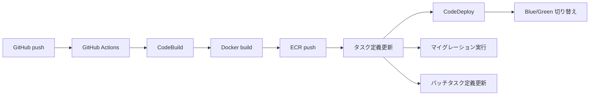
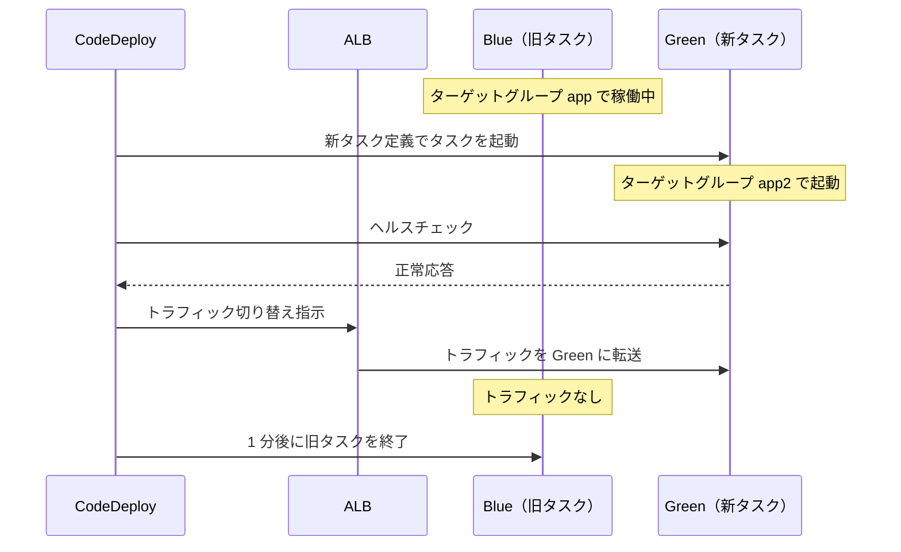
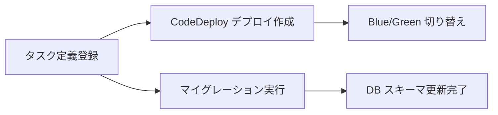

# 5-3-2 CodeBuild と CodeDeploy

📝 **前提知識**: このセクションはセクション 5-3-1（GitHub Actions の仕組みと LMS のワークフロー）およびセクション 5-1-3（コンテナオーケストレーション）の内容を前提としています。

## 🎯 このセクションで学ぶこと

- GitHub Actions と AWS CodeBuild の役割分担を理解する
- buildspec.yml の 4 つのフェーズ（install / pre_build / build / post_build）を読み解く
- CodeDeploy による Blue/Green デプロイの仕組みを理解する
- デプロイフロー全体（イメージビルドからマイグレーションまで）の流れを把握する

GitHub Actions がデプロイの「着火役」であるのに対し、実際にイメージをビルドしコンテナを入れ替える重い処理は AWS 側で行われます。このセクションでは、その AWS 側の仕組みを順を追って見ていきます。

---

## 導入: ビルドとデプロイは誰がやるのか

セクション 5-3-1 で、GitHub Actions のワークフローが `aws codebuild start-build` コマンドで CodeBuild を起動していることを確認しました。GitHub Actions はデプロイの「着火役」に過ぎず、実際にイメージをビルドし、コンテナを入れ替え、データベースを更新するのは AWS 側のサービスです。

では、CodeBuild に起動指示を出した後、何が起きるのでしょうか。Docker イメージはどこでビルドされ、どうやって本番環境のコンテナが新しいものに入れ替わるのでしょうか。そしてデータベースのマイグレーションはいつ、どこで実行されるのでしょうか。

このセクションでは、LMS の `infra/buildspec.yml` を中心にデプロイの全工程を読み解いていきます。

### 🧠 先輩エンジニアはこう考える

> デプロイの仕組みを理解していると、「デプロイが失敗した」ときの切り分けが格段に速くなります。CodeBuild のログを見ればビルドの問題か、CodeDeploy のステータスを見ればデプロイの問題か、マイグレーションのログを見れば DB 更新の問題かがわかります。逆にこの仕組みを理解していないと、「なんか失敗した」で止まってしまい、どこから調べればいいかもわかりません。buildspec.yml を一度読んでおくだけで、トラブルシューティングの速度が全然違います。

---

## デプロイフローの全体像

LMS のデプロイは、GitHub への push をきっかけに、複数のサービスが連携して進みます。全体の流れを Mermaid 図で確認しましょう。



### GitHub Actions と CodeBuild の役割分担

この 2 つのサービスは明確に役割が分かれています。

| サービス | 役割 | 実行場所 |
|---|---|---|
| **GitHub Actions** | トリガー検知、環境判定（main → production / staging → staging）、CodeBuild の起動指示 | GitHub のランナー |
| **CodeBuild** | Docker イメージのビルド・プッシュ、タスク定義の更新、CodeDeploy デプロイの作成、マイグレーションの実行 | AWS の VPC 内 |

GitHub Actions のワークフロー（`.github/workflows/codebuild-run.yml`）は非常にシンプルです。ブランチ名から環境を判定し、対応する CodeBuild プロジェクトを起動するだけの処理です。

```yaml
# .github/workflows/codebuild-run.yml
- name: Start CodeBuild
  run: |
    aws codebuild start-build \
      --project-name lms-"$STACK_NAME"-new-ecs-image-build \
      --region ap-northeast-1
```

### なぜ GitHub Actions だけで完結しないのか

GitHub Actions だけでビルドからデプロイまで行うことも技術的には可能ですが、LMS では以下の理由から CodeBuild を使っています。

🔑 **VPC 内リソースへのアクセス**: CodeBuild は VPC 内のプライベートサブネットで実行されるため、RDS（データベース）に直接アクセスしてマイグレーションを実行できます。GitHub Actions のランナーは AWS の VPC 外にあるため、プライベートサブネット内のリソースに直接アクセスできません。

🔑 **ビルド環境のカスタマイズ**: CodeBuild は特権モード（Docker in Docker）をサポートしており、Docker イメージのビルドに適した環境を提供します。

🔑 **AWS サービスとの密な連携**: CodeBuild は IAM ロールを通じて ECR、ECS、CodeDeploy などの AWS サービスにシームレスにアクセスできます。

---

## CodeBuild の仕組み

### CodeBuild とは

**CodeBuild** は AWS のマネージドビルドサービスです。ソースコードを取得し、ビルドスペック（buildspec.yml）に従ってビルド処理を実行します。Jenkins のようなビルドサーバーを自前で構築・運用する必要がなく、ビルドが実行されるときだけリソースが起動されます。

### LMS の CodeBuild プロジェクト設定

LMS の CodeBuild プロジェクトは Terraform で定義されています。主要な設定を見てみましょう。

以下は主要部分の抜粋です。

```hcl
# infra/stacks/modules/cicd/codebuild.tf
resource "aws_codebuild_project" "ecs_image_build" {
  name          = "${var.name_prefix}-ecs-image-build"
  description   = "Build Laravel + nginx container image for ECS"
  service_role  = aws_iam_role.codebuild_role.arn
  build_timeout = 10

  source {
    type            = "GITHUB"
    location        = var.github_repository_url
    git_clone_depth = 1
    buildspec       = "infra/buildspec.yml"
  }

  vpc_config {
    vpc_id             = var.vpc_id
    subnets            = var.private_app_subnet_ids
    security_group_ids = [var.codebuild_sg_id]
  }

  environment {
    compute_type    = "BUILD_GENERAL1_SMALL"
    image           = "aws/codebuild/standard:7.0"
    type            = "LINUX_CONTAINER"
    privileged_mode = true
    # ... 環境変数（後述）
  }
}
```

各設定の意味を整理します。

| 設定 | 値 | 意味 |
|---|---|---|
| `name` | `{name_prefix}-ecs-image-build` | プロジェクト名。環境ごとに `lms-production-new-ecs-image-build` などになる |
| `build_timeout` | `10` | ビルドのタイムアウト（分）。10 分以内に完了しなければ失敗扱い |
| `source.type` | `GITHUB` | ソースコードの取得元 |
| `source.git_clone_depth` | `1` | Shallow clone（最新コミットのみ取得）で高速化 |
| `source.buildspec` | `infra/buildspec.yml` | ビルド手順を定義するファイルのパス |
| `compute_type` | `BUILD_GENERAL1_SMALL` | ビルドマシンのスペック（3 GB メモリ、2 vCPU） |
| `image` | `aws/codebuild/standard:7.0` | ビルド環境の Docker イメージ |
| `privileged_mode` | `true` | Docker in Docker を有効化。Docker イメージをビルドするために必要 |
| `vpc_config` | プライベートサブネット | VPC 内で実行し、RDS 等のプライベートリソースにアクセス可能にする |

### CodeBuild に渡される環境変数

CodeBuild は Terraform から 14 個の環境変数を受け取ります。これらは buildspec.yml の中で `$変数名` として参照されます。

| 環境変数 | 用途 |
|---|---|
| `CONTAINER_NAME_NGINX` | Nginx コンテナの名前 |
| `CONTAINER_PORT_NGINX` | Nginx コンテナのポート番号 |
| `CONTAINER_NAME_LARAVEL` | Laravel コンテナの名前 |
| `ECR_REPO_LARAVEL` | Laravel イメージの ECR リポジトリ URL |
| `ECR_REPO_NGINX` | Nginx イメージの ECR リポジトリ URL |
| `AWS_ACCOUNT_ID` | AWS アカウント ID |
| `AWS_REGION` | AWS リージョン |
| `ECS_CLUSTER_NAME` | ECS クラスター名 |
| `ECS_TASK_DEFINITION_NAME` | アプリ用タスク定義の ARN |
| `BATCH_TASK_DEFINITION_NAME` | バッチ用タスク定義の ARN |
| `CODEDEPLOY_APP_NAME` | CodeDeploy アプリケーション名 |
| `CODEDEPLOY_DEPLOYMENT_GROUP_NAME` | CodeDeploy デプロイグループ名 |
| `PRIVATE_APP_SUBNET_IDS` | プライベートサブネット ID（カンマ区切り） |
| `APP_SG_ID` | アプリ用セキュリティグループ ID |

💡 これらの環境変数は Terraform の `var.*` から渡されるため、環境（production / staging）ごとに異なる値が自動的に設定されます。buildspec.yml 自体は環境に依存しない汎用的なスクリプトになっています。

---

## buildspec.yml のコードリーディング

buildspec.yml は CodeBuild の「レシピ」です。ファイルの先頭には `version: 0.2` と記述されており、これは buildspec のフォーマットバージョンを示しています（2026 年 3 月時点で `0.2` が最新です）。その後に 4 つのフェーズが続き、上から順に実行されます。LMS の `infra/buildspec.yml` を読んでいきましょう。

### フェーズ 1: install

```yaml
# infra/buildspec.yml
phases:
  install:
    runtime-versions:
      nodejs: 18
```

Node.js 18 ランタイムをインストールします。ビルド環境に必要なツールのセットアップを行うフェーズです。

### フェーズ 2: pre_build

```yaml
  pre_build:
    commands:
      # イメージのタグを変数に格納
      - IMAGE_TAG=${IMAGE_TAG:-$(date +%Y%m%d%H%M%S)}
```

イメージタグを生成します。`${IMAGE_TAG:-$(date +%Y%m%d%H%M%S)}` は、環境変数 `IMAGE_TAG` が未設定の場合にタイムスタンプ（例: `20260330143025`）を使うという意味です。これにより、デプロイごとにユニークなタグが付けられます。

### フェーズ 3: build

```yaml
  build:
    commands:
      # Laravelのコンテナイメージをビルド
      - echo "Building Laravel image..."
      - docker build -t $ECR_REPO_LARAVEL:$IMAGE_TAG -f docker/laravel/production/Dockerfile .
      # Nginxのコンテナイメージをビルド
      - echo "Building Nginx image..."
      - docker build -t $ECR_REPO_NGINX:$IMAGE_TAG -f docker/nginx/production/Dockerfile .
```

Docker イメージを 2 つビルドします。セクション 5-1-3 で学んだ **サイドカーパターン** を思い出してください。LMS の ECS タスクは Laravel コンテナと Nginx コンテナの 2 つで構成されています。それぞれ本番用の Dockerfile（`docker/laravel/production/Dockerfile` と `docker/nginx/production/Dockerfile`）を使ってビルドし、ECR リポジトリ URL とタイムスタンプタグを付与します。

### フェーズ 4: post_build

post_build は最も長いフェーズで、ビルドしたイメージのプッシュからデプロイ、マイグレーションまでを一連の流れで実行します。7 つのステップに分けて見ていきます。

#### ステップ 1: ECR 認証とイメージプッシュ

```yaml
      # ECRにログイン(Laravel)
      - aws ecr get-login-password --region $AWS_REGION | docker login --username AWS --password-stdin "$AWS_ACCOUNT_ID.dkr.ecr.$AWS_REGION.amazonaws.com/$ECR_REPO_LARAVEL"
      # LaravelのコンテナイメージをECRにプッシュ
      - docker push $ECR_REPO_LARAVEL:$IMAGE_TAG
      # ECRにログイン(Nginx)
      - aws ecr get-login-password --region $AWS_REGION | docker login --username AWS --password-stdin "$AWS_ACCOUNT_ID.dkr.ecr.$AWS_REGION.amazonaws.com/$ECR_REPO_NGINX"
      # NginxのコンテナイメージをECRにプッシュ
      - docker push $ECR_REPO_NGINX:$IMAGE_TAG
```

ECR（Elastic Container Registry）に認証してから、ビルドした 2 つのイメージをプッシュします。`aws ecr get-login-password` で一時的な認証トークンを取得し、`docker login` に渡しています。Laravel と Nginx それぞれのリポジトリに対して個別にログインとプッシュを行います。

#### ステップ 2: タスク定義の更新

```yaml
      # 既存のタスク定義からtaskdef.jsonを作成
      - aws ecs describe-task-definition --task-definition $ECS_TASK_DEFINITION_NAME --query taskDefinition > taskdef.json

      # taskdef.jsonから不要なフィールドを削除
      - |
        jq 'del(
          .taskDefinitionArn,
          .revision,
          .status,
          .requiresAttributes,
          .compatibilities,
          .registeredAt,
          .registeredBy
        )' taskdef.json > clean-taskdef.json

      # taskdef.json内のコンテナイメージを置換
      - |
        jq --arg nginx_image "$ECR_REPO_NGINX:$IMAGE_TAG" \
           --arg laravel_image "$ECR_REPO_LARAVEL:$IMAGE_TAG" \
           --arg nginx_name "$CONTAINER_NAME_NGINX" \
           --arg laravel_name "$CONTAINER_NAME_LARAVEL" \
           '
           .containerDefinitions |= map(
             if .name == $nginx_name then .image = $nginx_image
             elif .name == $laravel_name then .image = $laravel_image
             else . end
           )
           ' clean-taskdef.json > new-taskdef.json

      # タスク定義を登録
      - TASK_DEF_ARN=$(aws ecs register-task-definition --cli-input-json file://new-taskdef.json --query "taskDefinition.taskDefinitionArn" --output text)
```

このステップは 3 つの操作を行っています。

1. **既存のタスク定義を取得**: `aws ecs describe-task-definition` で現在のタスク定義を JSON として取得します
2. **メタデータを除去しイメージタグを置換**: `jq` コマンドで AWS が自動付与するメタデータフィールド（`taskDefinitionArn`, `revision` 等）を削除し、コンテナイメージのタグを新しいものに置き換えます
3. **新バージョンとして登録**: `aws ecs register-task-definition` で新しいタスク定義を登録し、その ARN（Amazon Resource Name）を変数に保存します

💡 タスク定義は **イミュータブル**（不変）です。既存のタスク定義を変更するのではなく、新しいリビジョン（バージョン）として登録します。例えば `lms-production-new-app:15` が現在のバージョンなら、新しく `lms-production-new-app:16` が作成されます。

#### ステップ 3: appspec.json の生成

```yaml
      # 登録したタスク定義のARNを用いてappspec.jsonを作成
      - |
        cat <<EOF > appspec.json
        {
          "version": 1,
          "Resources": [
            {
              "TargetService": {
                "Type": "AWS::ECS::Service",
                "Properties": {
                  "TaskDefinition": "$TASK_DEF_ARN",
                  "LoadBalancerInfo": {
                    "ContainerName": "$CONTAINER_NAME_NGINX",
                    "ContainerPort": $CONTAINER_PORT_NGINX
                  }
                }
              }
            }
          ]
        }
        EOF
```

**appspec.json** は CodeDeploy に「何をデプロイするか」を伝えるファイルです。ここには 3 つの情報が含まれます。

- **TaskDefinition**: 新しいタスク定義の ARN（ステップ 2 で登録したもの）
- **ContainerName**: トラフィックを受けるコンテナの名前（Nginx）
- **ContainerPort**: トラフィックを受けるポート番号

#### ステップ 4: revision.json の生成

`aws deploy create-deployment` コマンドに渡すには、appspec.json の内容を CodeDeploy API が受け付ける形式にラップする必要があります。buildspec.yml では、appspec.json の内容を JSON 文字列としてエスケープし、`revision.json` に埋め込んでいます。

```yaml
      # appspec.jsonを用いてrevision.jsonを作成
      - |
        cat <<EOF > revision.json
        {
          "revisionType": "AppSpecContent",
          "appSpecContent": {
            "content": $(cat appspec.json | jq -Rs .)
          }
        }
        EOF
```

`jq -Rs .` は appspec.json の内容全体を 1 つの JSON 文字列にエスケープするコマンドです。これにより、appspec.json の中身が `"content"` フィールドの値として正しく埋め込まれます。

#### ステップ 5: CodeDeploy デプロイメントの作成

```yaml
      # CodeDeployにappspec.jsonを渡してデプロイを実行させる
      - |
        aws deploy create-deployment \
          --application-name "$CODEDEPLOY_APP_NAME" \
          --deployment-group-name "$CODEDEPLOY_DEPLOYMENT_GROUP_NAME" \
          --deployment-config-name "CodeDeployDefault.ECSAllAtOnce" \
          --revision file://revision.json
```

`aws deploy create-deployment` コマンドで CodeDeploy にデプロイを指示します。appspec.json を含む revision.json を渡すことで、CodeDeploy が Blue/Green デプロイを開始します。デプロイの詳細は次の章で解説します。

#### ステップ 6: マイグレーションの実行

```yaml
      # アプリ用タスクのコマンドを上書きしてマイグレーションを実行
      - |
        aws ecs run-task \
          --cluster "$ECS_CLUSTER_NAME" \
          --launch-type FARGATE \
          --network-configuration "awsvpcConfiguration={subnets=[$PRIVATE_APP_SUBNET_IDS],securityGroups=[$APP_SG_ID],assignPublicIp=DISABLED}" \
          --task-definition "$TASK_DEF_ARN" \
          --region $AWS_REGION \
          --overrides "{\"containerOverrides\": [{\"name\": \"$CONTAINER_NAME_LARAVEL\", \"command\": [\"php\", \"artisan\", \"migrate\", \"--force\"]}]}"
```

マイグレーションは **ワンショット ECS タスク** として実行されます。セクション 5-1-3 で学んだ `aws ecs run-task` コマンドを使い、通常のアプリケーションタスク定義の **コマンドをオーバーライド** して `php artisan migrate --force` を実行します。

ここで重要なポイントを整理します。

- **プライベートサブネットで実行**: `assignPublicIp=DISABLED` でパブリック IP を持たず、VPC 内のプライベートサブネットで実行されます。これにより RDS に直接アクセスできます
- **コマンドオーバーライド**: タスク定義本来のコマンド（Laravel アプリケーションの起動）を `php artisan migrate --force` で上書きします。タスク定義を新しく作るのではなく、既存のタスク定義をそのまま使い、コマンドだけ変えるのがポイントです
- **`--force` フラグ**: 本番環境では確認プロンプトなしでマイグレーションを実行するために必要です

#### ステップ 7: バッチタスク定義の更新

```yaml
      # 既存のバッチ処理用のタスク定義からtaskdef-batch.jsonを作成
      - aws ecs describe-task-definition --task-definition $BATCH_TASK_DEFINITION_NAME --query taskDefinition > taskdef-batch.json

      # taskdef-batch.jsonから不要なフィールドを削除
      - |
        jq 'del(
          .taskDefinitionArn,
          .revision,
          .status,
          .requiresAttributes,
          .compatibilities,
          .registeredAt,
          .registeredBy
        )' taskdef-batch.json > clean-taskdef-batch.json

      # taskdef-batch.json内のコンテナイメージを置換
      - |
        jq --arg laravel_image "$ECR_REPO_LARAVEL:$IMAGE_TAG" \
           '
           .containerDefinitions |= map(.image = $laravel_image)
           ' clean-taskdef-batch.json > new-taskdef-batch.json

      # タスク定義を登録
      - aws ecs register-task-definition --cli-input-json file://new-taskdef-batch.json --query "taskDefinition.taskDefinitionArn"
```

最後にバッチ処理用のタスク定義も同じイメージタグで更新します。バッチタスクは Laravel コンテナのみ（Nginx なし）で構成されるため、すべてのコンテナ定義に一律で新しい Laravel イメージを設定しています。ステップ 2 と同じ「取得 → メタデータ除去 → イメージ置換 → 登録」のパターンですが、CodeDeploy によるデプロイは行いません。バッチタスクは常時稼働するサービスではなく、スケジュールで起動されるため、タスク定義を更新するだけで次回実行時から新しいイメージが使われます。

---

## CodeDeploy と Blue/Green デプロイ

### CodeDeploy とは

**CodeDeploy** は AWS のデプロイ自動化サービスです。EC2 インスタンス、Lambda 関数、ECS サービスなど、さまざまなコンピューティングリソースへのデプロイを管理します。LMS では ECS サービスへのデプロイに使用しています。

### Blue/Green デプロイの仕組み

LMS の CodeDeploy は **Blue/Green デプロイ** 戦略を採用しています。これは、旧バージョン（Blue）と新バージョン（Green）を同時に稼働させ、トラフィックを切り替えることでダウンタイムなしのデプロイを実現する手法です。



この流れを詳しく説明します。

1. **Green タスクの起動**: CodeDeploy が新しいタスク定義でタスクセットを起動します。このタスクセットは **ターゲットグループ app2** に登録されます
2. **ヘルスチェック**: Green タスクが正常に応答することを確認します
3. **トラフィック切り替え**: ALB のリスナーが参照するターゲットグループを app から app2 に切り替えます。ユーザーからのリクエストは即座に Green タスクに転送されます
4. **Blue タスクの終了**: 切り替え成功後、1 分の猶予を置いて旧タスク（Blue）を終了します

🔑 **ゼロダウンタイムが実現される理由**: Blue タスクがリクエストを処理している間に Green タスクが起動し、ヘルスチェックに合格した時点でトラフィックが切り替わります。ユーザーから見ると、どの時点でもリクエストを処理するタスクが存在するため、サービスが途切れません。

### LMS の CodeDeploy 設定

LMS の CodeDeploy 設定を Terraform から確認しましょう。

```hcl
# infra/stacks/modules/cicd/codedeploy.tf
resource "aws_codedeploy_app" "ecs" {
  name             = "${var.name_prefix}-ecs-deployment"
  compute_platform = "ECS"
}

resource "aws_codedeploy_deployment_group" "ecs" {
  app_name              = aws_codedeploy_app.ecs.name
  deployment_group_name = "${var.name_prefix}-ecs-deployment-group"
  service_role_arn      = aws_iam_role.codedeploy_service_role.arn

  deployment_style {
    deployment_type   = "BLUE_GREEN"
    deployment_option = "WITH_TRAFFIC_CONTROL"
  }

  blue_green_deployment_config {
    deployment_ready_option {
      action_on_timeout = "CONTINUE_DEPLOYMENT"
    }

    terminate_blue_instances_on_deployment_success {
      action                           = "TERMINATE"
      termination_wait_time_in_minutes = 1
    }
  }

  auto_rollback_configuration {
    enabled = true
    events  = ["DEPLOYMENT_FAILURE"]
  }

  ecs_service {
    cluster_name = var.ecs_cluster_name
    service_name = var.ecs_service_name
  }

  load_balancer_info {
    target_group_pair_info {
      prod_traffic_route {
        listener_arns = [var.alb_listener_arn]
      }

      target_group {
        name = var.alb_target_group_name_app
      }

      target_group {
        name = var.alb_target_group_name_app2
      }
    }
  }

  deployment_config_name = "CodeDeployDefault.ECSAllAtOnce"
}
```

主要な設定を整理します。

| 設定 | 値 | 意味 |
|---|---|---|
| `deployment_type` | `BLUE_GREEN` | Blue/Green デプロイ戦略を使用 |
| `deployment_option` | `WITH_TRAFFIC_CONTROL` | ALB によるトラフィック制御を使用 |
| `deployment_config_name` | `CodeDeployDefault.ECSAllAtOnce` | トラフィックを一度に 100% 切り替え（段階的ではなく即時） |
| `action_on_timeout` | `CONTINUE_DEPLOYMENT` | タイムアウト時はデプロイを続行 |
| `termination_wait_time_in_minutes` | `1` | 切り替え成功後、1 分で旧タスクを終了 |
| `auto_rollback.enabled` | `true` | デプロイ失敗時の自動ロールバックを有効化 |
| `auto_rollback.events` | `DEPLOYMENT_FAILURE` | デプロイが失敗した場合にロールバック |
| `ecs_service` | クラスター名 / サービス名 | デプロイ対象の ECS クラスターとサービスを指定 |
| `target_group`（2 つ） | `app` / `app2` | Blue と Green で使い分ける 2 つのターゲットグループ |

📝 **自動ロールバック** はデプロイの安全性を高める重要な機能です。新しいタスクがヘルスチェックに失敗するなどデプロイが失敗した場合、CodeDeploy は自動的にトラフィックを Blue（旧バージョン）に戻します。手動で対応する必要がないため、深夜のデプロイでも安心です。

---

## マイグレーションの実行タイミング

buildspec.yml をもう一度振り返ると、マイグレーションは **CodeDeploy のデプロイ作成後** に実行されています。これは意図的な順序です。



マイグレーションは CodeDeploy とは独立したワンショットタスクとして実行されます。`aws ecs run-task` でタスクを起動し、`php artisan migrate --force` を実行して終了します。このタスクはプライベートサブネット内で実行されるため、RDS に直接接続できます。

⚠️ **マイグレーションの実行順序に注意**: CodeDeploy のデプロイとマイグレーションはほぼ同時に開始されます。そのため、新バージョンのコードが古いスキーマでも動作する（後方互換性がある）ことが重要です。例えば、カラムの削除やリネームを行うマイグレーションは、新しいコードがそのカラムを使わなくなった後のデプロイで別途実行する必要があります。これは Blue/Green デプロイの一般的な制約です。

---

## ✨ まとめ

- LMS のデプロイは **GitHub Actions（着火役）→ CodeBuild（ビルド・デプロイ実行）→ CodeDeploy（Blue/Green 切り替え）** の 3 段構成で動作する
- CodeBuild は VPC 内のプライベートサブネットで実行されるため、RDS へのマイグレーションや ECR へのプッシュなど AWS リソースと直接やり取りできる
- buildspec.yml は **install → pre_build → build → post_build** の 4 フェーズで構成され、Docker イメージのビルドからデプロイ、マイグレーションまでを一連の流れで実行する
- タスク定義の更新は「取得 → メタデータ除去 → イメージタグ置換 → 新バージョン登録」のパターンで行われる
- CodeDeploy の **Blue/Green デプロイ** により、旧タスクと新タスクを同時稼働させてトラフィックを切り替えることで、ゼロダウンタイムのデプロイを実現している
- マイグレーションはワンショット ECS タスクとして実行され、後方互換性のないスキーマ変更には注意が必要である

---

次のセクションでは、デプロイした後のアプリケーション運用として、dev/staging/production 環境の違い、Secrets Manager による機密情報管理、CloudWatch ログ・メトリクスによるモニタリングとトラブルシューティングの基本手順を学びます。
