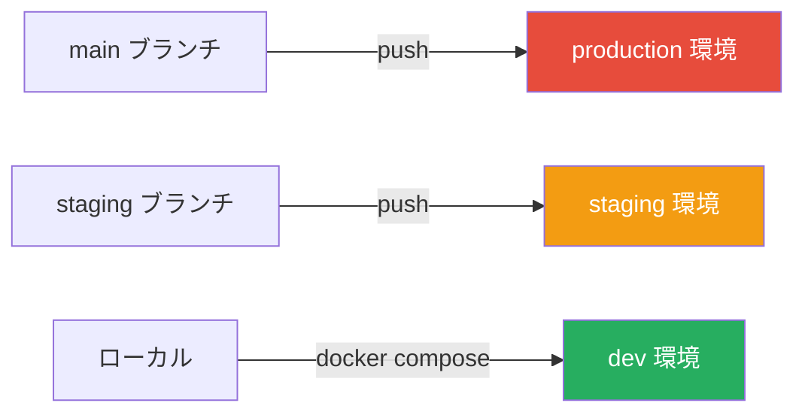
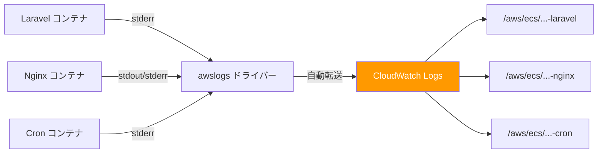
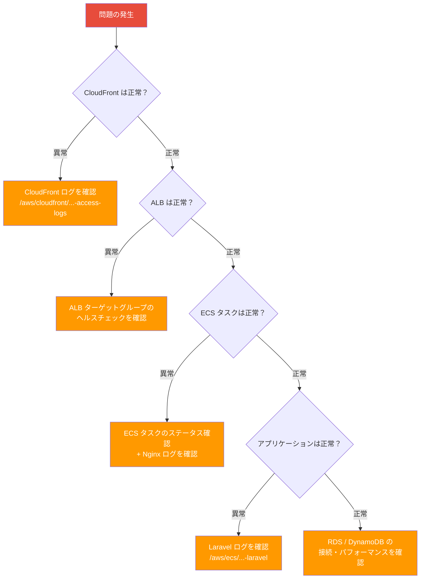

# 5-3-3 環境管理とモニタリング

📝 **前提知識**: このセクションはセクション 5-3-2（CodeBuild と CodeDeploy）の内容を前提としています。

## 🎯 このセクションで学ぶこと

- **dev / staging / production** の 3 つの環境の違いと、環境変数による切り替えの仕組みを理解する
- **Secrets Manager** による機密情報管理の構成と、ECS タスク定義での参照方式を理解する
- **CloudWatch Logs** によるログ管理の仕組みと、LMS のロググループ構成を理解する
- 本番環境での **トラブルシューティング** の基本手順と、問題の切り分け方を理解する

このセクションでは、デプロイした後のアプリケーションの管理と監視に焦点を当て、環境ごとの設定の違い、機密情報の安全な管理、ログによる問題の特定方法を順に学びます。

---

## 導入: デプロイした後、どうやって「正常」を確認するのか？

セクション 5-3-1 と 5-3-2 で、GitHub Actions によるワークフロー管理、CodeBuild によるイメージビルド、CodeDeploy による Blue/Green デプロイの仕組みを学びました。コードを書いてプッシュすれば、自動的にビルドされてデプロイされる流れは理解できたはずです。

しかし、デプロイが完了した後に重要な疑問が残ります。アプリケーションは本当に正常に動いているのか？ユーザーからエラーの報告があったとき、どこを確認すればいいのか？ステージング環境と本番環境で異なる設定はどう管理されているのか？

これらの疑問に答えるのが、**環境管理** と **モニタリング** です。環境管理はアプリケーションの「設定」を環境ごとに切り替える仕組みであり、モニタリングはアプリケーションの「状態」を継続的に観察する仕組みです。

### 🧠 先輩エンジニアはこう考える

> 障害対応で最も重要なのは「どこを見ればいいか知っている」ことです。LMS のログは CloudWatch にすべて集約されているので、ログの場所と見方を知っていれば、大半の問題は切り分けられます。逆に言えば、ログの場所を知らないまま本番運用に入ると、問題が起きたときにパニックになります。このセクションで「何がどこに記録されているか」を把握しておけば、実際の障害対応でも落ち着いて対処できます。

---

## 3 つの環境: dev / staging / production

LMS の開発では、**dev**（ローカル開発）、**staging**（ステージング）、**production**（本番）の 3 つの環境を使い分けています。

### 環境ごとの比較

| 項目 | dev（ローカル開発） | staging | production |
|---|---|---|---|
| **実行基盤** | Docker Compose | ECS Fargate（CPU: 256 / メモリ: 512） | ECS Fargate（CPU: 1024 / メモリ: 2048） |
| **URL** | localhost | stag-new.coachtech.site | lms.coachtech.site |
| **セッション** | ファイルベース | DynamoDB（480 分） | DynamoDB（480 分） |
| **キャッシュ** | ファイルベース | DynamoDB | DynamoDB |
| **キュー** | sync | sync | sync |
| **ログレベル** | debug | notice | error |
| **デプロイブランチ** | （ローカル） | staging | main |
| **タスク数** | （コンテナ 1 セット） | 1 | 2（冗長構成） |
| **用途** | 開発・テスト | 結合テスト・確認 | 本番運用 |

### 環境の使い分け

**dev** 環境はローカルの Docker Compose 上で動作し、コードの変更をすぐに確認できます。セッションやキャッシュはファイルベースで、外部サービスへの依存がないためセットアップが簡単です。

**staging** 環境は、本番と同じ AWS インフラ上で動作しますが、リソースのスペックを最小限に抑えてコストを節約しています。本番デプロイ前の動作確認や、チーム内での機能レビューに使います。

**production** 環境は、実際のユーザーがアクセスする本番環境です。CPU とメモリに余裕を持たせ、タスクを 2 つ起動する冗長構成で可用性を確保しています。

### コードは同一、設定で挙動を変える

ここで重要なのは、3 つの環境で動くアプリケーションの **コード自体は同一** だということです。staging も production も同じ Docker イメージからコンテナを起動しますが、**環境変数** によって挙動を切り替えています。

これは **Twelve-Factor App** と呼ばれるアプリケーション設計の原則に基づいています。Twelve-Factor App では「設定を環境変数に格納する」ことを推奨しており、コードと設定を分離することで、同じコードベースを複数の環境にデプロイできるようにします。

LMS の Terraform コードを見ると、この思想が明確に反映されています。

```hcl
# infra/stacks/modules/application/ecs.tf
locals {
  environment = [
    { name = "APP_ENV", value = var.env_name },
    { name = "LOG_LEVEL", value = var.log_level },
    { name = "SESSION_DRIVER", value = "dynamodb" },
    { name = "CACHE_DRIVER", value = "dynamodb" },
    { name = "QUEUE_CONNECTION", value = "sync" },
    # ... 他の環境変数
  ]
}
```

`var.env_name` や `var.log_level` の値は、環境ごとの `terraform.tfvars` ファイルで定義されています。

```hcl
# infra/stacks/production/terraform.tfvars
env_name  = "production"
log_level = "error"
```

```hcl
# infra/stacks/staging/terraform.tfvars
env_name  = "staging"
log_level = "notice"
```

このように、環境固有の値は `terraform.tfvars` に集約し、モジュール側のコードは変数を参照するだけという構造になっています。新しい環境を追加する場合も、新しい `terraform.tfvars` を用意するだけで対応できます。

### ブランチと環境の対応



セクション 5-3-1 で学んだ GitHub Actions のワークフローは、ブランチごとにトリガーされます。`main` ブランチへのプッシュは production 環境へ、`staging` ブランチへのプッシュは staging 環境へデプロイされます。ローカルでは Docker Compose で dev 環境を構築します。

---

## Secrets Manager による機密情報管理

### なぜ環境変数に直接書かないのか

前のセクションで見たように、LMS では環境変数を使ってアプリケーションの設定を管理しています。しかし、すべての設定を環境変数として Terraform コードに直接書くわけではありません。

データベースのパスワードや API トークンのような **機密情報**（シークレット）は、特別な扱いが必要です。Terraform のコードは Git リポジトリで管理されているため、機密情報を直接記述すると以下のリスクがあります。

- **情報漏洩**: Git の履歴に残り、リポジトリにアクセスできる全員が閲覧できてしまう
- **ローテーションの困難さ**: パスワードを変更するたびにコードを修正してデプロイが必要になる
- **環境間の混在**: 本番のパスワードがステージングのコードに混入するリスク

そこで AWS の **Secrets Manager** を使い、機密情報をコードとは別の安全な場所で管理します。

### LMS の Secrets Manager 構成

LMS では 5 つのシークレットを Secrets Manager で管理しています。

```hcl
# infra/stacks/modules/storage/secrets_manager.tf

resource "aws_secretsmanager_secret" "rds_credentials" {
  name = "${var.name_prefix}-rds-credentials"

  lifecycle {
    prevent_destroy = true
  }
}

resource "aws_secretsmanager_secret" "app_key" {
  name        = "${var.name_prefix}-app-key"
  description = "Laravel APP_KEY"

  lifecycle {
    prevent_destroy = true
  }
}

resource "aws_secretsmanager_secret" "hubspot" {
  name        = "${var.name_prefix}-hubspot-access-token"
  description = "HubSpot access token"

  lifecycle {
    prevent_destroy = true
  }
}

resource "aws_secretsmanager_secret" "line" {
  name        = "${var.name_prefix}-line-credentials"
  description = "LINE credentials"

  lifecycle {
    prevent_destroy = true
  }
}

resource "aws_secretsmanager_secret" "slack_bot_token" {
  name        = "${var.name_prefix}-slack-bot-token"
  description = "Slack Bot Token for Web API"

  lifecycle {
    prevent_destroy = true
  }
}
```

| シークレット名 | 格納内容 | 用途 |
|---|---|---|
| `{name_prefix}-rds-credentials` | username, password | RDS データベースへの接続 |
| `{name_prefix}-app-key` | Laravel APP_KEY | セッション暗号化・署名 |
| `{name_prefix}-hubspot-access-token` | API トークン | HubSpot との連携 |
| `{name_prefix}-line-credentials` | client_id, client_secret, access_token | LINE ログイン・通知 |
| `{name_prefix}-slack-bot-token` | Bot トークン | Slack 通知 |

`{name_prefix}` は環境ごとに異なる値（例: `lms-production-new`、`lms-staging-new`）が入るため、同じ AWS アカウント内でも環境ごとにシークレットが分離されます。

### `prevent_destroy` による誤削除防止

すべてのシークレットに `lifecycle { prevent_destroy = true }` が設定されています。これは Terraform のライフサイクル設定で、`terraform destroy` や設定変更によるリソースの削除を防止します。機密情報は一度失われると復旧が困難なため、意図しない削除から保護する重要な安全策です。

### ECS タスク定義での参照: environment と secrets の使い分け

ECS タスク定義では、設定値の性質に応じて 2 つの方法で環境変数を注入します。

```hcl
# infra/stacks/modules/application/ecs.tf

# 通常の設定値: environment で直接指定
environment = [
  { name = "APP_ENV", value = var.env_name },
  { name = "LOG_CHANNEL", value = "stderr" },
  { name = "SESSION_DRIVER", value = "dynamodb" },
  # ...
]

# 機密情報: secrets で Secrets Manager を参照
secrets = [
  { name = "DB_PASSWORD", valueFrom = "${var.rds_secrets_manager_arn}:password::" },
  { name = "DB_USERNAME", valueFrom = "${var.rds_secrets_manager_arn}:username::" },
  { name = "APP_KEY", valueFrom = var.app_key_secrets_manager_arn },
  { name = "HUBSPOT_ACCESS_TOKEN", valueFrom = var.hubspot_secrets_manager_arn },
  { name = "LINE_LOGIN_CLIENT_ID", valueFrom = "${var.line_secrets_manager_arn}:client_id::" },
  { name = "LINE_LOGIN_CLIENT_SECRET", valueFrom = "${var.line_secrets_manager_arn}:client_secret::" },
  { name = "LINE_CHANNEL_ACCESS_TOKEN", valueFrom = "${var.line_secrets_manager_arn}:access_token::" },
  { name = "SLACK_BOT_TOKEN", valueFrom = var.slack_bot_token_secrets_manager_arn },
]
```

**`environment`** は値を直接指定する方式です。Terraform のコードに値がそのまま含まれるため、ログレベルやドライバー名のような機密性のない設定に使います。

**`secrets`** は Secrets Manager の ARN（リソース識別子）を指定する方式です。ECS がコンテナを起動する際に、Secrets Manager から値を取得してコンテナの環境変数に注入します。Terraform のコードには ARN だけが記録され、実際の値は含まれません。

`valueFrom` の書式にも注目してください。`${var.rds_secrets_manager_arn}:password::` のように `:password::` が付いている場合、JSON 形式で格納されたシークレットの特定のキーだけを取り出しています。`rds-credentials` には `{"username": "...", "password": "..."}` という JSON が格納されており、それぞれのキーを個別の環境変数にマッピングしています。

### IAM ロールと最小権限の原則

Secrets Manager の値にアクセスできるのは、ECS の **実行ロール**（execution role）だけです。

```hcl
# infra/stacks/modules/application/iam.tf

data "aws_iam_policy_document" "secrets_manager_policy" {
  statement {
    actions = [
      "secretsmanager:GetSecretValue"
    ]
    resources = [
      var.rds_secrets_manager_arn,
      var.app_key_secrets_manager_arn,
      var.hubspot_secrets_manager_arn,
      var.line_secrets_manager_arn,
      var.slack_bot_token_secrets_manager_arn,
    ]
  }
}

resource "aws_iam_role_policy_attachment" "attach_secrets_manager_policy" {
  role       = aws_iam_role.fargate_execution_role.name
  policy_arn = aws_iam_policy.secrets_manager_policy.arn
}
```

ここでのポイントは 2 つあります。

1. **許可するアクション** は `secretsmanager:GetSecretValue`（値の取得）だけです。シークレットの作成・更新・削除はできません
2. **対象リソース** は LMS で使う 5 つのシークレットだけに限定されています。AWS アカウント内の他のシークレットにはアクセスできません

これは **最小権限の原則**（Principle of Least Privilege）と呼ばれるセキュリティの基本方針で、必要最小限の権限だけを付与することで、万が一の漏洩時の被害を最小化します。

💡 **ECS の 2 つのロール**: ECS タスクには **実行ロール**（execution role）と **タスクロール**（task role）の 2 つがあります。実行ロールは ECS エージェントがコンテナを起動する際に使うロール（ECR からのイメージ取得、Secrets Manager からの値取得など）で、タスクロールはコンテナ内のアプリケーションが使うロール（S3 へのファイル保存、DynamoDB へのアクセスなど）です。Secrets Manager へのアクセスは、コンテナ起動時に ECS エージェントが行うため、実行ロールに権限を付与しています。

---

## CloudWatch によるログ管理

### CloudWatch Logs とは

**CloudWatch Logs** は、AWS が提供するマネージドログ管理サービスです。アプリケーションや AWS サービスのログを収集・保存・検索できます。

ECS Fargate で動くコンテナのログは、ローカル開発のように `docker logs` コマンドで直接確認することはできません。コンテナは AWS のマネージド環境で動いているため、ログの確認には CloudWatch Logs を使います。

### LMS のロググループ構成

LMS では 5 つの **ロググループ** を定義しています。ロググループはログの保存先を論理的に分けるための単位です。

```hcl
# infra/stacks/modules/logs/cloudwatch.tf

resource "aws_cloudwatch_log_group" "laravel" {
  name              = "/aws/ecs/${var.name_prefix}-laravel"
  retention_in_days = 30
}

resource "aws_cloudwatch_log_group" "nginx" {
  name              = "/aws/ecs/${var.name_prefix}-nginx"
  retention_in_days = 30
}

resource "aws_cloudwatch_log_group" "cron" {
  name              = "/aws/ecs/${var.name_prefix}-cron"
  retention_in_days = 30
}

resource "aws_cloudwatch_log_group" "codebuild" {
  name              = "/aws/codebuild/${var.name_prefix}-ecs-image-build"
  retention_in_days = 30
}

# CloudFrontのログはグローバルリソースであるため、ロググループもバージニアリージョンで作成する
resource "aws_cloudwatch_log_group" "cloudfront" {
  provider = aws.virginia
  name     = "/aws/cloudfront/${var.name_prefix}-access-logs"

  retention_in_days = 7
}
```

| ロググループ | 内容 | 保持期間 | リージョン |
|---|---|---|---|
| `/aws/ecs/{name_prefix}-laravel` | アプリケーションログ | 30 日 | 東京 |
| `/aws/ecs/{name_prefix}-nginx` | Web サーバーログ | 30 日 | 東京 |
| `/aws/ecs/{name_prefix}-cron` | バッチ処理ログ | 30 日 | 東京 |
| `/aws/codebuild/{name_prefix}-ecs-image-build` | ビルドログ | 30 日 | 東京 |
| `/aws/cloudfront/{name_prefix}-access-logs` | CDN アクセスログ | 7 日 | バージニア（us-east-1） |

**保持期間**（`retention_in_days`）は、ログを何日間保存するかを指定します。ECS と CodeBuild のログは 30 日間、CloudFront のアクセスログは 7 日間で自動的に削除されます。保持期間を長くするほどストレージコストが増えるため、ログの重要度に応じて期間を設定しています。

💡 **CloudFront ログだけバージニアリージョン**: CloudFront は AWS のグローバルサービスであり、リアルタイムログの送信先となる CloudWatch ロググループは `us-east-1`（バージニア北部）リージョンに作成する必要があります。そのため、Terraform で `provider "aws" { alias = "virginia" }` を使って別リージョンにロググループを作成しています。

### ログレベルの環境差

LMS では、環境ごとにログの詳細度を変えています。

- **production**: `LOG_LEVEL=error`（エラーのみ記録）
- **staging**: `LOG_LEVEL=notice`（通知レベル以上を記録）

production でログレベルを `error` に絞っているのは、**コスト最適化** のためです。ログの量が増えると CloudWatch の保存・検索コストが増加します。本番環境では問題の検知に必要なエラーログだけを記録し、デバッグが必要な場合は staging 環境で `notice` レベルの詳細なログを確認します。

📝 Laravel のログレベルは、低い方から `debug` → `info` → `notice` → `warning` → `error` → `critical` → `alert` → `emergency` の 8 段階です。設定したレベル以上のログだけが記録されます。たとえば `notice` に設定すると、`notice`、`warning`、`error`、`critical`、`alert`、`emergency` のログが記録されます。

### Laravel の `LOG_CHANNEL=stderr` とコンテナログの仕組み

LMS の ECS タスク定義では、`LOG_CHANNEL` が `stderr` に設定されています。

```hcl
{ name = "LOG_CHANNEL", value = "stderr" },
```

ローカル開発では Laravel のログは `storage/logs/laravel.log` ファイルに書き込まれますが、コンテナ環境ではファイルに書き込む代わりに **標準エラー出力**（stderr）に出力します。これには 2 つの理由があります。

1. **コンテナの一時性**: ECS Fargate のコンテナはデプロイのたびに破棄・再作成されるため、ファイルに書いたログは失われます
2. **ログ集約の標準パターン**: コンテナの標準出力/標準エラー出力は、ログドライバーによって外部に転送するのが一般的な設計パターンです

### awslogs ドライバーによる CloudWatch への転送

コンテナの stderr に出力されたログは、ECS の **awslogs ドライバー** によって自動的に CloudWatch Logs に転送されます。

```hcl
# infra/stacks/modules/application/ecs.tf

# Laravel コンテナの例
{
  name      = var.container_name_laravel
  image     = "${aws_ecr_repository.laravel.repository_url}:latest"
  essential = true
  logConfiguration = {
    logDriver = "awslogs"
    options = {
      awslogs-group         = "/aws/ecs/${var.name_prefix}-${var.container_name_laravel}"
      awslogs-region        = var.aws_region
      awslogs-stream-prefix = var.container_name_laravel
    }
  }
  environment = local.environment
  secrets     = local.secrets
}
```

`logConfiguration` ブロックの各オプションの意味は以下のとおりです。

| オプション | 値 | 説明 |
|---|---|---|
| `logDriver` | `"awslogs"` | CloudWatch Logs に転送するドライバーを指定 |
| `awslogs-group` | `/aws/ecs/{name_prefix}-laravel` | 転送先のロググループ名 |
| `awslogs-region` | `var.aws_region` | ロググループが存在するリージョン |
| `awslogs-stream-prefix` | `var.container_name_laravel` | ログストリーム名のプレフィックス |

この設定により、Laravel コンテナのログは `/aws/ecs/{name_prefix}-laravel` ロググループに、Nginx コンテナのログは `/aws/ecs/{name_prefix}-nginx` ロググループに、それぞれ自動的に転送されます。開発者がログ転送の仕組みを意識する必要はありません。



### CloudWatch メトリクス

CloudWatch にはログだけでなく、AWS リソースの数値データを自動収集する **メトリクス** の機能もあります。メトリクスはリソースの「健康状態」を数値で継続的に記録するもので、ログが「何が起きたか」を記録するのに対し、メトリクスは「どのくらいの負荷がかかっているか」を記録します。

LMS の運用で特に重要なメトリクスは以下のとおりです。

| サービス | メトリクス | 意味 |
|---|---|---|
| ECS | `CPUUtilization` | タスクの CPU 使用率 |
| ECS | `MemoryUtilization` | タスクのメモリ使用率 |
| ALB | `RequestCount` | リクエスト数 |
| ALB | `TargetResponseTime` | ターゲットの応答時間 |
| ALB | `HTTPCode_Target_5XX_Count` | ターゲットが返した 5XX エラーの数 |

これらのメトリクスは AWS コンソールの CloudWatch ダッシュボードから確認できます。たとえば `CPUUtilization` が継続的に高い場合はタスクのスペック不足、`HTTPCode_Target_5XX_Count` が急増した場合はアプリケーションのエラーを疑う、といった判断に活用します。

---

## トラブルシューティングの基本手順

### 問題の切り分けフロー

本番環境で問題が発生したとき、最も重要なのは **どのレイヤーで問題が起きているかを特定すること** です。LMS のリクエストは複数の AWS サービスを経由するため、問題がどこで発生しているかによって確認すべきログが異なります。



このフロー図は、リクエストの流れに沿って上流から順に確認していく方法を示しています。CloudFront（最も外側）から始めて、ALB、ECS、アプリケーション、データベース（最も内側）へと順に確認を進めることで、問題の発生箇所を効率的に絞り込めます。

### よくある問題と確認箇所

#### デプロイが失敗した場合

**症状**: GitHub Actions のワークフローが失敗する、または新しいバージョンに切り替わらない

**確認箇所**:
- **CodeBuild ログ**（`/aws/codebuild/{name_prefix}-ecs-image-build`）: Docker イメージのビルドエラー（依存パッケージのインストール失敗、構文エラーなど）
- **CodeDeploy のデプロイステータス**: Blue/Green デプロイのヘルスチェック失敗（新しいコンテナが正常に起動しない）

⚠️ **注意**: CodeDeploy のヘルスチェックが失敗した場合、自動的にロールバックされるため、ユーザーへの影響はありません。ただし、原因を特定して修正しないと次回のデプロイも失敗します。

#### 500 エラーが発生した場合

**症状**: ユーザーがアクセスすると 500 Internal Server Error が表示される

**確認箇所**:
- **Laravel ログ**（`/aws/ecs/{name_prefix}-laravel`）: 例外のスタックトレースやエラーメッセージが記録されています。エラーの発生時刻で絞り込み、スタックトレースを確認することで原因を特定できます

#### 接続できない場合

**症状**: サイトにアクセスしてもレスポンスが返らない、タイムアウトする

**確認箇所**:
- **ECS タスクのステータス**: AWS コンソールで ECS サービスのタスク一覧を確認し、タスクが RUNNING 状態かを確認します。STOPPED になっている場合はタスクの停止理由を確認します
- **セキュリティグループ**: ネットワークの通信許可設定が正しいかを確認します

#### レスポンスが遅い場合

**症状**: ページの表示に時間がかかる

**確認箇所**:
- **CloudFront ログ**（`/aws/cloudfront/{name_prefix}-access-logs`）: キャッシュヒット率を確認します。ヒット率が低い場合、キャッシュ設定の見直しが必要です
- **Nginx ログ**（`/aws/ecs/{name_prefix}-nginx`）: upstream（Laravel）へのリクエストの応答時間を確認し、どのエンドポイントが遅いかを特定します

### Claude Code を活用したトラブルシューティング

💡 **Claude Code に指示するときのポイント**: トラブルシューティングを Claude Code に依頼するときは、「何が起きているか」と「どこを見てほしいか」を具体的に伝えると効率的です。

例:
- 「CloudWatch の `/aws/ecs/lms-production-new-laravel` ロググループで、直近 1 時間のエラーログを確認して」
- 「ECS の lms-production-new-cluster で、タスクのステータスを確認して」
- 「CodeBuild の直近のビルドログを確認して、失敗の原因を教えて」

ロググループ名や環境名を具体的に指定することで、Claude Code が AWS CLI を使って素早くログを取得できます。

---

## ✨ まとめ

- LMS は **dev / staging / production** の 3 つの環境を持ち、同一のコードを **環境変数** で切り替える Twelve-Factor App の思想に基づいている
- **Secrets Manager** で 5 つの機密情報（DB 認証、APP_KEY、HubSpot、LINE、Slack）を安全に管理し、ECS タスク定義の `secrets` ブロックで参照している
- すべてのシークレットに **`prevent_destroy`** を設定し、誤削除を防止している
- IAM ポリシーで **最小権限の原則** を適用し、実行ロールだけが特定のシークレットのみ取得できるようにしている
- **CloudWatch Logs** に 5 つのロググループを定義し、Laravel・Nginx・Cron・CodeBuild・CloudFront のログを集約している
- ログレベルは production で `error`、staging で `notice` に設定し、コストとデバッグ容易性のバランスを取っている
- コンテナのログは `LOG_CHANNEL=stderr` で標準エラー出力に書き出し、**awslogs ドライバー** が CloudWatch に自動転送する
- トラブルシューティングでは、リクエストの流れに沿って **上流（CloudFront）から下流（RDS）へ** 順に切り分けるのが基本

---

この Chapter では、GitHub Actions によるワークフロー管理、CodeBuild によるイメージビルド、CodeDeploy による Blue/Green デプロイ、そして環境管理とモニタリングの仕組みを学びました。

Part 5 全体を振り返ると、クラウドインフラの基礎概念（Chapter 5-1）、Terraform によるインフラのコード管理（Chapter 5-2）、CI/CD パイプライン（Chapter 5-3）を通して、LMS を支えるインフラストラクチャの全体像を理解しました。これで、フロントエンド（Part 2, 3）、バックエンド（Part 4）、インフラ（Part 5）の各領域の知識が揃いました。次の Part 6 では、これらの知識を統合し、LMS のコードベースをフロントエンドからバックエンド、インフラまで横断的に読み解く力を身につけます。
