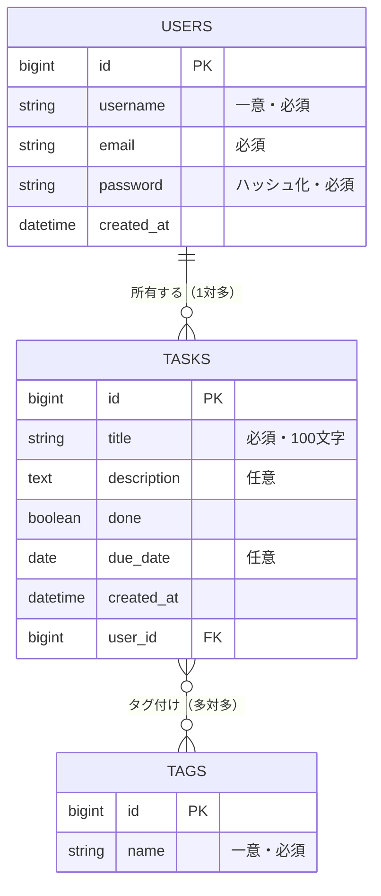
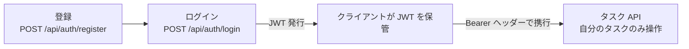

# 5-1-1 要件と API の設計

📝 **このハンズオンで使う機能**: REST API のエンドポイント設計（3-3-1）・ドメインモデルとテーブル設計（3-4-1・3-4-2）。本セクションは Part 1〜4 で積み上げた概念を、1 つのアプリケーションづくりへと移す出発点です。

Part 5 は、これまで学んだ知識をすべて統合し、**認証付きのタスク管理 REST API をゼロから設計・実装・テスト** する総合ハンズオンです。題材は CT の最終課題と同系統のタスク管理アプリで、「Laravel で作ったものを Java / Spring Boot で作り直す」感覚で進めます。本教材の方針どおり、構文の暗記よりも、**構造を理解して組み立てること** に重きを置きます。

| セクション | テーマ | 種類 |
|---|---|---|
| 5-1-1 | 要件と API の設計 | ハンズオン |
| 5-1-2 | 環境構築とプロジェクト作成 | ハンズオン |
| 5-2-1 | ドメインとデータアクセス | ハンズオン |
| 5-2-2 | ビジネスロジックと API | ハンズオン |
| 5-2-3 | Spring Security 設定とログイン認証 | ハンズオン |
| 5-2-4 | JWT 発行・検証と認可 | ハンズオン |
| 5-2-5 | タスク一覧画面（Thymeleaf） | ハンズオン |
| 5-3-1 | テストを書く | ハンズオン |
| 5-3-2 | 動作確認と振り返り | ハンズオン |

📖 **この Part の進め方**: まず本セクションで **設計** （要件・ドメインモデル・テーブル・API エンドポイント・認証方針）を固めます。次に 5-1-2 で **起動可能なプロジェクト** を用意し、5-2 で **データ層 → ロジック / API → 認証 → 画面** の順に積み上げて動く API を完成させ、5-3 で **テストと仕上げ** を行って教材全体を締め括ります。1 つのプロジェクトを少しずつ育てていくので、各セクションは前のセクションの成果物をそのまま引き継ぎます。

## 🎯 このセクションで学ぶこと

- タスク管理 API の要件を整理し、ドメインモデル（ユーザー / タスク / タグ）と関連を設計できる
- テーブル設計（カラム・型・制約・外部キー・中間テーブル）と REST API のエンドポイント設計を起こせる
- 認証・認可の方針（JWT・自分のタスクのみ操作）を決められる

要件の整理から始め、ドメインモデル、テーブル、API エンドポイント、認証方針へと、抽象から具体へ順に設計を固めていきます。

---

## 導入: いきなりコードを書かない

CT の最終課題を思い出してください。タスク管理アプリを作るとき、あなたは最初からコントローラを書き始めたでしょうか。おそらく違います。まず「どんな機能が要るか」を書き出し、テーブルを設計し、ルーティング（どの URL でどの操作を受けるか）を決めてから、手を動かし始めたはずです。Java / Spring Boot でも、この順序はまったく変わりません。むしろ静的型付けの世界では、**型・クラス・テーブルを先に決めておくほど、後の実装が速く正確になります**。

本セクションでは 1 行もアプリのコードを書きません。代わりに、これから 8 セクションかけて作るものの **設計図** を引きます。要件 → ドメインモデル → テーブル → API → 認証方針。この地図があるからこそ、次のセクション以降で迷わず実装に集中できます。

### 🧠 先輩エンジニアの思考プロセス

> Laravel から Java の現場に移って驚いたのは、設計フェーズの重みでした。Laravel では `php artisan make:model` と `make:migration` を叩きながら、走りながら設計を固めることもできました。Java の案件では、エンティティのフィールド名や型、API のリクエスト / レスポンスの形を、実装着手前にドキュメントで詰めることが多かった。型が決まらないと DTO もエンティティも書けないからです。

> 最初は「手戻りを恐れて慎重すぎるのでは」と感じましたが、すぐに考えが変わりました。型を先に決めておくと、コンパイラが設計どおりかを常にチェックしてくれる。設計と実装がズレた瞬間に赤線で教えてくれるのです。今は AI に設計を壁打ちさせて素早く形にし、その設計を型に落とし込んでから実装に入る、という進め方をしています。設計が地図、型がガードレール、という感覚です。

---

## Step 1: 要件を整理する

まず、何を作るのかを言葉で固めます。本教材のタスク管理 API の要件は次のとおりです。

- 利用者は **ユーザー登録** し、**ログイン** して使う
- ログインしたユーザーは、自分の **タスク** を作成・一覧・取得・更新・削除できる（CRUD）
- タスクには **タイトル・説明・完了状態・期限** を持たせる
- タスクには **タグ** を複数付けられる（1 つのタグは複数のタスクに付く）
- ユーザーは **自分のタスクだけ** を操作できる（他人のタスクは見えない・触れない）
- 主役は REST API（JSON）。加えて、自分のタスク一覧を **HTML 画面** でも表示する（読み取り専用）

登場するデータは 3 つです。**ユーザー（User）**・**タスク（Task）**・**タグ（Tag）**。この 3 つの関係を次に設計します。

---

## Step 2: ドメインモデルを描く

データ同士の関係を整理します。CT で学んだリレーションの考え方がそのまま使えます。

- **ユーザー 1 人** が **複数のタスク** を持つ（一対多）。タスクから見ると、所有者のユーザーは 1 人（多対一）
- **タスク** には **複数のタグ** が付き、**タグ** は **複数のタスク** に付く（多対多）

💡 **Laravel との対応**: この関係は Eloquent でいう `hasMany`（User → Task）/ `belongsTo`（Task → User）/ `belongsToMany`（Task ↔ Tag）です。3-4-2 で学んだとおり、Java / JPA ではこれを `@OneToMany` / `@ManyToOne` / `@ManyToMany` というアノテーションで表します。実装は 5-2-1 で行います。

---

## Step 3: テーブルを設計する

ドメインモデルをテーブルに落とします。多対多は **中間テーブル** （`task_tags`）で表現します。これは CT の `belongsToMany` で中間テーブルを置いたのと同じ考え方です。

| テーブル | 主なカラム | 制約・備考 |
|---|---|---|
| `users` | `id`（PK）・`username`・`email`・`password`・`created_at` | `username` は一意。`password` はハッシュ化して保存 |
| `tasks` | `id`（PK）・`title`・`description`・`done`・`due_date`・`created_at`・`user_id`（FK） | `user_id` は `users.id` を参照する外部キー |
| `tags` | `id`（PK）・`name` | `name` は一意 |
| `task_tags` | `task_id`（FK）・`tag_id`（FK） | タスクとタグをつなぐ中間テーブル |

⚠️ **注意**: 設計段階では「テーブルをどう作るか（マイグレーション）」を細かく決めなくて構いません。本教材では JPA / Hibernate がエンティティ定義から起動時にテーブルを作ります（5-1-2 で `ddl-auto` を設定）。Laravel のマイグレーションに当たる役割を、エンティティクラス自体が兼ねるイメージです。ここで大事なのは **カラム・型・制約・関連を決めておく** ことです。

---

## Step 4: REST API のエンドポイントを設計する

次に、どの URL でどの操作を受けるかを決めます。3-3-1 で学んだ REST のエンドポイント設計と HTTP ステータスをそのまま適用します。CT で書いた `routes/api.php` の設計と同じ作業です。

**認証関連（誰でも叩ける）**

| 操作 | メソッド | パス | 主なステータス |
|---|---|---|---|
| ユーザー登録 | POST | `/api/auth/register` | 201 / 400 / 409 |
| ログイン | POST | `/api/auth/login` | 200 / 401 |

**タスク関連（ログイン必須・自分のタスクのみ）**

| 操作 | メソッド | パス | 主なステータス |
|---|---|---|---|
| 一覧取得 | GET | `/api/tasks` | 200 |
| 1 件取得 | GET | `/api/tasks/{id}` | 200 / 404 |
| 作成 | POST | `/api/tasks` | 201 / 400 |
| 更新 | PUT | `/api/tasks/{id}` | 200 / 400 / 404 |
| 削除 | DELETE | `/api/tasks/{id}` | 204 / 404 |

**画面（ログイン必須・読み取り専用）**

| 操作 | メソッド | パス | 返すもの |
|---|---|---|---|
| タスク一覧画面 | GET | `/tasks` | HTML ページ |

リクエスト / レスポンスの本体（DTO）は、3-3-2 で学んだとおり **入力用と出力用を分けて** 設計します。たとえばタスク作成では、クライアントから受け取るのは `title` / `description` / `dueDate` / タグ名の一覧で、`id` や `done` はサーバ側が決めます。具体的な DTO のフィールドは 5-2-2 で確定します。ここでは「入力と出力を分ける」という方針だけ押さえておけば十分です。

💡 **Laravel との対応**: `/api/...` を API、`/tasks` を画面、と入口を分ける考え方は、Laravel の `routes/api.php` と `routes/web.php` の分離に対応します。Java では「クラスにどのアノテーションを付けるか」（`@RestController` か `@Controller` か）でこの違いを表します。詳しくは 5-2-5 で扱います。

---

## Step 5: 認証・認可の方針を決める

最後に、セキュリティの方針を決めます。4-1 で学んだ内容を、この題材にどう当てはめるかです。

- **認証（あなたは誰か）**: ユーザー登録時にパスワードをハッシュ化して保存し、ログイン時に照合する。ログインに成功したら **JWT（署名付きトークン）** を発行し、以降のリクエストでは `Authorization: Bearer <JWT>` ヘッダーで身元を示す（ステートレス認証）
- **認可（何をしてよいか）**: 各リクエストで「いま誰がログインしているか」を JWT から復元し、**そのユーザーが所有するタスクだけ** を操作対象にする。他人のタスクは一覧にも出さず、ID を指定しても見つからない扱いにする

💡 **Laravel との対応**: Sanctum でトークンを発行し、ポリシー（Policy）で「自分の資源だけ操作させる」認可を書いた経験が、そのまま当てはまります。JWT の発行・検証は 5-2-4 で、認可（自分のタスクのみ）も同じ 5-2-4 で実装します。

---

## ✅ 完成チェックリスト

設計の成果物として、次が揃っていることを確認してください。

- [ ] 機能要件を箇条書きで整理した（登録・ログイン・タスク CRUD・タグ・自分のタスクのみ・一覧画面）
- [ ] ドメインモデル（User / Task / Tag）と関連（1対多・多対多）を図にした
- [ ] テーブル設計（カラム・型・制約・外部キー・中間テーブル `task_tags`）を起こした
- [ ] REST API のエンドポイント（メソッド・パス・ステータス）を表にした
- [ ] 認証（JWT）と認可（自分のタスクのみ）の方針を決めた

---

## ✨ まとめ

- Part 5 は、Part 1〜4 の知識を統合して **1 つのタスク管理 REST API をゼロから作る** 総合ハンズオン。設計 → 環境構築 → 実装 → テスト・仕上げの順で、1 つのプロジェクトを育てていく
- 実装前に **設計図** を引く。要件 → ドメインモデル（User / Task / Tag）→ テーブル（中間テーブル `task_tags` を含む）→ REST エンドポイント → 認証・認可の方針、と抽象から具体へ固める
- 登場データは ユーザー（1）─ タスク（多）─ タグ（多対多）。認証は JWT、認可は「自分のタスクのみ」

---

次のセクションでは、この設計を載せる器を用意します。JDK / Docker / IDE を準備し、Spring Initializr でプロジェクトを生成して、MySQL（Docker）へ接続し、起動を確認するところまでを行います。
