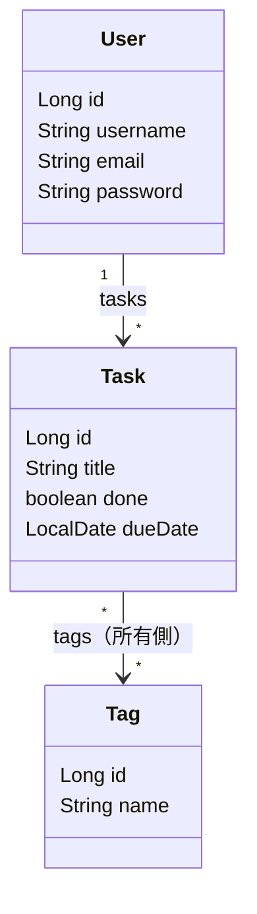

# 5-2-1 ドメインとデータアクセス

📝 **このハンズオンで使う機能**: エンティティとマッピング（3-4-1 で学習）・リレーションと `JpaRepository`（3-4-2 で学習）・クラスとインスタンス（2-1-1 で学習）

## 🎯 このセクションで学ぶこと

- 設計したドメインモデルを Java のエンティティ（ユーザー・タスク・タグ）として実装できる
- 一対多（ユーザー ↔ タスク）と多対多（タスク ↔ タグ）のリレーションをアノテーションで表現できる
- `JpaRepository` を継承したリポジトリを 3 つ用意できる
- 起動時に Hibernate がテーブル（スキーマ）を作ることを確認できる

パッケージ構成を整え、ユーザー・タスク・タグのエンティティを順に作り、リポジトリを用意して、起動でスキーマ生成を確認します。

---

## 導入: 一番下の層から積む

5-1-1 で「ユーザー 1 人が複数のタスクを持ち、タスクには複数のタグが付く」という設計を起こしました。これを Java で形にします。Spring Boot のアプリは、3-2-2 で学んだとおり Controller → Service → Repository の層に分かれ、依存は上から下へ流れます。だから作る順番は **一番下のデータ層から** が定石です。土台のデータ構造が決まれば、その上の Service・Controller は迷わず載せられます。

Laravel でいえば、マイグレーションでテーブルを作り、Eloquent モデルにリレーションを定義する作業に当たります。Java / JPA では、その 2 つが **エンティティクラス 1 つ** にまとまります。クラスがテーブルの設計図であり、同時にモデルでもある、という感覚です。

### 🧠 先輩エンジニアの思考プロセス

> Laravel のマイグレーションとモデルが Java では 1 つのクラスになる、と最初に知ったとき、少し戸惑いました。「スキーマ定義とモデルが混ざって大丈夫か」と。でも使ってみると、テーブルとクラスが必ず一致するので、ズレようがない安心感がありました。マイグレーションファイルとモデルのカラムが食い違う、という Laravel でたまにあったミスが、構造的に起きないのです。

> 一点だけ、最初にハマったのが関連の「所有側」です。多対多をどちらのエンティティに `@JoinTable` を書くかで、中間テーブルの作られ方が決まる。ここを意識せずに両側に書いて、テーブルが二重にできかけたことがありました。「外部キー（や中間テーブル）を実際に持つ方が所有側」という原則さえ押さえれば、もう迷いません。

---

## 📌 実装を始める前の確認

- [ ] 5-1-2 のプロジェクトが `./mvnw spring-boot:run` で起動できる
- [ ] MySQL コンテナが起動している（`docker compose up -d`）
- [ ] `application.yml` の `ddl-auto` が `update` になっている

---

## 🏃 実践: エンティティと Repository を作る

### 🏃 Step 1: パッケージ構成を作る

3-1-2 で学んだとおり、Java はパッケージ名とフォルダ階層が一致します。`src/main/java/com/example/taskapp/` の下に、層ごとのパッケージを作ります。

```text
src/main/java/com/example/taskapp/
├── TaskappApplication.java   ← 起動クラス（生成済み）
├── entity/                   ← エンティティ（このセクション）
├── repository/               ← リポジトリ（このセクション）
├── service/                  ← ビジネスロジック（5-2-2）
├── controller/               ← Web 入出力（5-2-2）
├── dto/                      ← 入出力データ（5-2-2）
├── exception/                ← 例外と統一エラー（5-2-2）
├── config/                   ← 設定（5-2-3 / 5-2-4）
└── security/                 ← 認証まわり（5-2-3）
```

まず `entity` と `repository` を作ります。残りは各セクションで使うときに作ります。

### 🏃 Step 2: User エンティティを作る

ユーザーを表すエンティティです。5-1-1 の設計どおり、`username`（一意）・`email`・`password`（ハッシュ化して保存）を持ちます。`password` は認証で使いますが、フィールドはここで用意しておきます。

```java
// src/main/java/com/example/taskapp/entity/User.java
package com.example.taskapp.entity;

import jakarta.persistence.*;
import java.time.LocalDateTime;
import java.util.ArrayList;
import java.util.List;

@Entity
@Table(name = "users")
public class User {

    @Id
    @GeneratedValue(strategy = GenerationType.IDENTITY)
    private Long id;

    @Column(nullable = false, unique = true)
    private String username;

    @Column(nullable = false)
    private String email;

    @Column(nullable = false)
    private String password;   // ハッシュ化済みのパスワードを保存（{bcrypt}...）

    private LocalDateTime createdAt;

    @OneToMany(mappedBy = "user")
    private List<Task> tasks = new ArrayList<>();

    // JPA 用の引数なしコンストラクタ
    protected User() {
    }

    // アプリのコードからユーザーを作るとき用
    public User(String username, String email, String password) {
        this.username = username;
        this.email = email;
        this.password = password;
        this.createdAt = LocalDateTime.now();
    }

    // getter / setter は IntelliJ で生成（Alt+Insert → Getter and Setter）
}
```

💡 **2 つのコンストラクタ**: 3-4-1 で学んだとおり、JPA はインスタンスを組み立てるために **引数なしコンストラクタ** を必要とします（`protected` で十分）。一方、アプリのコードからは `new User(...)` で値を入れて作りたいので、**値を受け取る public コンストラクタ** も用意します。この使い分けは Task・Tag でも同じです。

⚠️ **注意（`equals` / `hashCode` を自動採番 ID で実装しない）**: 3-4-1 で触れたとおり、自動採番される `id` を `equals` / `hashCode` の判定に使うと、保存の前後で同一性が崩れます。本教材ではエンティティの `equals` / `hashCode` は **オーバーライドしません** （既定の参照同一性のまま使います）。

### 🏃 Step 3: Task エンティティを作る

タスク本体です。`@ManyToOne` で所有者のユーザーを参照します。3-4-3 で学んだ方針に従い、関連は **遅延フェッチ（LAZY）** にしておきます。

```java
// src/main/java/com/example/taskapp/entity/Task.java
package com.example.taskapp.entity;

import jakarta.persistence.*;
import java.time.LocalDate;
import java.time.LocalDateTime;
import java.util.HashSet;
import java.util.Set;

@Entity
@Table(name = "tasks")
public class Task {

    @Id
    @GeneratedValue(strategy = GenerationType.IDENTITY)
    private Long id;

    @Column(nullable = false, length = 100)
    private String title;

    @Column(columnDefinition = "TEXT")
    private String description;

    @Column(nullable = false)
    private boolean done;

    private LocalDate dueDate;

    private LocalDateTime createdAt;

    @ManyToOne(fetch = FetchType.LAZY)   // 所有者のユーザー（遅延フェッチ。3-4-3）
    @JoinColumn(name = "user_id")
    private User user;

    @ManyToMany   // タスクが所有側。中間テーブル task_tags を作る
    @JoinTable(
        name = "task_tags",
        joinColumns = @JoinColumn(name = "task_id"),
        inverseJoinColumns = @JoinColumn(name = "tag_id")
    )
    private Set<Tag> tags = new HashSet<>();

    protected Task() {
    }

    public Task(String title, String description, LocalDate dueDate) {
        this.title = title;
        this.description = description;
        this.dueDate = dueDate;
        this.done = false;                  // 作成時は未完了
        this.createdAt = LocalDateTime.now();
    }

    // getter / setter は IntelliJ で生成
}
```

💡 **`done` の getter は `isDone()`**: `boolean` 型のフィールドは、JavaBeans の慣習で getter が `isDone()` になります（`getDone()` ではありません）。3-3-2 の DTO 変換でこの名前を使うので覚えておいてください。

### 🏃 Step 4: Tag エンティティと多対多を仕上げる

タグです。多対多の **非所有側** なので、`mappedBy = "tags"` で「相手（Task）の `tags` フィールドが関連を持っている」と示します。

```java
// src/main/java/com/example/taskapp/entity/Tag.java
package com.example.taskapp.entity;

import jakarta.persistence.*;
import java.util.HashSet;
import java.util.Set;

@Entity
@Table(name = "tags")
public class Tag {

    @Id
    @GeneratedValue(strategy = GenerationType.IDENTITY)
    private Long id;

    @Column(nullable = false, unique = true)
    private String name;

    @ManyToMany(mappedBy = "tags")   // 非所有側（中間テーブルは Task 側が持つ）
    private Set<Task> tasks = new HashSet<>();

    protected Tag() {
    }

    public Tag(String name) {
        this.name = name;
    }

    // getter / setter は IntelliJ で生成
}
```

🔑 **所有側はどちらか**: 多対多では、`@JoinTable` を書いた方（ここでは `Task`）が **所有側** で、実際に中間テーブル `task_tags` を作ります。`Tag` 側は `mappedBy` で「Task の `tags` に任せる」と宣言するだけです。両側に `@JoinTable` を書くと中間テーブルが二重にできかねないので、**所有側は一方だけ** にします（3-4-2）。



### 🏃 Step 5: Repository を 3 つ用意する

3-4-2 で学んだとおり、`JpaRepository<エンティティ, 主キーの型>` を継承したインターフェースを作るだけで、基本的な CRUD（`save` / `findById` / `findAll` / `deleteById` など）が手に入ります。実装クラスは書きません（Spring Data JPA が用意します）。

```java
// src/main/java/com/example/taskapp/repository/UserRepository.java
package com.example.taskapp.repository;

import com.example.taskapp.entity.User;
import org.springframework.data.jpa.repository.JpaRepository;
import java.util.Optional;

public interface UserRepository extends JpaRepository<User, Long> {
    Optional<User> findByUsername(String username);   // ログイン時に使う（5-2-3）
    boolean existsByUsername(String username);         // 登録時の重複チェック（5-2-3）
}
```

```java
// src/main/java/com/example/taskapp/repository/TaskRepository.java
package com.example.taskapp.repository;

import com.example.taskapp.entity.Task;
import org.springframework.data.jpa.repository.JpaRepository;

public interface TaskRepository extends JpaRepository<Task, Long> {
    // 基本 CRUD は JpaRepository から継承される。
    // タスク固有のクエリ（タグの一括取得・ユーザー単位の取得）は 5-2-2 / 5-2-4 で追加する。
}
```

```java
// src/main/java/com/example/taskapp/repository/TagRepository.java
package com.example.taskapp.repository;

import com.example.taskapp.entity.Tag;
import org.springframework.data.jpa.repository.JpaRepository;
import java.util.Optional;

public interface TagRepository extends JpaRepository<Tag, Long> {
    Optional<Tag> findByName(String name);   // 同名タグの再利用に使う（5-2-2）
}
```

`findByUsername` や `findByName` は、3-4-2 の **派生クエリ** （メソッド名から Spring がクエリを組み立てる仕組み）です。メソッドを宣言するだけで動きます。

### 🏃 Step 6: 起動してスキーマ生成を確認する

MySQL コンテナを起動した状態で（5-1-2 の `docker compose up -d`）、アプリを起動します。

```bash
./mvnw spring-boot:run
```

`application.yml` で `ddl-auto: update` と `show-sql: true` を設定したので（5-1-2）、起動ログにテーブルを作る SQL が流れます。

```text
Hibernate: create table users (id bigint not null auto_increment, ...)
Hibernate: create table tasks (id bigint not null auto_increment, ..., user_id bigint, ...)
Hibernate: create table tags (id bigint not null auto_increment, ...)
Hibernate: create table task_tags (task_id bigint not null, tag_id bigint not null, ...)
```

4 つのテーブル（`users` / `tasks` / `tags` / 中間テーブル `task_tags`）ができていれば成功です。MySQL コンテナの中で直接確認することもできます。

```bash
# コンテナ内の MySQL でテーブル一覧を確認
docker compose exec mysql mysql -utaskuser -psecret taskapp -e "show tables;"
```

確認できたら `Ctrl + C` で止めます。

> ⚠️ **よくあるエラー**: 起動時に次のような検証エラーで失敗する場合があります。
>
> ```
> Schema-validation: missing table [tasks]
> ```
>
> **原因**: `ddl-auto` が `validate`（既存スキーマとの一致を検証するだけ）になっていて、まだテーブルが無い、という状況です。
>
> **対処法**: 開発中は `application.yml` の `ddl-auto` を `update`（不足するテーブル・列を追加）にします。本番向けの切り替えは 5-3-2 で扱います。

---

## ✅ 完成チェックリスト

- [ ] `entity` / `repository` パッケージを作った
- [ ] `User` / `Task` / `Tag` の 3 エンティティを作り、`@Entity` / `@Id` / `@GeneratedValue` を付けた
- [ ] 一対多（`@OneToMany(mappedBy="user")` / `@ManyToOne`）を実装した
- [ ] 多対多（Task に `@ManyToMany` + `@JoinTable`、Tag に `mappedBy`）を実装した
- [ ] `UserRepository` / `TaskRepository` / `TagRepository` を `JpaRepository` 継承で作った
- [ ] 起動して `users` / `tasks` / `tags` / `task_tags` の 4 テーブルが作られた

---

## ✨ まとめ

- データ層から積む。Laravel のマイグレーション + Eloquent モデルに当たる役割を、Java では **エンティティクラス 1 つ** が担う
- エンティティには JPA 用の `protected` 引数なしコンストラクタと、アプリ用の値を受け取る public コンストラクタを用意する
- 一対多は `@OneToMany(mappedBy)` / `@ManyToOne`、多対多は **所有側に** `@ManyToMany` + `@JoinTable`、非所有側に `mappedBy`。`task_tags` という中間テーブルが所有側（Task）から作られる
- `JpaRepository<エンティティ, Long>` を継承するだけで基本 CRUD が手に入り、派生クエリ（`findByUsername` 等）はメソッド名の宣言で動く
- `ddl-auto: update` で、起動時にエンティティ定義からテーブルが作られる

---

次のセクションでは、このデータ層の上にビジネスロジックと API を載せます。DTO（record）とバリデーション、`@RestControllerAdvice` による例外ハンドリング、`@Service` のビジネスロジックと `@Transactional`、`@RestController` のエンドポイントを実装し、N+1 問題を fetch join で抑えながら、タスクの CRUD の API を完成させます。
