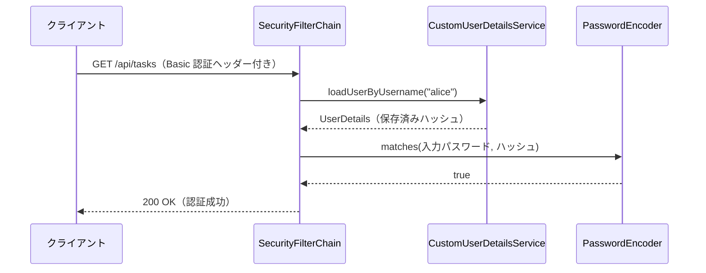

# 5-2-3 Spring Security 設定とログイン認証

📝 **このハンズオンで使う機能**: Spring Security の仕組み・`SecurityFilterChain`・パスワードハッシュ（4-1-1 で学習）・`UserDetailsService` と認証フロー（4-1-2 で学習）

## 🎯 このセクションで学ぶこと

- 暫定の全許可設定を、本物の `SecurityFilterChain` に置き換えられる
- `PasswordEncoder` でパスワードをハッシュ化して保存できる
- `UserDetailsService` を実装し、自前の `User` テーブルを Spring Security につなげられる
- ユーザー登録を実装し、登録したユーザーで認証（ログイン）できることを確認できる

セキュリティ設定の置き換えから始め、ユーザー情報の接続、登録の実装、認証の確認へと進みます。

---

## 導入: 「誰でも叩ける」から「本人だけ」へ

5-2-2 では、API のロジックに集中するために全リクエストを許可していました。ここからは本物の認証を入れます。やることは 2 つです。1 つは「パスワードを安全に保存し、照合できるようにする」こと。もう 1 つは「Spring Security に、自前の `users` テーブルからユーザーを引く方法を教える」ことです。4-1 で学んだ `SecurityFilterChain`・`PasswordEncoder`・`UserDetailsService` が、そのまま道具になります。

このセクションのゴールは、登録したユーザーが **資格情報を送ったときだけ** API にアクセスできる状態です。トークン（JWT）を使ったステートレスな仕組みは次の 5-2-4 で組みます。まずは「ユーザーを登録でき、その本人だと確認できる」という認証の土台を固めます。

### 🧠 先輩エンジニアの思考プロセス

> パスワードの扱いは、最初に正しい型を身につけるべき場所です。私が新人に必ず言うのは「平文では絶対に保存しない、ログにも出さない」。Spring Security の `PasswordEncoder` を使えば、登録時に `encode` でハッシュ化し、ログイン時に `matches` で照合する、という安全な型が自然に身につきます。bcrypt はハッシュのたびに salt が変わるので、同じパスワードでも保存値は毎回違う。だから「もう一度ハッシュして文字列比較」では照合できず、必ず `matches` を使う、というのが勘所です。

> もう一つは `UserDetailsService` の役割です。Laravel が裏で隠していた「ユーザープロバイダがユーザーを引く」処理を、Java では自分で 1 メソッド書く。最初は「面倒」と感じましたが、引き方を自分で握れるので、後から「メールアドレスでもログインさせたい」といった要望に柔軟に応えられます。隠されていないことの強みです。

---

## 📌 実装を始める前の確認

- [ ] 5-2-2 までの CRUD API が動作する
- [ ] 暫定の `SecurityConfig`（全許可）が置かれている（このセクションで置き換える）
- [ ] MySQL コンテナが起動している

---

## 🏃 実践: ユーザー登録とログイン認証

### 🏃 Step 1: PasswordEncoder と本物の SecurityConfig に置き換える

5-2-2 で置いた暫定の `SecurityConfig` を、本物に書き換えます。4-1-1 で学んだとおり、`@EnableWebSecurity` を付け、`PasswordEncoder` と `SecurityFilterChain` を Bean として定義します。認証方式は、まずは確認しやすい HTTP Basic にします（次のセクションで JWT に切り替えます）。

```java
// src/main/java/com/example/taskapp/config/SecurityConfig.java（暫定版を置き換える）
package com.example.taskapp.config;

import org.springframework.context.annotation.Bean;
import org.springframework.context.annotation.Configuration;
import org.springframework.security.config.Customizer;
import org.springframework.security.config.annotation.web.builders.HttpSecurity;
import org.springframework.security.config.annotation.web.configuration.EnableWebSecurity;
import org.springframework.security.crypto.factory.PasswordEncoderFactories;
import org.springframework.security.crypto.password.PasswordEncoder;
import org.springframework.security.web.SecurityFilterChain;

@Configuration
@EnableWebSecurity
public class SecurityConfig {

    @Bean
    public PasswordEncoder passwordEncoder() {
        return PasswordEncoderFactories.createDelegatingPasswordEncoder();
    }

    @Bean
    public SecurityFilterChain filterChain(HttpSecurity http) throws Exception {
        http
            .authorizeHttpRequests(auth -> auth
                .requestMatchers("/api/auth/**").permitAll()   // 登録・ログインは公開
                .anyRequest().authenticated()                  // それ以外は認証必須
            )
            .httpBasic(Customizer.withDefaults())              // 認証方式（今は HTTP Basic）
            .csrf(csrf -> csrf.disable());                     // API なので CSRF 無効（5-2-4 で詳説）
        return http.build();
    }
}
```

`PasswordEncoderFactories.createDelegatingPasswordEncoder()` は、4-1-1 で学んだ委譲方式のエンコーダです。保存されるハッシュは `{bcrypt}$2a$10$...` のように先頭にアルゴリズム名が付き、既定で bcrypt が使われます。

> 💡 **Spring Security 7 の書き方**: 4-1-1 でも触れたとおり、本教材は Spring Security 7 系（Spring Boot 4 が引き込む）を前提にしています。`authorizeHttpRequests(...)`・`requestMatchers(...)`・`Customizer.withDefaults()` はこの版の書き方です。`WebSecurityConfigurerAdapter` を継承する 5.x 以前の古い記事の書き方は使えません。

### 🏃 Step 2: UserDetailsService で自前のユーザーをつなぐ

Spring Security に「ユーザー名から `users` テーブルを引く方法」を教えます。4-1-2 で学んだ `UserDetailsService` の実装です。`security` パッケージに置きます。

```java
// src/main/java/com/example/taskapp/security/CustomUserDetailsService.java
package com.example.taskapp.security;

import com.example.taskapp.entity.User;
import com.example.taskapp.repository.UserRepository;
import org.springframework.security.core.userdetails.UserDetails;
import org.springframework.security.core.userdetails.UserDetailsService;
import org.springframework.security.core.userdetails.UsernameNotFoundException;
import org.springframework.stereotype.Service;

@Service
public class CustomUserDetailsService implements UserDetailsService {

    private final UserRepository userRepository;

    public CustomUserDetailsService(UserRepository userRepository) {
        this.userRepository = userRepository;
    }

    @Override
    public UserDetails loadUserByUsername(String username) {
        User user = userRepository.findByUsername(username)
                .orElseThrow(() -> new UsernameNotFoundException(username));

        // 自前の User を、Spring Security 標準の UserDetails に詰め替えて返す
        return org.springframework.security.core.userdetails.User
                .withUsername(user.getUsername())
                .password(user.getPassword())   // 保存済みのハッシュ
                .roles("USER")                   // 権限（ここでは一律 USER）
                .build();
    }
}
```

⚠️ **2 つの `User` に注意**: ここには `User` が 2 つ登場します。あなたのエンティティ `com.example.taskapp.entity.User` と、Spring Security 標準の `org.springframework.security.core.userdetails.User` です。後者は紛らわしいので、4-1-2 と同じく **完全修飾名（フルパス）** で書いて区別しています。

💡 **生成パスワードが消える**: この `UserDetailsService` を Bean として用意すると、5-1-2 で起動ログに出ていた `Using generated security password:` が出なくなります。Spring Security が「ユーザーの引き方は自前で用意された」と判断し、開発用の仮ユーザーを作らなくなるからです。これも接続できた証拠です。

### 🏃 Step 3: ユーザー登録を実装する

登録の入力 DTO と、重複時の例外、登録ロジック、エンドポイントを用意します。

```java
// src/main/java/com/example/taskapp/dto/RegisterRequest.java
package com.example.taskapp.dto;

import jakarta.validation.constraints.Email;
import jakarta.validation.constraints.NotBlank;
import jakarta.validation.constraints.Size;

public record RegisterRequest(
        @NotBlank @Size(max = 50) String username,
        @NotBlank @Email String email,
        @NotBlank @Size(min = 8, max = 100) String password   // 8 文字以上
) {
}
```

```java
// src/main/java/com/example/taskapp/exception/DuplicateUsernameException.java
package com.example.taskapp.exception;

public class DuplicateUsernameException extends RuntimeException {
    public DuplicateUsernameException(String username) {
        super("そのユーザー名は既に使われています: " + username);
    }
}
```

`GlobalExceptionHandler` に、重複を 409（Conflict）に変換するハンドラを足します。

```java
// src/main/java/com/example/taskapp/exception/GlobalExceptionHandler.java（ハンドラを追加）
import com.example.taskapp.dto.ErrorResponse;

@ExceptionHandler(DuplicateUsernameException.class)
public ResponseEntity<ErrorResponse> handleDuplicateUsername(DuplicateUsernameException ex) {
    ErrorResponse body = new ErrorResponse(HttpStatus.CONFLICT.value(), ex.getMessage(), null);
    return ResponseEntity.status(HttpStatus.CONFLICT).body(body);   // 409
}
```

登録ロジックは `AuthService` に書きます。パスワードは `PasswordEncoder.encode` でハッシュ化してから保存します（4-1-1）。

```java
// src/main/java/com/example/taskapp/service/AuthService.java
package com.example.taskapp.service;

import com.example.taskapp.dto.RegisterRequest;
import com.example.taskapp.entity.User;
import com.example.taskapp.exception.DuplicateUsernameException;
import com.example.taskapp.repository.UserRepository;
import org.springframework.security.crypto.password.PasswordEncoder;
import org.springframework.stereotype.Service;
import org.springframework.transaction.annotation.Transactional;

@Service
public class AuthService {

    private final UserRepository userRepository;
    private final PasswordEncoder passwordEncoder;

    public AuthService(UserRepository userRepository, PasswordEncoder passwordEncoder) {
        this.userRepository = userRepository;
        this.passwordEncoder = passwordEncoder;
    }

    @Transactional
    public void register(RegisterRequest request) {
        if (userRepository.existsByUsername(request.username())) {
            throw new DuplicateUsernameException(request.username());
        }
        String hashed = passwordEncoder.encode(request.password());   // ハッシュ化（平文は保存しない）
        User user = new User(request.username(), request.email(), hashed);
        userRepository.save(user);
    }
}
```

```java
// src/main/java/com/example/taskapp/controller/AuthController.java
package com.example.taskapp.controller;

import com.example.taskapp.dto.RegisterRequest;
import com.example.taskapp.service.AuthService;
import jakarta.validation.Valid;
import org.springframework.http.HttpStatus;
import org.springframework.web.bind.annotation.*;

@RestController
@RequestMapping("/api/auth")
public class AuthController {

    private final AuthService authService;

    public AuthController(AuthService authService) {
        this.authService = authService;
    }

    @PostMapping("/register")
    @ResponseStatus(HttpStatus.CREATED)
    public void register(@Valid @RequestBody RegisterRequest request) {
        authService.register(request);
    }
}
```

### 🏃 Step 4: 登録して認証を確認する

アプリを起動し（MySQL 起動済み）、ユーザーを登録します。

```bash
# 登録（201）
curl -X POST http://localhost:8080/api/auth/register \
  -H "Content-Type: application/json" \
  -d '{"username":"alice","email":"alice@example.com","password":"password123"}'
```

次に、認証の有無で結果が変わることを確かめます。

```bash
# 認証なしでタスク一覧 → 401 Unauthorized
curl -i http://localhost:8080/api/tasks

# 登録したユーザーで Basic 認証 → 200 OK
curl -u alice:password123 http://localhost:8080/api/tasks
```

認証なしでは 401、登録ユーザーの資格情報を送れば 200 が返れば成功です。これは、`UserDetailsService` が `users` テーブルから `alice` を引き、`PasswordEncoder.matches` で保存済みハッシュと照合できたことを意味します。



> ⚠️ **よくあるエラー**: 登録時に `400` が返り、`password` のエラーが出ることがあります。
>
> ```
> { "status": 400, "message": "入力内容に誤りがあります",
>   "errors": [ { "field": "password", "message": "サイズは 8 から 100 の間でなければなりません" } ] }
> ```
>
> **原因**: `RegisterRequest` の `@Size(min = 8, ...)` により、8 文字未満のパスワードが弾かれています。
>
> **対処法**: 8 文字以上のパスワードで登録します（仕様どおりの正しい挙動です）。

---

## ✅ 完成チェックリスト

- [ ] 暫定の `SecurityConfig` を、`PasswordEncoder` と `SecurityFilterChain` を持つ本物に置き換えた
- [ ] `/api/auth/**` は公開、それ以外は認証必須に設定した
- [ ] `CustomUserDetailsService` を実装し、`users` テーブルからユーザーを引けるようにした
- [ ] `RegisterRequest` / `DuplicateUsernameException` / `AuthService` / `AuthController` で登録を実装した
- [ ] 登録（201）→ 認証なしで 401 → Basic 認証で 200 を確認した

---

## ✨ まとめ

- 暫定の全許可を、`@EnableWebSecurity` + `PasswordEncoder` + `SecurityFilterChain` の本物に置き換える。`/api/auth/**` は公開、他は認証必須（4-1-1）
- パスワードは `PasswordEncoder.encode` でハッシュ化して保存し、照合は `matches` で行う（平文は保存しない・ログに出さない）
- `UserDetailsService.loadUserByUsername` を実装し、自前の `User` を Spring Security 標準の `UserDetails` に詰め替えて返す（4-1-2）。これで生成パスワードは出なくなる
- 登録ユーザーの資格情報でだけ API にアクセスできる状態になった。認証方式は今は HTTP Basic

---

次のセクションでは、この認証をステートレスな JWT に切り替えます。ログイン成功時に JWT を発行し、以降のリクエストごとに Bearer トークンを検証する仕組みを組み込みます。さらに、認証されたユーザーが自分のタスクのみ操作できるよう認可を実装し、他人のタスクには触れないようにします。
