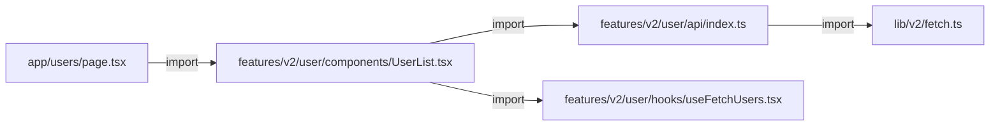
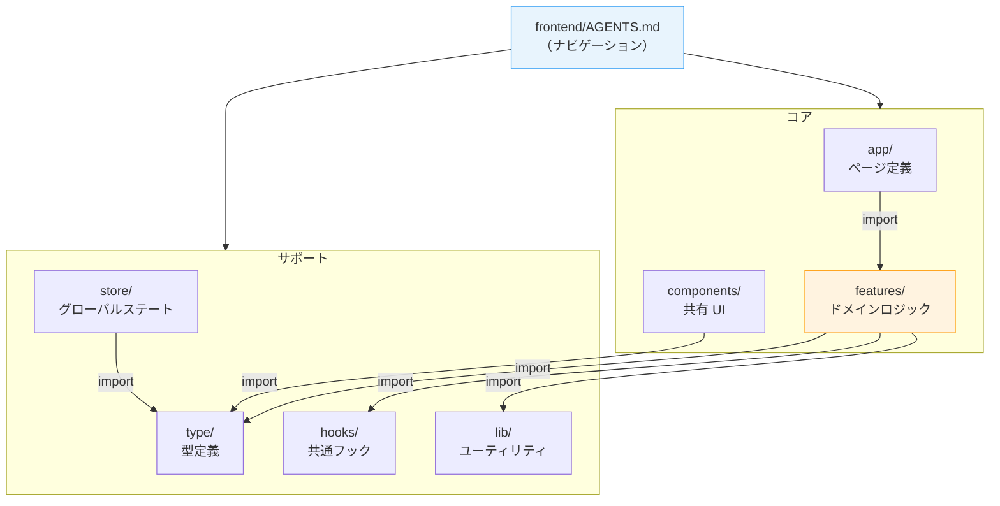

# 6-1-1 ディレクトリ構造と V1/V2 移行戦略

📝 **前提知識**: このセクションは Part 2（フロントエンド基盤）および Part 3（フロントエンドエコシステム）の内容を前提としています。

Part 2〜5 で、フロントエンド（React / Next.js / TypeScript）、バックエンド（Clean Architecture / Sanctum / 外部連携）、インフラ（AWS / Terraform / CI/CD）の各領域を体系的に学びました。この Chapter では、それらの知識を使って **LMS フロントエンドの実際のコード** を読み解きます。

| セクション | テーマ | 種類 |
|---|---|---|
| **6-1-1** | ディレクトリ構造と V1/V2 移行戦略 | 概念 |
| **6-1-2** | feature モジュールの構造 | 概念 |
| **6-1-3** | 認証フローとプロバイダー構成 | 概念 |

**Chapter ゴール**: LMS フロントエンドのコード構造とパターンを実際のコードで読み解く

📖 まず本セクションで LMS フロントエンドのディレクトリ構造の全体像と V1/V2 の移行戦略を把握し、次のセクション 6-1-2 で feature モジュールの内部構造と HttpDocument 型パターンを深掘りします。最後にセクション 6-1-3 で認証フローとプロバイダー構成を読み解き、フロントエンドのコードリーディング力を仕上げます。

## 🎯 このセクションで学ぶこと

- LMS フロントエンドの **`src/` ディレクトリ構造** と各ディレクトリの役割を理解する
- **V1（凍結）→ V2（現行）** の移行戦略と、両バージョンの構造的な違いを理解する
- **AGENTS.md** を活用したコードナビゲーションの方法を理解する

LMS フロントエンドの「地図」を手に入れるセクションです。まずディレクトリ全体を俯瞰し、次に V1/V2 の違いを構造的に理解し、最後にドキュメントを使った効率的なコード探索方法を学びます。

---

## 導入: 大規模フロントエンドは「どこに何があるか」が最初の壁

Part 2 で React のコンポーネント設計を、Part 3 で状態管理やデータフェッチのパターンを学びました。これらの概念は理解できたはずです。しかし、いざ LMS のフロントエンドコードを開いてみると、最初にぶつかるのは「ファイルが多すぎて、どこから読めばいいかわからない」という壁です。

LMS のフロントエンドには **66 個の feature モジュール** があり、それぞれが api / components / hooks などのサブディレクトリを持っています。さらに、同じ機能に対して `v1` と `v2` の2つのバージョンが共存しています。この構造を理解せずにコードを読み始めると、すぐに迷子になります。

コードリーディングの第一歩は、「全体の地図」を手に入れることです。

### 🧠 先輩エンジニアはこう考える

> LMS のフロントエンドに初めて触れたとき、ファイルの多さに圧倒されました。でも実は、ディレクトリ構造にはしっかりとした設計思想があります。`src/` 直下のディレクトリ名を見れば「どんな種類のコードがどこにあるか」がわかり、`v1` / `v2` のプレフィックスを見れば「どちらが現行コードか」が判断できます。この2つのルールを知っているだけで、コードベース全体の見通しが一気によくなります。

---

## `src/` ディレクトリの全体マップ

LMS フロントエンドの `src/` ディレクトリは、Next.js 14 の App Router をベースに、機能ごとにコードを分離する構造になっています。

```
frontend/src/
├── app/              # Next.js App Router のページ定義
├── components/       # 共有 UI コンポーネント（v1, v2）
├── config/           # 設定ファイル
├── constants/        # グローバル定数
├── features/         # ドメインロジック（v1, v2）★最重要
├── hooks/            # 共通カスタムフック（v1, v2）
├── lib/              # ユーティリティライブラリ（v1, v2）
├── providers/        # React プロバイダー（v1, v2）
├── store/            # グローバルステート管理（v1, v2）
├── type/             # グローバル型定義（v1, v2）
├── globals.css       # グローバルスタイル
└── ...
```

各ディレクトリの役割を、Part 2〜3 で学んだ概念と対応させて整理します。

| ディレクトリ | 役割 | 対応する概念（Part 2〜3） |
|---|---|---|
| `app/` | URL とページの対応を定義 | Next.js の App Router（セクション 2-4） |
| `components/` | 複数の feature で共有する UI 部品 | React コンポーネント（セクション 2-3） |
| `features/` | ドメインごとの API・コンポーネント・フック | feature ベースのコード分割 |
| `hooks/` | feature を横断する共通フック | カスタムフック（セクション 2-3） |
| `lib/` | HTTP 通信・ユーティリティ関数 | データフェッチ基盤（セクション 3-1） |
| `providers/` | アプリ全体を囲むプロバイダー | React Context / Provider（セクション 2-3） |
| `store/` | グローバルステート（Zustand） | 状態管理（セクション 3-1） |
| `type/` | アプリ横断の型定義 | TypeScript の型（セクション 2-2） |
| `config/` | API エンドポイント等の設定値 | — |
| `constants/` | Enum 等のグローバル定数 | — |

🔑 **最も重要なディレクトリは `features/`** です。LMS の機能ごとのビジネスロジック（API 呼び出し、画面コンポーネント、カスタムフック）はすべてここに集約されています。日常の開発で最も頻繁に触るのもこのディレクトリです。

### `app/` と `features/` の関係

Part 2 のセクション 2-4 で学んだように、Next.js の App Router は `app/` ディレクトリのフォルダ構造がそのまま URL になります。LMS では、`app/` はページの「枠」を定義する場所であり、実際のビジネスロジックや UI コンポーネントは `features/` から import して使います。



この分離により、URL 構造の変更とビジネスロジックの変更を独立して行えます。`app/` はルーティングに専念し、`features/` がドメインロジックを担う、という責務の分離です。

💡 **TIP**: この構造は、Part 4 で学んだバックエンドの Clean Architecture と同じ考え方です。バックエンドでは Route → Controller → UseCase と責務を分離していましたが、フロントエンドでは `app/`（ルーティング）→ `features/`（ドメインロジック）→ `lib/`（インフラ層）という層構造になっています。

---

## V1 と V2: 2つのバージョンが共存する理由

LMS のフロントエンドでは、`features/`、`hooks/`、`lib/`、`providers/`、`store/`、`type/` の各ディレクトリに `v1/` と `v2/` のサブディレクトリが存在します。

```
features/
├── v1/          # 凍結（レガシー）
│   ├── auth/
│   ├── employee/
│   ├── exam/
│   └── ... (16 feature)
└── v2/          # 現行（アクティブ開発）
    ├── aiChatbot/
    ├── curriculum/
    ├── employee/
    └── ... (66 feature)
```

⚠️ **注意**: **v1 ディレクトリは凍結** されており、すべての開発は v2 で行います。これは AGENTS.md にも明記されている最重要ルールです。

### なぜ V1 が残っているのか

V1 は LMS の初期に構築されたコードです。プロダクトが成長する中で、以下のような課題が生じました。

| 課題 | V1 の状態 | V2 での改善 |
|---|---|---|
| 状態管理の複雑化 | React Context API で feature ごとに `contexts/` を持つ | Zustand で一元管理（`store/v2/`） |
| API 型安全性 | 基本的な HttpDocument 型 | ISR タグ対応・CSRF リトライ付きの拡張 HttpDocument |
| 認証エラーハンドリング | onSuccess / onError のみ | onAuthError コールバック追加 |
| テストデータ | `dummyData/` を feature 内に保持 | feature 外で管理 |

V1 のコードを一度に V2 に書き換えるのはリスクが大きいため、**新機能は V2 で開発し、V1 は既存機能の維持のみ** という戦略が採られています。V1 の feature は 16 個に対し、V2 は 66 個。現在の開発は圧倒的に V2 が中心です。

### V1 と V2 の feature 構造の違い

構造的な違いを比較すると、設計思想の進化が見えてきます。

**V1 の feature 構造**:

```
features/v1/employee/
├── api/           # API 呼び出し
├── components/    # UI コンポーネント
├── constants/     # 定数
├── contexts/      # React Context による状態管理 ← V1 固有
├── dummyData/     # テスト用ダミーデータ ← V1 固有
├── hooks/         # カスタムフック
└── types/         # 型定義
```

**V2 の feature 構造**:

```
features/v2/employee/
├── api/           # API 呼び出し（HttpDocument 拡張版）
├── components/    # UI コンポーネント
└── constants/     # 定数
```

```
features/v2/aiChatbot/
├── api/           # API 呼び出し
├── components/    # UI コンポーネント
├── constants/     # 定数
├── hooks/         # カスタムフック
├── store/         # feature スコープのステート ← V2 の新パターン
└── utils/         # ユーティリティ関数
```

🔑 **V2 の設計方針**: feature ごとに必要なサブディレクトリだけを持つ。`api/` と `components/` はほぼ全 feature にありますが、`hooks/`、`store/`、`utils/` は必要な feature にのみ存在します。V1 のように全 feature が `contexts/` や `dummyData/` を持つ「テンプレート型」から、**必要最小限の「オンデマンド型」** に変わりました。

### kit ディレクトリ: V1 時代のコンポーネントライブラリ

`components/v1/kit/` は、V1 時代に構築された共有コンポーネントライブラリです。

```
components/v1/kit/
├── elements/    # ボタン、バッジ等の基本要素
├── forms/       # フォーム関連コンポーネント
└── layout/      # レイアウトコンポーネント
```

V2 では、この役割を `components/v2/` が担っています。加えて、HeroUI や MUI といった外部 UI ライブラリ（セクション 3-2 で学習）を組み合わせて使う方針に移行しています。V1 の kit は、V1 の feature から参照されているため残っていますが、新規開発で使うことはありません。

---

## `lib/v2/`: フロントエンドのインフラ層

`lib/` ディレクトリは、HTTP 通信やユーティリティ関数を提供する「フロントエンドのインフラ層」です。

```
lib/
├── v1/
│   └── fetch.ts     # V1 の HTTP クライアント
└── v2/
    └── fetch.ts     # V2 の HTTP クライアント ★
```

`lib/v2/fetch.ts` は LMS フロントエンドの **最も重要なファイルの1つ** です。すべての feature の API 呼び出しは、このファイルの `http()` 関数を経由します。ここで定義されている `HttpDocument` 型がフロントエンド全体の型安全性を支えています（詳細はセクション 6-1-2 で解説します）。

V1 と V2 の `fetch.ts` の主な違いは以下のとおりです。

| 機能 | V1 | V2 |
|---|---|---|
| 基本的な HTTP 通信 | ○ | ○ |
| HttpDocument 型による型付け | ○ | ○ |
| CSRF トークンの自動リトライ（419 対応） | — | ○ |
| CSRF トークンのプリフェッチ | — | ○ |
| Next.js ISR タグによるキャッシュ制御 | — | ○ |
| onAuthError コールバック | — | ○ |
| サーバー/クライアント環境の自動判定 | — | ○ |

V2 の `fetch.ts` は、セクション 3-1 で学んだデータフェッチの概念を、LMS のプロダクション要件（CSRF 対策、認証エラー処理、ISR 連携）に合わせて拡張したものです。

---

## AGENTS.md によるコードナビゲーション

LMS リポジトリには、コードベースの構造を説明するドキュメントファイルが配置されています。その中でも `frontend/AGENTS.md` は、フロントエンドの各ディレクトリにあるガイドドキュメントへの案内役を果たします。

```markdown
<!-- frontend/AGENTS.md（抜粋） -->
## ディレクトリ別詳細ガイド

### コア機能
- **ページ実装**: src/app/CLAUDE.md
- **UI コンポーネント**: src/components/CLAUDE.md
- **ドメインロジック**: src/features/CLAUDE.md

### サポート機能
- **共通フック**: src/hooks/CLAUDE.md
- **ライブラリ**: src/lib/CLAUDE.md
- **状態管理**: src/store/CLAUDE.md
- **型定義**: src/type/CLAUDE.md
```

AGENTS.md は「コア機能」と「サポート機能」の2つに分類し、各ディレクトリの詳細ガイドへのパスを示しています。新しい機能の実装や既存コードの調査を始めるとき、まずこのファイルを参照することで、関連するディレクトリを素早く特定できます。

### 🧠 先輩エンジニアはこう考える

> Claude Code で LMS の開発をするとき、AGENTS.md の存在は非常に大きいです。Claude Code はリポジトリ内の CLAUDE.md や AGENTS.md を自動的に読み込むので、「この feature の API はどこにある？」と聞くだけで、適切なディレクトリ構造を踏まえた回答が返ってきます。人間がコードを読むときも同じで、AGENTS.md を起点にすれば「どこから読み始めればいいか」が明確になります。

### ディレクトリ構造とドキュメントの全体関係

LMS フロントエンドのコードとドキュメントの関係を図にすると、以下のようになります。



**コードの依存方向** に注目してください。`app/` → `features/` → `lib/` という一方向の流れがあり、これは Part 4 で学んだバックエンドの Clean Architecture（Controller → UseCase → Repository）と同じ考え方です。上位の層は下位の層に依存しますが、逆方向の依存はありません。

---

## ✨ まとめ

- LMS フロントエンドの `src/` は、`app/`（ルーティング）、`features/`（ドメインロジック）、`lib/`（インフラ層）を中心とした層構造になっている
- **`features/` が最重要ディレクトリ** であり、66 個の feature モジュールに API・コンポーネント・フックが集約されている
- V1 は凍結、V2 が現行。V1 → V2 の移行で、状態管理が Context API から Zustand に、feature 構造が「テンプレート型」から「オンデマンド型」に進化した
- `lib/v2/fetch.ts` がすべての API 通信の基盤であり、HttpDocument 型による型安全性・CSRF リトライ・ISR タグ対応を提供している
- `frontend/AGENTS.md` を起点にすることで、目的のコードに素早くたどり着ける

---

次のセクションでは、`features/v2/` の中に入り、feature モジュールの標準構成と HttpDocument 型による型安全な API 呼び出しパターンを詳しく読み解きます。
