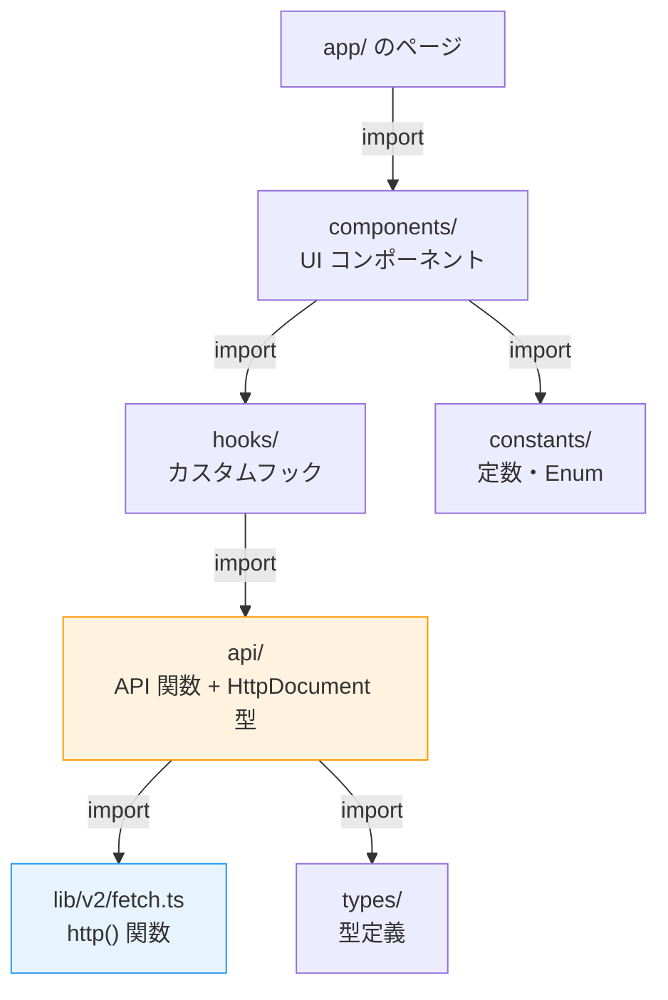
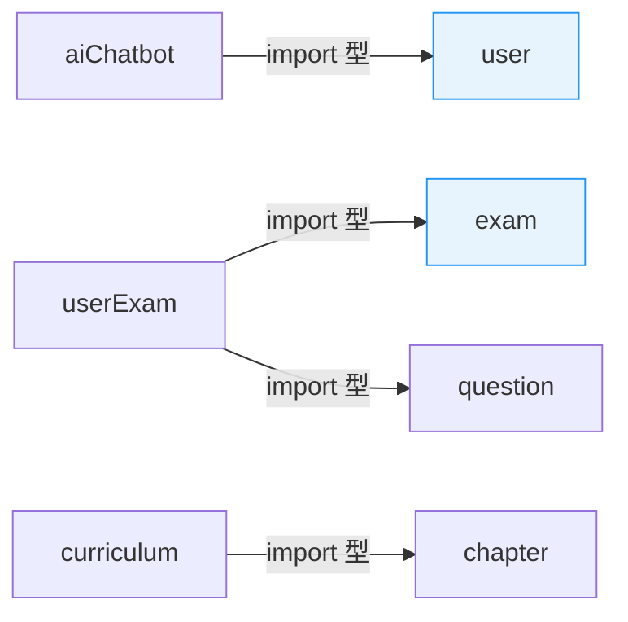

# 6-1-2 feature モジュールの構造

📝 **前提知識**: このセクションはセクション 6-1-1（ディレクトリ構造と V1/V2 移行戦略）の内容を前提としています。

## 🎯 このセクションで学ぶこと

- feature ディレクトリの **標準構成**（api / components / hooks / constants / types / utils）と各サブディレクトリの役割を理解する
- **HttpDocument 型** による型安全な API 呼び出しパターン（PathParams / QueryParams / RequestBody / Response の4パラメータ）を理解する
- 実際の feature コードを読み、**API 定義の3つのパターン**（一覧取得・単体取得・作成）を理解する
- **feature 間の依存関係** と import の方向性を理解する

セクション 6-1-1 でフロントエンド全体の地図を手に入れました。このセクションでは、その中で最も重要な `features/v2/` の内部に入り、1つの feature がどのような構造で成り立っているかを読み解きます。

---

## 導入: 66 個の feature をどう読むか

セクション 6-1-1 で確認したように、LMS の `features/v2/` には 66 個の feature モジュールがあります。aiChatbot、curriculum、employee、exam、schedule、user など、LMS のドメインごとに1つの feature が対応しています。

66 個の feature を1つずつ読むのは現実的ではありません。しかし、すべての feature は **共通のパターン** に従って構築されています。このパターンを理解すれば、どの feature を開いても「api/ はこういう構造だろう」「hooks/ にはこういうコードがあるだろう」と予測しながら読めるようになります。

### 🧠 先輩エンジニアはこう考える

> コードリーディングのコツは「パターンを見つけること」です。LMS のフロントエンドでは、feature の構造が驚くほど統一されています。1つの feature を深く読めば、他の 65 個の feature も同じ読み方ができるんです。逆に言えば、パターンを知らずに個別の feature を読もうとすると、毎回ゼロから構造を理解する羽目になります。

---

## feature の標準構成

V2 の feature は、以下のサブディレクトリで構成されます。すべてのサブディレクトリが必須ではなく、feature の規模や性質に応じて必要なものだけを持ちます。

| サブディレクトリ | 役割 | 存在頻度 |
|---|---|---|
| `api/` | バックエンド API の呼び出し関数と型定義 | ほぼ全 feature |
| `components/` | feature 固有の UI コンポーネント | ほぼ全 feature |
| `hooks/` | feature 固有のカスタムフック（データ取得・ロジック） | 多くの feature |
| `constants/` | feature 固有の定数・Enum | 多くの feature |
| `types/` | feature 固有の型定義 | 一部の feature |
| `schema/` | フォームバリデーションスキーマ（Yup / Zod） | 一部の feature |
| `store/` | feature スコープの Zustand ストア | 一部の feature |
| `utils/` | feature 固有のユーティリティ関数 | 一部の feature |

### 具体例: 2つの feature の構造比較

実際の feature を2つ見てみましょう。

**curriculum（学習カリキュラム管理）** — 標準的な中規模 feature:

```
features/v2/curriculum/
├── api/                 # 7 ファイル
│   ├── fetchPublicCurriculum.ts
│   ├── searchCurriculums.ts
│   ├── update.ts
│   ├── destroy.ts
│   ├── reorder.ts
│   └── ...
├── components/          # 14 ファイル
│   ├── CurriculumList.tsx
│   ├── PublicCurriculumCard.tsx
│   ├── UpdateCurriculumModal.tsx
│   ├── Sidebar.tsx
│   └── ...
├── hooks/               # 4 ファイル
│   ├── useFetchCurriculums.tsx
│   ├── useCurriculumDrag.ts
│   └── ...
└── types/               # 1 ファイル
    └── LocalStoragePrevCurriculum.ts
```

**employee（従業員管理）** — 大規模 feature:

```
features/v2/employee/
├── api/                 # 13 ファイル
│   ├── fetchCoachDetail.ts
│   ├── fetchCoachMeetings.ts
│   ├── fetchCoaches.ts
│   ├── fetchEmployeeMe.ts
│   ├── update.ts
│   ├── forceDeleteEmployee.ts
│   └── ...
├── components/          # 9 ファイル
│   ├── CoachProfile.tsx
│   ├── CoachListTable.tsx
│   ├── CoachInfoEditModal.tsx
│   ├── CsEmployeeListTable.tsx
│   └── ...
└── constants/           # 3 ファイル
    ├── coachProfileTabs.ts
    ├── employeeRole.ts
    └── EmployeePriority.ts
```

2つの feature を比較すると、共通点と違いが見えます。

🔑 **共通点**: どちらも `api/` と `components/` を持ち、API 関数名は `fetch*`（取得）、`update`（更新）、`destroy`（削除）のような命名規則に従っています。

🔑 **違い**: curriculum は `hooks/` と `types/` を持ちますが、employee は `constants/` を持っています。これは feature ごとの要件の違いを反映しています。curriculum はドラッグ操作やデータ取得のロジックが複雑なので hooks が必要であり、employee はロール（コーチ、CS 等）の定義に constants が必要です。

### feature 内のデータフロー

1つの feature の中で、各サブディレクトリのコードがどのように連携するかを見てみましょう。



データの流れは **上から下へ一方向** です。ページが components を使い、components が hooks を呼び、hooks が api を呼び、api が lib の http() 関数を呼びます。この一方向の依存は、Part 4 のバックエンド Clean Architecture（Controller → UseCase → Service → Repository）と同じ設計原則です。

---

## HttpDocument 型: API 呼び出しの型安全パターン

LMS フロントエンドの API 呼び出しの中核にあるのが、`lib/v2/fetch.ts` で定義されている **HttpDocument 型** です。この型は、API リクエストとレスポンスの「契約」を TypeScript の型システムで表現します。

### HttpDocument 型の定義

```typescript
// lib/v2/fetch.ts
export type HttpDocument<
  PathParams = Record<string, string>,      // URL パスパラメータ
  QueryParams = Record<string, unknown>,    // クエリ文字列パラメータ
  RequestBody = Record<string, unknown>,    // リクエストボディ
  Response = any,                           // レスポンスの型
> = {
  params: {
    pathParams?: PathParams
    queryParams?: QueryParams
    requestBody?: RequestBody
  }
  response: Response
  options?: {
    callbacks?: {
      onSuccess?: (data: Response) => void
      onError?: (error: Error) => void
      onAuthError?: () => void
    }
    tags?: string[]  // Next.js ISR のリバリデーション用タグ
  }
}
```

HttpDocument は **4つのジェネリクスパラメータ** を持ちます。

| パラメータ | 用途 | 例 |
|---|---|---|
| `PathParams` | URL 中の `:paramName` を置換する値 | `{ workspaceId: string }` |
| `QueryParams` | `?key=value` のクエリ文字列 | `{ page?: number }` |
| `RequestBody` | POST / PUT のリクエストボディ | `{ title: string, input: string }` |
| `Response` | API レスポンスの型 | `{ data: User[], meta: Pagination }` |

セクション 2-2 で学んだ TypeScript のジェネリクスが、ここで実践的に使われています。4つのパラメータを型で定義することで、**API 関数の呼び出し側で間違ったパラメータを渡すとコンパイルエラーになる** という型安全性を実現しています。

### `http()` 関数の概要

HttpDocument 型と組み合わせて使うのが、`http()` 関数です。

```typescript
// lib/v2/fetch.ts
export async function http<T extends HttpDocument>(
  path: string,
  method: string = 'GET',
  params?: T['params'],
  options?: T['options'],
): Promise<T['response']>
```

この関数は以下の処理を内部で行います。

1. **パスパラメータの置換**: `/api/workspaces/:workspaceId/users` の `:workspaceId` を実際の値に置き換え
2. **クエリ文字列の構築**: オブジェクトを `?page=1&status=active` の形式に変換
3. **CSRF トークンの管理**: POST / PUT / DELETE 時にトークンを自動付与。419（トークン期限切れ）の場合は再取得してリトライ
4. **認証エラーの処理**: 401 の場合に onAuthError コールバックを呼び出すか、ログインページにリダイレクト
5. **サーバー/クライアント判定**: Next.js の Server Components と Client Components で異なるヘッダー・Cookie の処理を自動切り替え

💡 **TIP**: セクション 3-1 で学んだ SWR のデータフェッチは「キャッシュとリバリデーション」を管理しますが、`http()` 関数は「HTTP 通信そのもの」を管理します。SWR が「いつ取得するか」を決め、`http()` が「どう取得するか」を実行する、という役割分担です。

---

## API 定義の3つのパターン

feature の `api/` ディレクトリにあるファイルは、3つの基本パターンに分類できます。実際の aiChatbot feature のコードで見てみましょう。

### パターン 1: 一覧取得（GET + ページネーション）

```typescript
// features/v2/aiChatbot/api/index.ts
export type IndexHttpDocument = HttpDocument<
  { workspaceId: string },           // PathParams: URL 中の :workspaceId
  { page?: number },                  // QueryParams: ページ番号
  undefined,                          // RequestBody: GET なので不要
  {                                   // Response: データ配列 + ページ情報
    data: {
      id: string
      type: { value: number; label: string }
      // ...
    }[]
    meta: Pagination
  }
>

export function index(
  params: IndexHttpDocument['params'],
  options?: IndexHttpDocument['options'],
) {
  return http<IndexHttpDocument>(
    `/api/workspaces/:workspaceId/ai-chatbot/conversations`,
    'GET',
    params,
    options,
  )
}
```

**読み方のポイント**:

- `IndexHttpDocument` という型で、このエンドポイントの「契約」を定義しています
- `PathParams` に `{ workspaceId: string }` があるので、URL の `:workspaceId` が実際の値に置換されます
- `Response` に `data` 配列と `meta: Pagination` があるのは、バックエンドの Laravel ページネーションレスポンスに対応しています（Part 4 で学んだ形式）
- `RequestBody` が `undefined` なのは、GET リクエストにボディがないためです

### パターン 2: フィルター付き取得（GET + パスパラメータ複数）

```typescript
// features/v2/aiChatbot/api/fetchByUserId.ts
export type FetchByUserIdHttpDocument = HttpDocument<
  { workspaceId: string; userId: string },  // PathParams: 2つ
  { page?: number },                         // QueryParams
  undefined,                                 // RequestBody
  {
    data: ConversationType[]
    meta: Pagination
  }
>

export function fetchByUserId(
  params: FetchByUserIdHttpDocument['params'],
  options?: FetchByUserIdHttpDocument['options'],
) {
  return http<FetchByUserIdHttpDocument>(
    `/api/workspaces/:workspaceId/ai-chatbot/conversations/user/:userId`,
    'GET',
    params,
    options,
  )
}
```

パターン 1 との違いは `PathParams` が2つになった点です。URL の `:workspaceId` と `:userId` の両方が置換されます。

### パターン 3: 作成（POST + リクエストボディ）

```typescript
// features/v2/aiChatbot/api/store.ts
export type StoreHttpDocument = HttpDocument<
  { workspaceId: string },                  // PathParams
  undefined,                                 // QueryParams: POST なので不要
  {                                          // RequestBody: 作成するデータ
    type: AiChatbotType
    title: string
    input: string
    output: string
    model: string
    input_tokens: number
    output_tokens: number
    response_time_ms: number
  },
  undefined                                  // Response: 204 No Content
>

export function store(
  params: StoreHttpDocument['params'],
  options?: StoreHttpDocument['options'],
) {
  return http<StoreHttpDocument>(
    `/api/workspaces/:workspaceId/ai-chatbot/conversations`,
    'POST',
    params,
    options,
  )
}
```

**読み方のポイント**:

- `QueryParams` が `undefined` になり、代わりに `RequestBody` にデータが入ります
- HTTP メソッドが `'POST'` に変わります
- `Response` が `undefined` なのは、作成成功時にレスポンスボディがない（204 No Content）ためです
- 関数名の `store` は、Laravel の命名規則（`store` = 新規作成）に合わせています

### 3つのパターンの使い分け

| パターン | HTTP メソッド | PathParams | QueryParams | RequestBody | Response | 用途 |
|---|---|---|---|---|---|---|
| 一覧取得 | GET | ○ | ○（ページ番号等） | — | データ配列 + Pagination | リスト画面 |
| フィルター取得 | GET | ○（複数） | ○ | — | データ配列 + Pagination | 絞り込み表示 |
| 作成 | POST | ○ | — | ○ | — or 作成データ | フォーム送信 |

この他に `update`（PUT / PATCH）や `destroy`（DELETE）のパターンもありますが、構造は作成パターンとほぼ同じです。HTTP メソッドと RequestBody の有無が変わるだけで、HttpDocument 型の使い方は共通です。

🔑 API 定義のパターンを知っていれば、新しい feature の `api/` ディレクトリを開いたとき、**ファイル名と HttpDocument の型定義** だけでそのエンドポイントの仕様がわかります。コードの中身を深く読む必要はありません。

---

## hooks/: SWR と feature ロジックの橋渡し

feature の `hooks/` ディレクトリには、`api/` の関数を SWR（セクション 3-1 で学習）で包んだカスタムフックが置かれます。

```typescript
// features/v2/aiChatbot/hooks/useAiConversations.ts（構造を簡略化）
export default function useAiConversations(
  workspaceId: string,
  userId: string,
  swrOptions?: SWRConfiguration,
) {
  const result = useSWRInfinite<FetchByUserIdHttpDocument['response']>(
    (pageIndex, previousPageData) => {
      // ページネーションロジック: 最終ページに達したら null を返して取得停止
      return {
        pathParams: { workspaceId, userId },
        queryParams: { page: pageIndex + 1 },
      }
    },
    (params) => fetchByUserId(params),
    swrOptions,
  )

  return {
    ...result,
    conversations: result.data?.flatMap((page) => page.data) ?? [],
    hasMore: /* ページネーション判定 */,
    loadMore: () => result.setSize((prev) => prev + 1),
  }
}
```

**読み方のポイント**:

- `useSWRInfinite` はセクション 3-1 で学んだ SWR の無限スクロール用フックです
- ジェネリクスに `FetchByUserIdHttpDocument['response']` を渡すことで、レスポンスの型が自動的に推論されます
- 戻り値で `conversations`（全ページのデータを結合）、`hasMore`（次ページの有無）、`loadMore`（次ページ読み込み関数）を公開しています
- components はこのフックを呼ぶだけで、ページネーション・キャッシュ・リバリデーションの詳細を意識する必要がありません

### api/ と hooks/ の役割分担

| 層 | 責務 | 例 |
|---|---|---|
| `api/` | HTTP リクエストの定義（何を取得するか） | `fetchByUserId()` — URL・メソッド・型の定義 |
| `hooks/` | データ取得のライフサイクル管理（いつ・どう取得するか） | `useAiConversations()` — キャッシュ・ページネーション・ローディング状態 |
| `components/` | UI の描画（データをどう見せるか） | `ConversationList` — リスト表示・スクロール検知 |

この3層の分離により、たとえば API のエンドポイントが変わっても `api/` だけを修正すればよく、ページネーションのロジックが変わっても `hooks/` だけを修正すれば済みます。

---

## constants/: 型安全な定数パターン

feature の `constants/` には、その feature で使う定数や Enum が定義されています。LMS では、TypeScript の `as const` アサーションを活用した型安全な定数パターンが使われています。

```typescript
// features/v2/aiChatbot/constants/aiChatbot.ts
export const AI_CHATBOT_DAILY_LIMIT = 100
export const AI_CHATBOT_MAX_INPUT_TOKENS = 2000

export const AI_CHATBOT_TYPE = {
  QUESTION: 'question',
} as const
export type AiChatbotType = typeof AI_CHATBOT_TYPE[keyof typeof AI_CHATBOT_TYPE]

export const STREAM_STATE = {
  IDLE: 'idle',
  STREAMING: 'streaming',
  DONE: 'done',
  ERROR: 'error',
} as const
export type StreamState = typeof STREAM_STATE[keyof typeof STREAM_STATE]
```

`as const` と `typeof` + `keyof typeof` の組み合わせは、セクション 2-2 で学んだ TypeScript のリテラル型を活用したパターンです。これにより、`StreamState` 型は `'idle' | 'streaming' | 'done' | 'error'` のユニオン型になり、typo（タイプミス）をコンパイル時に検出できます。

💡 **TIP**: バックエンドの Laravel では PHP の Enum（`enum StreamState: string`）で同じことを実現しています。フロントエンドの `as const` パターンは、TypeScript における同等の手法です。

---

## feature 間の依存関係

feature モジュールは基本的に **独立** していますが、一部の feature は他の feature の型や API を参照することがあります。



依存の方向には原則があります。

🔑 **原則**: feature 間の依存は **型定義と定数の参照のみ** に限定します。ある feature が別の feature の `components/` や `hooks/` を直接 import することは避けます。複数の feature で共有するコンポーネントは `components/v2/`（共有 UI）に、共有するフックは `hooks/v2/`（共通フック）に配置します。

この原則を守ることで、feature の独立性が保たれ、1つの feature を修正しても他の feature への影響を最小限に抑えられます。

---

## ✨ まとめ

- V2 feature の標準構成は `api/` + `components/` を核に、`hooks/`・`constants/`・`types/`・`store/`・`utils/` を必要に応じて持つ「オンデマンド型」
- **HttpDocument 型** は PathParams・QueryParams・RequestBody・Response の4パラメータで API の契約を型レベルで定義し、呼び出し側の型安全性を保証する
- API 定義は一覧取得（GET + Pagination）・フィルター取得（GET + 複数 PathParams）・作成（POST + RequestBody）の3パターンが基本
- `api/`（何を取得するか）→ `hooks/`（いつ・どう取得するか）→ `components/`（どう見せるか）の3層分離により、変更の影響範囲を限定できる
- feature 間の依存は型定義と定数の参照に限定し、コンポーネントやフックの直接参照は共有ディレクトリに配置する

---

次のセクションでは、サーバーサイド認証（requireUser / requireEmployee）、Zustand の actor-store、Provider 構成を読み解き、LMS フロントエンドの認証フローとプロバイダー構成の全体像を理解します。
