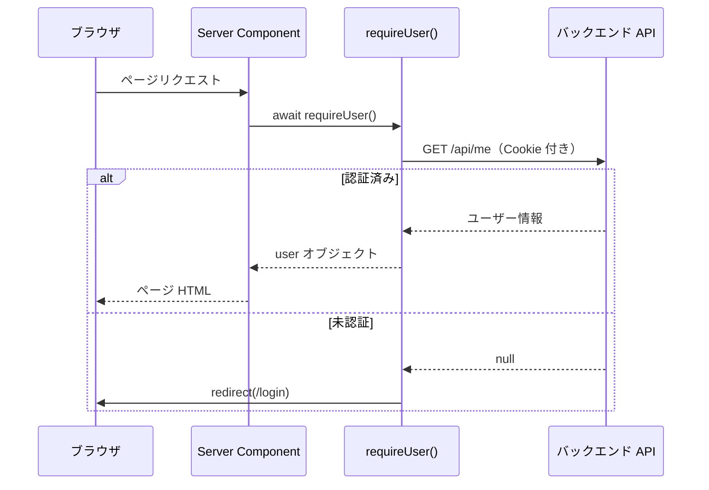
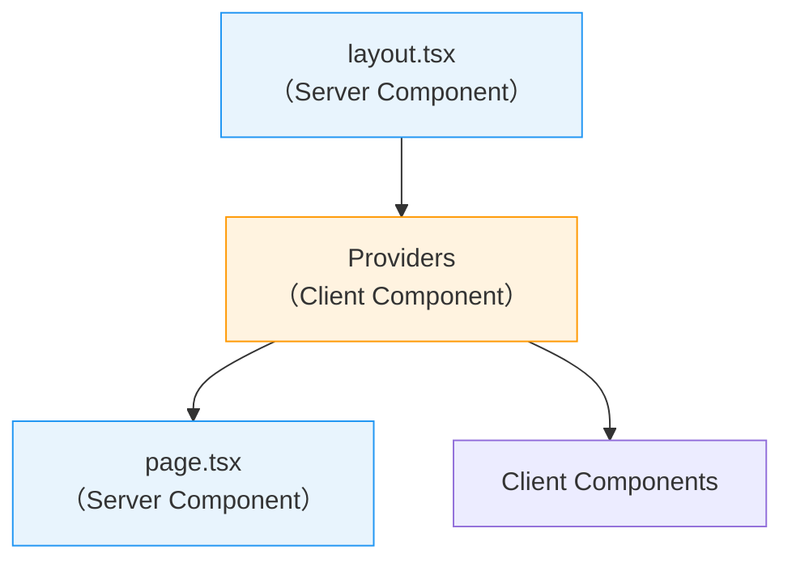
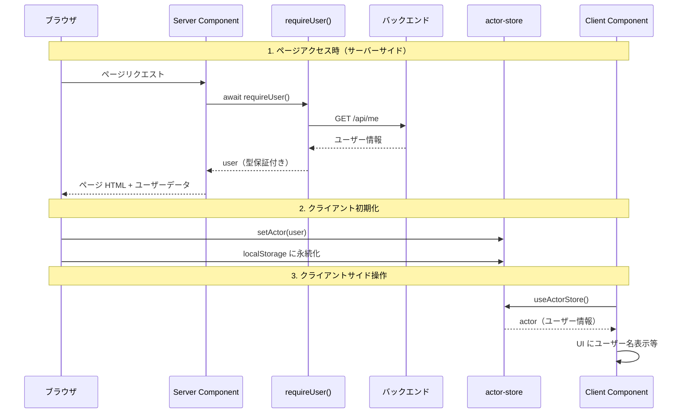

# 6-1-3 認証フローとプロバイダー構成

📝 **前提知識**: このセクションはセクション 6-1-1（ディレクトリ構造と V1/V2 移行戦略）の内容を前提としています。

## 🎯 このセクションで学ぶこと

- **Server Components でのサーバーサイド認証**（`requireUser` / `requireEmployee`）の仕組みと、React の `cache()` による重複リクエスト防止を理解する
- **Zustand の actor-store** による認証状態のクライアントサイド管理と、`persist` ミドルウェアによる localStorage 永続化を理解する
- **Provider 構成**（HeroUIProvider / ToastProvider / LoadingProvider）のネスト構造と各プロバイダーの役割を理解する
- サーバーサイド認証とクライアントサイド状態の **役割分担** を理解する

このセクションでは、LMS フロントエンドの「入口」である認証の仕組みを読み解きます。ユーザーがログインしていなければページを表示させない仕組み、ログイン後のユーザー情報の管理、そしてアプリ全体を囲むプロバイダー構成を順に見ていきます。

---

## 導入: 「ログインしていないユーザー」をどう弾くか

Web アプリケーションでは、ほとんどのページがログイン済みユーザーにのみアクセスを許可します。Part 4 で学んだバックエンドでは、Laravel Sanctum のミドルウェアがこの役割を担っていました。リクエストにトークンがなければ 401 を返す、というシンプルな仕組みです。

フロントエンドでも同様の「認証ガード」が必要です。しかし、Next.js 14 の App Router では、ページが **Server Components** と **Client Components** の2種類に分かれるため、認証の仕組みも2つの層で考える必要があります。

| 層 | 実行環境 | 認証の役割 | 使用技術 |
|---|---|---|---|
| サーバーサイド | Node.js サーバー | ページアクセス時にユーザー情報を取得し、未認証ならリダイレクト | `requireUser()` / `requireEmployee()` |
| クライアントサイド | ブラウザ | ログイン後のユーザー情報を保持し、UI に反映 | Zustand actor-store |

### 🧠 先輩エンジニアはこう考える

> 認証は「サーバーで確実にチェックし、クライアントで便利に使う」が鉄則です。クライアントサイドだけで認証をチェックすると、JavaScript を無効にしたり devtools で状態を書き換えたりすることで突破できてしまいます。LMS ではサーバーサイドの `requireUser()` が「門番」として確実にチェックし、Zustand の actor-store はチェック済みのユーザー情報をクライアントに配るだけ、という役割分担になっています。

---

## サーバーサイド認証: `requireUser()` と `requireEmployee()`

LMS のサーバーサイド認証は `hooks/v2/auth.ts` に実装されています。このファイルは Next.js の Server Components から呼び出される認証ユーティリティです。

### `requireUser()` の実装

```typescript
// hooks/v2/auth.ts
import { cache } from 'react'
import { redirect } from 'next/navigation'
import { fetchMeAsUser } from '@/features/v2/user/api/fetchMe'

export const requireUser = cache(async () => {
  const user = await fetchMeAsUser()

  if (!user) {
    const currentPath = /* 現在のパスを取得 */
    redirect(`/login?redirect=${encodeURIComponent(currentPath)}`)
  }

  return user as typeof user & { id: string }
})
```

**読み方のポイント**:

1. **`cache()` で包んでいる理由**: React の `cache()` 関数は、同一リクエスト内で同じ関数を複数回呼んでもAPIリクエストは1回だけ実行するメモ化機能です。1つのページで複数の Server Components が `requireUser()` を呼んでも、バックエンドへの認証 API は1回しか実行されません

2. **`fetchMeAsUser()` の役割**: セクション 6-1-2 で学んだ HttpDocument パターンで定義された API 関数です。バックエンドの `/api/me` エンドポイント（Sanctum 認証付き）を呼び出し、ログイン中のユーザー情報を取得します

3. **未認証時のリダイレクト**: ユーザー情報が取得できなかった場合、ログインページにリダイレクトします。`redirect` パラメータに現在のパスを含めることで、ログイン後に元のページに戻れます

4. **戻り値の型**: `user as typeof user & { id: string }` により、戻り値のユーザーオブジェクトには必ず `id` が存在することが型レベルで保証されます

### `requireEmployee()` の実装

```typescript
// hooks/v2/auth.ts
export const requireEmployee = cache(async () => {
  const employee = await fetchEmployeeMe()

  if (!employee) {
    const currentPath = /* 現在のパスを取得 */
    redirect(`/employee/login?redirect=${encodeURIComponent(currentPath)}`)
  }

  return employee as typeof employee & { id: string }
})
```

`requireUser()` と同じパターンですが、以下の点が異なります。

| | `requireUser()` | `requireEmployee()` |
|---|---|---|
| 対象 | 受講生（User） | 従業員（Employee） |
| API エンドポイント | `/api/me` | `/api/employee/me` |
| リダイレクト先 | `/login` | `/employee/login` |

LMS では受講生と従業員が別々のログイン画面・別々の API エンドポイントを持つため、認証関数も2つ用意されています。

### Server Components での使い方

```tsx
// app/dashboard/page.tsx（イメージ）
export default async function DashboardPage() {
  const user = await requireUser()  // 未認証ならここでリダイレクト

  return <Dashboard userId={user.id} />
}
```

`requireUser()` は `async` 関数なので、Server Components の中で `await` で呼び出します。この1行で「未認証ならリダイレクト、認証済みならユーザー情報を取得」が完了します。



⚠️ **注意**: `requireUser()` は **Server Components 専用** です。Client Components（`'use client'` が宣言されたコンポーネント）では使えません。Client Components でユーザー情報が必要な場合は、次に説明する actor-store を使います。

---

## Zustand の actor-store: クライアントサイドの認証状態

サーバーサイド認証がページアクセス時の「門番」だとすれば、Zustand の actor-store はログイン後の「名札」です。クライアントサイドでユーザー情報を保持し、どのコンポーネントからでもアクセスできるようにします。

### actor-store の定義

```typescript
// store/v2/actor-store.ts
import { create } from 'zustand'
import { persist } from 'zustand/middleware'

export type ActorState = {
  actor: Actor | null           // ログイン中のユーザーまたは従業員
  actorType: ActorType | null   // 'user' または 'employee'
  isManualLogout: boolean       // 手動ログアウトフラグ
}

export type ActorAction = {
  setActor: (actor: Actor | null) => void
  setActorType: (actorType: ActorType | null) => void
  setManualLogout: () => void
  clearManualLogout: () => void
}

export const useActorStore = create<ActorStore>()(
  persist(
    (set) => ({
      // State
      actor: null,
      actorType: null,
      isManualLogout: false,
      // Actions
      setActor: (actor) => set({ actor }),
      setActorType: (actorType) => set({ actorType }),
      setManualLogout: () => set({ isManualLogout: true }),
      clearManualLogout: () => set({ isManualLogout: false }),
    }),
    { name: 'actor-store' }  // localStorage のキー名
  )
)
```

**読み方のポイント**:

1. **`Actor` 型の意味**: `Actor` はログイン中の「行為者」を表す型で、受講生（User）と従業員（Employee）のユニオン型です。`actorType` でどちらのロールかを判別します

2. **`persist` ミドルウェア**: セクション 3-1 で学んだ Zustand の `persist` は、ステートを localStorage に自動保存・復元します。`{ name: 'actor-store' }` により、ブラウザの localStorage に `actor-store` というキーでデータが保存されます。ページをリロードしてもログイン状態が維持されるのは、この仕組みのおかげです

3. **`isManualLogout` フラグ**: ユーザーが意図的にログアウトボタンを押した場合と、セッション期限切れで自動的にログアウトされた場合を区別するためのフラグです。手動ログアウト後に自動ログインを防ぐ制御に使われます

### Actor 型の定義

```typescript
// type/v2/index.ts
export type Actor =
  | FetchMeAsUserHttpDocument['response']['data']
  | FetchCurrentEmployeeAsEmployeeHttpDocument['response']['data']

export type ActorType = ACCOUNT_TYPE
```

`Actor` 型は、先ほどの `requireUser()` や `requireEmployee()` が返すレスポンスデータの型を直接参照しています。これにより、バックエンド API のレスポンス型と actor-store の型が常に一致することが保証されます。

### グローバル型定義の構成

`type/v2/` ディレクトリには、アプリケーション横断で使われる型が集約されています。

```
type/v2/
├── index.ts      # Actor 型、ActorType 型
├── paginate.ts   # Pagination 型（API レスポンスのページ情報）
└── enum.ts       # グローバル Enum
```

```typescript
// type/v2/paginate.ts
export type Pagination = {
  total: number
  perPage: number
  currentPage: number
  lastPage: number
  path: string
  from: string
  to: string
}
```

`Pagination` 型は、セクション 6-1-2 で見た HttpDocument のレスポンスに含まれる `meta` の型です。Laravel のページネーションレスポンスと同じ構造になっており、バックエンドとフロントエンドの間で型の整合性を保っています。

---

## Provider 構成: アプリ全体を囲む3つのプロバイダー

セクション 2-3 で学んだ React の Provider パターンが、LMS ではどのように使われているかを見てみましょう。

### Providers コンポーネントの実装

```tsx
// providers/v2/providers.tsx
'use client'

export function Providers({ children }: { children: React.ReactNode }) {
  return (
    <HeroUIProvider locale="ja" navigate={router.push}>
      <ToastProvider
        placement={isMobile ? 'top-center' : 'bottom-right'}
      >
        <LoadingProvider>
          {children}
        </LoadingProvider>
      </ToastProvider>
    </HeroUIProvider>
  )
}
```

3つのプロバイダーがネストしています。外側から順に見ていきましょう。

| プロバイダー | 役割 | 設定 |
|---|---|---|
| **HeroUIProvider** | HeroUI コンポーネントのテーマ・ロケール・ルーター連携 | `locale="ja"`（日本語）、`navigate={router.push}`（Next.js ルーター連携） |
| **ToastProvider** | トースト通知の表示位置管理 | モバイル: 画面上部中央、デスクトップ: 画面右下 |
| **LoadingProvider** | グローバルローディング状態の管理 | — |

### なぜ `'use client'` が必要か

`Providers` コンポーネントの先頭に `'use client'` ディレクティブがあります。これはセクション 2-4 で学んだ Server Components と Client Components の境界です。

Provider は内部でステート（useState）やブラウザ API（window のサイズ検知等）を使うため、Client Components として宣言する必要があります。一方、Provider で囲まれた `{children}` の中には Server Components を含めることができます。



### レスポンシブなトースト配置

`ToastProvider` のトースト表示位置はウィンドウサイズに応じて動的に切り替わります。

```tsx
// providers/v2/providers.tsx（トースト配置ロジック）
const [isMobile, setIsMobile] = useState(false)

useEffect(() => {
  const handleResize = () => {
    setIsMobile(isMobileDevice())  // 画面幅でモバイル判定
  }
  handleResize()
  window.addEventListener('resize', handleResize)
  return () => window.removeEventListener('resize', handleResize)
}, [])
```

セクション 2-3 で学んだ `useEffect` によるイベントリスナーの登録・解除パターンが、ここで実践的に使われています。`return` のクリーンアップ関数でリスナーを解除するのは、メモリリーク防止のためです。

---

## サーバーサイド認証とクライアントサイド状態の役割分担

ここまで見てきた2つの認証メカニズムの全体像を整理します。



| フェーズ | 担当 | やること |
|---|---|---|
| **ページアクセス時** | `requireUser()` | バックエンド API に認証確認。未認証ならリダイレクト |
| **初期化** | actor-store | サーバーから受け取ったユーザー情報をクライアントの Zustand ストアに保存 |
| **操作中** | actor-store | コンポーネントが `useActorStore()` でユーザー情報を参照 |
| **ページリロード** | `persist` | localStorage からユーザー情報を復元（API 再呼び出し不要） |
| **ログアウト** | actor-store | `setActor(null)` + `setManualLogout()` |

🔑 **この役割分担が重要な理由**: サーバーサイド認証は「セキュリティ」を担保し、クライアントサイド状態は「UX」を担保します。セキュリティはサーバーで確実にチェックし、UX のための情報（ユーザー名の表示、ロールに応じた UI 切り替え等）はクライアントのストアから即座に取得する、という分離です。

### バックエンド認証との対応関係

Part 4 で学んだバックエンドの認証（Laravel Sanctum）と、フロントエンドの認証メカニズムの対応関係を整理します。

| バックエンド（Part 4） | フロントエンド（本セクション） | 役割 |
|---|---|---|
| Sanctum ミドルウェア | `requireUser()` / `requireEmployee()` | 認証チェック + 未認証時の処理 |
| `Auth::user()` | `useActorStore()` | ログイン中ユーザーの取得 |
| セッション / トークン | Cookie（Sanctum SPA 認証） | 認証状態の伝達手段 |
| `Auth::guard('employee')` | `requireEmployee()` + `actorType` | ロールの区別 |

フロントエンドの認証は、バックエンドの認証 API を「呼び出す」側です。認証の実体（セッション管理、トークン検証）はあくまでバックエンドにあり、フロントエンドはその結果を受け取って表示に使う、という関係を理解しておくことが重要です。

---

## ✨ まとめ

- **`requireUser()` / `requireEmployee()`** は Server Components 専用の認証関数で、React の `cache()` による同一リクエスト内のメモ化と、未認証時の自動リダイレクトを提供する
- **actor-store** は Zustand + `persist` ミドルウェアで認証状態をクライアントサイドに保持し、localStorage への永続化によりページリロード時の再認証を不要にする
- **Actor 型** は受講生（User）と従業員（Employee）のユニオン型で、`actorType` でロールを判別する
- **Provider 構成** は HeroUIProvider → ToastProvider → LoadingProvider の3層ネストで、UI テーマ・通知・ローディングをアプリ全体に提供する
- サーバーサイド認証が **セキュリティ** を、クライアントサイド状態が **UX** を担保する役割分担になっている

---

この Chapter では、LMS フロントエンドのディレクトリ構造（6-1-1）、feature モジュールの内部構造と HttpDocument 型パターン（6-1-2）、認証フローとプロバイダー構成（6-1-3）を読み解きました。これで、LMS フロントエンドのコードを「どこに何があるか」「どんなパターンで書かれているか」「認証はどう機能しているか」という3つの軸で理解できたはずです。次の Chapter では、バックエンドのコードリーディングに進み、リクエストのライフサイクルとドメインモデルの構造を読み解きます。
