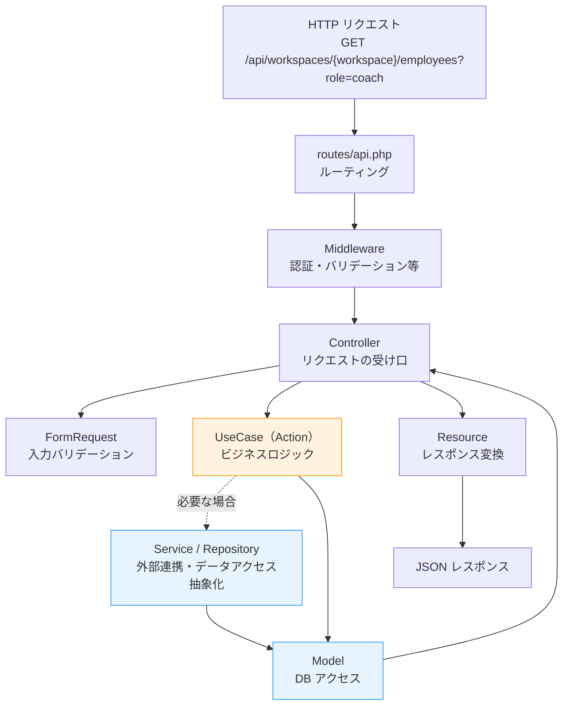
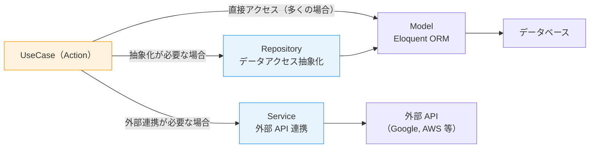
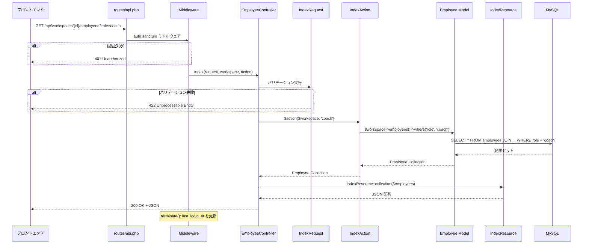

# 6-2-1 リクエストのライフサイクル

📝 **前提知識**: このセクションは Part 4（バックエンド応用と外部連携）の内容を前提としています。

Chapter 6-1 では、LMS フロントエンドのコード構造を読み解きました。この Chapter では視点をバックエンドに移し、**フロントエンドから送られたリクエストがバックエンドのどこを通ってレスポンスになるのか** を、LMS の実際のコードでトレースします。

| セクション | テーマ | 種類 |
|---|---|---|
| **6-2-1** | リクエストのライフサイクル | 概念 |
| **6-2-2** | ドメインモデルとビジネスロジック | 概念 |

**Chapter ゴール**: LMS バックエンドの Clean Architecture をリクエストのライフサイクルに沿って読み解く

📖 まず本セクションでリクエストが Route から Resource まで通過する一連の流れを1つのエンドポイントで具体的にトレースし、次のセクション 6-2-2 でドメインモデルの関係性、Enum による状態管理、Observer によるイベント処理を読み解きます。

## 🎯 このセクションで学ぶこと

- LMS バックエンドの **ディレクトリ構造** と各層の役割を理解する
- HTTP リクエストが **Route → Middleware → Controller → UseCase → Service / Repository → Model → Resource** の各層を通過する流れを、実際のエンドポイントでトレースして理解する
- **FormRequest** による入力バリデーションと **Resource** によるレスポンス変換の仕組みを理解する
- **Middleware** の認証ガードと terminate フックの動作を理解する

Part 4 で学んだ Clean Architecture の概念が、LMS の実コードでどのように実装されているかを確認するセクションです。

---

## 導入: リクエストが「どこを通って」レスポンスになるのか

Chapter 6-1 のセクション 6-1-2 で、フロントエンドの `http()` 関数がバックエンド API を呼び出す仕組みを見ました。たとえば、従業員一覧を取得するとき、フロントエンドは以下のようなリクエストを送ります。

```typescript
// フロントエンド: features/v2/employee/api/index.ts
http<IndexHttpDocument>(
  `/api/workspaces/:workspaceId/employees`,
  'GET',
  { pathParams: { workspaceId }, queryParams: { role: 'coach' } },
)
```

このリクエストがバックエンドに届いてから、JSON レスポンスとしてフロントエンドに返るまでの間に、何が起きているのでしょうか。Part 4 で学んだ概念（Controller、UseCase、Model 等）は覚えていても、実際のコードベースで「どのファイルの何行目を通るのか」がわからなければ、バグの調査も新機能の追加もできません。

### 🧠 先輩エンジニアはこう考える

> バックエンドで障害が起きたとき、最初にやるのは「リクエストの流れを追うこと」です。Route でどの Controller に振り分けられるか、Controller でどの UseCase が呼ばれるか、UseCase でどんなクエリが走るか。この流れを頭に入れておけば、エラーログを見たときに「この層で問題が起きている」とすぐに切り分けられます。LMS のバックエンドは Clean Architecture で層が分かれているので、1つの層を理解すれば、80 以上ある UseCase もすべて同じパターンで読めます。

---

## バックエンドのディレクトリマップ

LMS バックエンドの `app/` ディレクトリを、リクエストの流れに沿って整理します。

```
backend/app/
├── Http/
│   ├── Controllers/      # リクエストの受け口（78+ ファイル）
│   ├── Middleware/        # リクエスト/レスポンスの横断処理
│   ├── Requests/          # 入力バリデーション
│   └── Resources/         # レスポンス変換
├── UseCases/              # ビジネスロジック（80+ ディレクトリ）★
├── Models/                # Eloquent モデル（87 ファイル）
├── Enums/                 # 型安全な定数（33 ファイル）
├── Observers/             # モデルライフサイクルフック
├── Services/              # 外部 API 連携
├── Repositories/          # データアクセス抽象化
├── Listeners/             # イベントリスナー
├── Mail/                  # メール送信
├── Notifications/         # 通知
├── Providers/             # サービスプロバイダー
└── Console/               # Artisan コマンド
```

Part 4 で学んだ Clean Architecture の各層と対応させます。

| Clean Architecture の層 | LMS のディレクトリ | 役割 |
|---|---|---|
| **プレゼンテーション層** | Controllers / Requests / Resources | HTTP の入出力 |
| **アプリケーション層** | UseCases（Actions） | ビジネスロジックの実行 |
| **ドメイン層** | Models / Enums | データ構造とビジネスルール |
| **インフラ層** | Services / Repositories | 外部システムとの接続 |

🔑 **最も重要なディレクトリは `UseCases/`** です。フロントエンドの `features/` と同様に、ドメインごとにビジネスロジックが集約されています。80 以上のサブディレクトリがあり、Employee、Curriculum、ChatRoom、Exercise など、LMS の機能ごとに Action クラスが配置されています。

---

## リクエストのライフサイクル全体図

フロントエンドからのリクエストがバックエンドで処理される流れを、全体図で把握しましょう。



この流れを、実際の LMS コードで1つずつトレースしていきます。題材は **従業員一覧取得 API**（`GET /api/workspaces/{workspace}/employees`）です。

---

## Step 1: Route — リクエストの振り分け

すべてのリクエストは `routes/api.php` で定義されたルートに基づいて、対応する Controller メソッドに振り分けられます。

```php
// backend/routes/api.php（抜粋）
Route::middleware('auth:sanctum')->group(function () {
    Route::prefix('workspaces/{workspace}')->group(function () {
        // 従業員関連 API
        Route::get('/employees', [EmployeeController::class, 'index']);
        Route::post('/employees', [EmployeeController::class, 'store']);
        Route::get('/employees/{employee}', [EmployeeController::class, 'show']);
        // ...
    });
});
```

**読み方のポイント**:

- `Route::middleware('auth:sanctum')`: このグループ内のすべてのルートは Sanctum 認証が必須。Part 4 で学んだ Sanctum ミドルウェアがここで適用されています
- `Route::prefix('workspaces/{workspace}')`: URL に `{workspace}` というパスパラメータが含まれます。Laravel の **ルートモデルバインディング** により、この `{workspace}` は自動的に `Workspace` モデルのインスタンスに解決されます
- `[EmployeeController::class, 'index']`: リクエストを `EmployeeController` の `index` メソッドに振り分けます

### ルートファイルの構造

`api.php` は約 500 行あり、以下のように機能グループごとに整理されています。

| グループ | 認証 | 用途 |
|---|---|---|
| ユーザー認証 API | なし | ログイン・ログアウト |
| 招待メール関連 API | なし | メール確認 |
| `auth:sanctum` グループ | Sanctum | 通常の業務 API（大半がここ） |
| マスターデータ API | なし | 定数・選択肢データ |
| デプロイ API | デプロイトークン | GitHub Actions 連携 |
| システム管理 API | システムユーザー | 管理者向け |

💡 **TIP**: セクション 6-1-2 で見たフロントエンドの API 関数の URL パスは、この `api.php` のルート定義と1対1で対応しています。フロントエンドの `http()` 関数で `/api/workspaces/:workspaceId/employees` を呼ぶと、バックエンドの `Route::get('/employees', [EmployeeController::class, 'index'])` にマッチします。

---

## Step 2: Middleware — リクエストの横断処理

ルートにマッチしたリクエストは、Controller に到達する前に **Middleware** を通過します。LMS では複数の Middleware が順番に処理を行います。

### 認証ミドルウェア

`auth:sanctum` ミドルウェアは、リクエストに有効な認証トークン（Cookie）が含まれているかをチェックします。含まれていなければ 401 Unauthorized を返し、Controller には到達しません。

### terminate フック: UpdateLastLoginAt

LMS 独自のミドルウェアとして、`UpdateLastLoginAt` があります。このミドルウェアは、**レスポンスを返した後に** ログイン日時を更新する面白い設計になっています。

```php
// backend/app/Http/Middleware/UpdateLastLoginAt.php
class UpdateLastLoginAt
{
    public function handle(Request $request, Closure $next): Response
    {
        return $next($request);  // 何もせず次の Middleware に渡す
    }

    public function terminate(Request $request, Response $response): void
    {
        // レスポンス送信後に実行される
        if (Auth::guard('user')->check()) {
            $this->updateUserLastLoginAt();
        } elseif (Auth::guard('employee')->check()) {
            $this->updateEmployeeLastLoginAt();
        }
    }

    private function updateUserLastLoginAt(): void
    {
        $user = Auth::guard('user')->user();
        $activeWorkspace = $user->activeWorkspace;

        if (!$activeWorkspace) {
            return;
        }

        // 今日すでに更新済みならスキップ
        if ($activeWorkspace->last_login_at
            && Carbon::parse($activeWorkspace->last_login_at)->isToday()) {
            return;
        }

        $updateData = ['last_login_at' => now()];
        if (!$activeWorkspace->is_recently_active) {
            $updateData['is_recently_active'] = true;
        }

        UserWorkspace::where('id', $activeWorkspace->id)->update($updateData);
    }
}
```

**読み方のポイント**:

- `handle()` メソッドは `$next($request)` を返すだけで、リクエスト処理には介入しません
- `terminate()` メソッドは、レスポンスがクライアントに送信された **後に** 実行されます。ログイン日時の更新はレスポンス速度に影響しないよう、この仕組みを使っています
- **1日1回だけ更新**: `Carbon::parse(...)->isToday()` で今日すでに更新済みかをチェックし、重複更新を防いでいます
- **マルチガード対応**: `Auth::guard('user')` と `Auth::guard('employee')` で受講生と従業員を分けて処理しています。これはセクション 6-1-3 で学んだフロントエンドの `requireUser()` / `requireEmployee()` の分離と同じ考え方です

🔑 **Middleware の `terminate()` フック** は、「ユーザーの体感速度に影響しないが、裏側で記録しておきたい処理」に適しています。ログイン日時の記録、アクセスログの書き込み、統計情報の更新などが典型的な用途です。

---

## Step 3: Controller — リクエストの受け口

Middleware を通過したリクエストは、Controller メソッドに到達します。

```php
// backend/app/Http/Controllers/EmployeeController.php
class EmployeeController extends Controller
{
    public function index(
        IndexRequest $request,
        Workspace $workspace,
        IndexAction $action
    ) {
        return IndexResource::collection(
            $action($workspace, $request->role)
        );
    }

    public function store(
        StoreRequest $request,
        Workspace $workspace,
        StoreAction $action
    ) {
        $action(
            $workspace,
            $request->first_name,
            $request->last_name,
            $request->email,
            $request->role
        );
        return response()->json(null, 204);
    }
}
```

**読み方のポイント**:

LMS の Controller メソッドは、わずか **3〜5 行** です。Part 4 で学んだ「Controller は薄くする」という Clean Architecture の原則が徹底されています。Controller の役割は3つだけです。

| 役割 | コード例 | 説明 |
|---|---|---|
| **入力の受け取り** | `IndexRequest $request` | FormRequest によるバリデーション済みの入力を受け取る |
| **ビジネスロジックの委譲** | `$action($workspace, $request->role)` | UseCase（Action）に処理を委譲する |
| **出力の変換** | `IndexResource::collection(...)` | Resource でレスポンス形式に変換する |

### 依存性注入（DI）

Controller メソッドの引数に注目してください。

```php
public function index(
    IndexRequest $request,    // ① FormRequest: 入力バリデーション
    Workspace $workspace,     // ② ルートモデルバインディング
    IndexAction $action       // ③ UseCase: ビジネスロジック
)
```

- **① `IndexRequest`**: Laravel のサービスコンテナが自動的にインスタンス化し、バリデーションを実行します
- **② `Workspace`**: URL の `{workspace}` パラメータから、対応する Workspace モデルが自動解決されます
- **③ `IndexAction`**: UseCase クラスがサービスコンテナから自動的に注入されます

この3つの引数はすべて **Laravel の依存性注入** によって自動的に解決されます。Controller は「何が必要か」を型で宣言するだけで、「どう作るか」を知る必要がありません。

---

## Step 4: FormRequest — 入力バリデーション

Controller に到達する前に、FormRequest がリクエストの入力値を検証します。以下は構造を示すイメージです。

```php
// backend/app/Http/Requests/Employee/IndexRequest.php
class IndexRequest extends BaseFormRequest
{
    public function rules()
    {
        return [
            'role' => 'string|nullable',
        ];
    }
}
```

```php
// 別の FormRequest の例
// backend/app/Http/Requests/Employee/FetchCoachMeetingsRequest.php
class FetchCoachMeetingsRequest extends BaseFormRequest
{
    public function rules()
    {
        return [
            'year_month' => 'string|nullable|date_format:Y-m',
        ];
    }
}
```

**読み方のポイント**:

- `rules()` メソッドで Laravel のバリデーションルールを定義します。これは Part 4 で学んだ内容です
- バリデーションに失敗すると、Controller メソッドは実行されず、自動的に **422 Unprocessable Entity** レスポンスが返されます
- `BaseFormRequest` を継承することで、共通のバリデーションロジック（認可チェック等）を再利用しています

💡 **TIP**: フロントエンドの HttpDocument 型でリクエストボディの型を定義し、バックエンドの FormRequest でバリデーションルールを定義する。この2つが「表」と「裏」の関係でリクエストの型安全性を担保しています。

---

## Step 5: UseCase（Action）— ビジネスロジック

Controller から委譲されたビジネスロジックは、UseCase（LMS では Action と呼ばれる）で実行されます。

### シンプルな Action: 一覧取得

```php
// backend/app/UseCases/Employee/IndexAction.php
class IndexAction
{
    public function __invoke(Workspace $workspace, ?string $role)
    {
        $query = $workspace->employees();

        if (isset($role)) {
            $query->where('role', $role);
        }

        return $query->orderBy('created_at', 'desc')->get();
    }
}
```

**読み方のポイント**:

- **`__invoke()` メソッド**: PHP のマジックメソッドで、オブジェクトを関数のように呼び出せます。Controller で `$action($workspace, $request->role)` と書けるのはこの仕組みのおかげです
- **単一責任**: 1つの Action は1つのビジネス操作だけを行います。「従業員一覧の取得」という1つの責務に集中しています
- **HTTP に依存しない**: `Request` オブジェクトを直接受け取らず、必要な値（`$workspace`, `$role`）だけを受け取ります。これにより、同じ Action を Artisan コマンドやテストからも呼び出せます

### 複雑な Action: データ作成

```php
// backend/app/UseCases/Employee/StoreAction.php
class StoreAction
{
    public function __invoke(
        Workspace $workspace,
        string $firstName,
        string $lastName,
        string $email,
        string $role
    ) {
        DB::transaction(function () use (
            $workspace, $firstName, $lastName, $email, $role
        ) {
            $employee = Employee::create([
                'first_name' => $firstName,
                'last_name' => $lastName,
                'email' => $email,
                'password' => Hash::make(Str::random(10)),
                'role' => $role,
            ]);

            $employee->employeeWorkspaces()->create([
                'workspace_id' => $workspace->id,
                'is_active' => true,
            ]);

            // 招待メールを送信
            $employee->notify(new VerifyEmail($workspace->id, 'employee'));
        });
    }
}
```

**読み方のポイント**:

- **`DB::transaction()`**: 従業員の作成とワークスペースへの紐付けを1つのトランザクションで実行します。途中でエラーが発生した場合、すべての変更がロールバックされます
- **パスワードの初期化**: `Hash::make(Str::random(10))` でランダムなパスワードを生成。招待メール経由でユーザー自身がパスワードを設定する想定です
- **通知の送信**: `$employee->notify()` で Laravel の通知システムを使って招待メールを送信します

### Action パターンの一覧

LMS の Action は、以下のパターンに分類できます。

| パターン | 例 | 特徴 |
|---|---|---|
| **一覧取得** | `IndexAction` | クエリ構築 → `get()` / `paginate()` |
| **単体取得** | `ShowAction` | `find()` / `findOrFail()` |
| **作成** | `StoreAction` | `DB::transaction()` + `create()` |
| **更新** | `UpdateAction` | `DB::transaction()` + `update()` |
| **削除** | `DestroyAction` | `delete()` / `forceDelete()` |
| **複雑なビジネスロジック** | `FetchCoachesAction` | 複数テーブルの JOIN + 集計 + ソート |

🔑 セクション 6-1-2 で見たフロントエンドの API パターン（一覧取得 / フィルター取得 / 作成）と、バックエンドの Action パターンが対応しています。フロントエンドの `index.ts` は `IndexAction` を、`store.ts` は `StoreAction` を呼び出す、という関係です。

---

## Step 5.5: Service / Repository — UseCase が呼び出すインフラ層

UseCase（Action）は多くの場合、Eloquent モデルに直接アクセスしてデータベース操作を行います。しかし、外部 API との連携やデータアクセスの抽象化が必要な場合は、**Service 層** や **Repository 層** を経由します。



| 層 | ディレクトリ | 使われる場面 | 例 |
|---|---|---|---|
| **Service** | `app/Services/` | 外部 API の SDK をラップ | `GoogleCalendarService`、`AWSS3Service` |
| **Repository** | `app/Repositories/` | データアクセスをインターフェースで抽象化 | `GoogleCalendarTokenRepository` |

今回トレースしている従業員一覧取得（`IndexAction`）は、外部 API を使わず、Eloquent モデルに直接アクセスするシンプルなケースです。そのため、Service / Repository 層は経由しません。Service 層の具体的な実装パターン（Google Calendar 連携等）はセクション 6-2-2 で詳しく読み解きます。

---

## Step 6: Model — データベースアクセス

Action からは Eloquent モデルを通じてデータベースにアクセスします。モデルの詳細はセクション 6-2-2 で扱いますが、ここではリクエストの流れの中での役割を確認します。

```php
// IndexAction 内での使われ方
$query = $workspace->employees();  // Workspace → Employee のリレーション
$query->where('role', $role);       // 条件の追加
$query->orderBy('created_at', 'desc');  // ソート
return $query->get();               // 実行して Collection を返す
```

- `$workspace->employees()` は、`Workspace` モデルに定義されたリレーション（`belongsToMany`）を呼び出しています
- クエリは **遅延実行** です。`where()` や `orderBy()` はクエリを組み立てるだけで、`get()` を呼んだ時点で初めて SQL が発行されます

---

## Step 7: Resource — レスポンス変換

Action から返されたモデルデータは、Resource クラスで JSON レスポンスに変換されます。以下は主要部分の抜粋です。

```php
// backend/app/Http/Resources/Employee/IndexResource.php
class IndexResource extends BaseResource
{
    public function toArray($request)
    {
        return [
            'id' => $this->id,
            'firstName' => $this->first_name,
            'lastName' => $this->last_name,
            'email' => $this->email,
            'avatar' => $this->avatar,
            'name' => $this->fullName,
            'role' => $this->role,
            'profileSetupCompleted' => $this->profile_setup_completed,
            'workspace' => [
                'id' => $this->employeeWorkspace->id,
                'workspaceId' => $this->employeeWorkspace->workspace_id,
                'userCapacity' => $this->employeeWorkspace->user_capacity,
                'priority' => $this->employeeWorkspace->priority,
                'isActive' => $this->employeeWorkspace->is_active,
            ],
        ];
    }
}
```

**読み方のポイント**:

1. **snake_case → camelCase 変換**: データベースのカラム名は `first_name`（snake_case）ですが、レスポンスでは `firstName`（camelCase）に変換されます。フロントエンドの JavaScript/TypeScript では camelCase が標準なので、この変換が必要です

2. **必要なフィールドだけを公開**: モデルのすべてのカラムを返すのではなく、API の利用者に必要なフィールドだけを選択して返します。パスワードハッシュや内部的なフラグなど、フロントエンドに不要な情報は除外されます

3. **ネストされたリレーション**: `workspace` キーの中に `employeeWorkspace` リレーションのデータをネストしています。フロントエンドで `employee.workspace.priority` のようにアクセスできます

4. **アクセサの利用**: `$this->fullName` は Model で定義された `getFullNameAttribute()` アクセサ（`$this->last_name . ' ' . $this->first_name`）の値です

### フロントエンドとの対応

Resource の出力は、フロントエンドの HttpDocument 型の `Response` パラメータと対応しています。

```
バックエンド Resource        フロントエンド HttpDocument['response']
─────────────────       ─────────────────────────────
'firstName' => ...   →   data: { firstName: string, ... }[]
'role' => ...        →
'workspace' => [     →
  'priority' => ...  →
]                    →
```

この対応関係が崩れると、フロントエンドで型エラーやランタイムエラーが発生します。Resource のフィールド名を変更するときは、フロントエンドの HttpDocument 型も合わせて更新する必要があります。

---

## リクエストのライフサイクル完全図

ここまでの流れを、1つのリクエストで完全にトレースします。



⚠️ **注意**: このシーケンス図で、Middleware の `terminate()` がレスポンス送信**後**に実行される点に注目してください。ユーザーはレスポンスを受け取った後に、裏側で `last_login_at` が更新されます。

---

## Controller を読むための3ステップ

LMS のバックエンドコードを読むときは、以下の3ステップで進めると効率的です。

### 1. Route を見つける

`routes/api.php` でエンドポイントの URL を検索し、対応する Controller とメソッドを特定します。

### 2. Controller メソッドの引数を読む

引数の型を見れば、そのエンドポイントの構造がわかります。

```php
public function index(
    IndexRequest $request,    // → Requests/Employee/IndexRequest.php
    Workspace $workspace,     // → ルートモデルバインディング
    IndexAction $action       // → UseCases/Employee/IndexAction.php
)
```

### 3. Action の `__invoke()` を読む

ビジネスロジックの本体は Action にあります。Action のコードを読めば、「何のデータを、どんな条件で、どう処理するか」がわかります。

🔑 **この3ステップは、Claude Code に指示を出すときにも使えます。** たとえば「従業員一覧に検索機能を追加したい」という場合、「`IndexAction` にキーワード検索のロジックを追加し、`IndexRequest` にバリデーションルールを追加して」と指示できます。各層の役割を知っていれば、変更箇所を的確に伝えられます。

---

## ✨ まとめ

- LMS バックエンドは **Route → Middleware → Controller → FormRequest → Action →（Service / Repository）→ Model → Resource** の順にリクエストを処理する。外部 API 連携やデータアクセス抽象化が必要な場合のみ Service / Repository 層を経由する
- **Controller は薄く**（3〜5行）、ビジネスロジックは **UseCase（Action）** に委譲する Clean Architecture パターンが徹底されている
- Action は **`__invoke()` メソッド** を持つ単一責任のクラスで、HTTP に依存しない純粋なビジネスロジックを実行する
- **FormRequest** が入力バリデーション、**Resource** がレスポンス変換（snake_case → camelCase）を担当し、Controller からこれらの関心事を分離している
- Middleware の **`terminate()` フック** を使えば、レスポンス速度に影響せずに裏側の処理（ログイン日時更新等）を実行できる
- フロントエンドの HttpDocument 型とバックエンドの Resource のフィールドが1対1で対応している

---

次のセクションでは、リクエストの流れの中で登場した Model に焦点を当て、LMS のドメインモデルの関係性、Enum による状態管理、Observer によるイベント処理を読み解きます。
