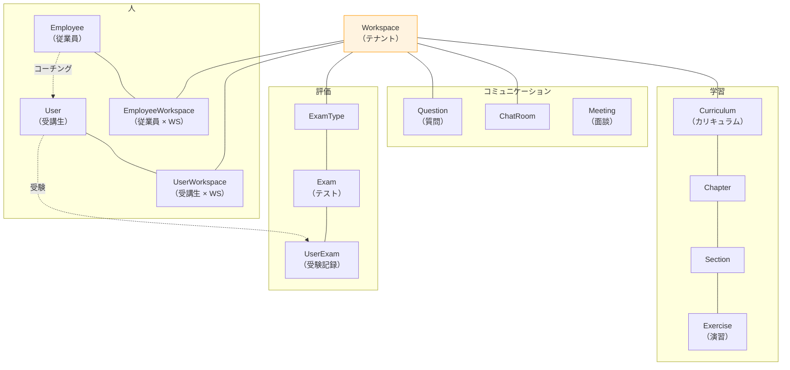
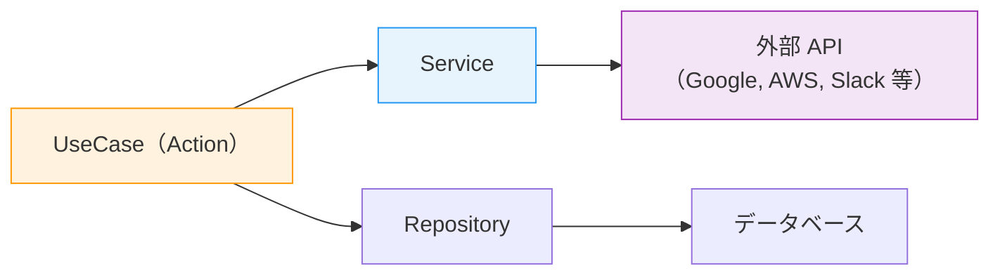
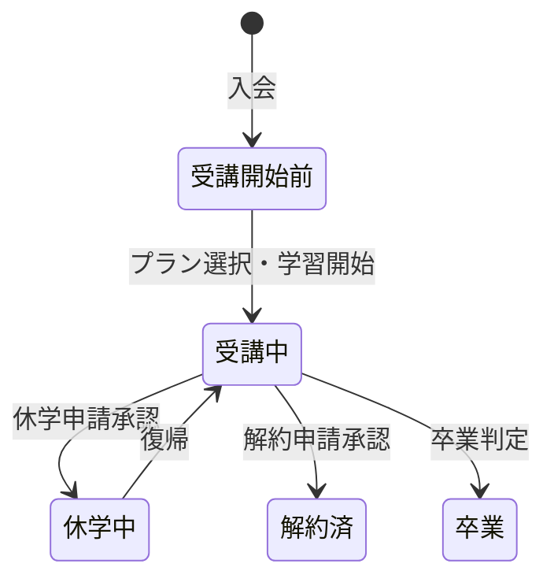
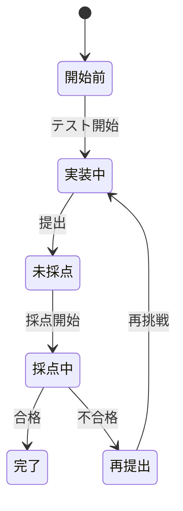

# 6-2-2 ドメインモデルとビジネスロジック

📝 **前提知識**: このセクションはセクション 6-2-1（リクエストのライフサイクル）の内容を前提としています。

## 🎯 このセクションで学ぶこと

- LMS の **マルチテナント構造**（Workspace を中心としたエンティティ関係）を理解する
- 主要モデル（User / Employee / Workspace / Curriculum 等）の **リレーション** と設計パターンを実際のコードで理解する
- PHP 8.1 の **Enum** による型安全な状態管理の仕組みを理解する
- **Observer パターン** によるモデルライフサイクルの自動処理を理解する
- **Service 層** による外部 API 連携の実装パターンを理解する

セクション 6-2-1 でリクエストの流れを追い、各層の役割を確認しました。このセクションでは、その流れの中で中心的な役割を果たす **Model** と、それを取り巻くビジネスロジックの仕組みに焦点を当てます。

---

## 導入: 89 個のモデルをどう読むか

LMS のバックエンドには 87 個の Eloquent モデルがあります。User、Employee、Workspace といった主要エンティティから、Matching、Meeting、ChatRoom といった業務モデル、CurriculumProgress や UserExamQuestionAnswer といった状態管理モデルまで、多岐にわたります。

87 個のモデルを1つずつ読むのは非現実的ですが、すべてのモデルは **Workspace を中心としたマルチテナント構造** の中に位置づけられます。この構造を理解すれば、「このモデルはどこに属するのか」「このリレーションは何を意味するのか」が自然とわかるようになります。

### 🧠 先輩エンジニアはこう考える

> LMS のモデルを理解するコツは「Workspace から始めること」です。LMS はマルチテナント型の SaaS なので、ほぼすべてのデータが Workspace に紐づいています。新しいモデルを見たとき、まず「このモデルは Workspace とどう繋がっているか」を確認します。直接 `workspace_id` を持っているのか、User や Employee を経由して間接的に紐づいているのか。これがわかれば、そのモデルの立ち位置が見えてきます。

---

## マルチテナント構造: Workspace を中心としたエンティティ関係

LMS は **マルチテナント型** のアプリケーションです。1つの LMS システム上で複数のワークスペース（テナント）が独立して運営されています。すべての主要エンティティは `workspace_id` でスコープされ、ワークスペース間でデータが混在しないように設計されています。



### 中間テーブルによる多対多の関係

Workspace と User / Employee の関係は、**中間テーブル** を介した多対多の関係です。

| 中間テーブル | 繋ぐエンティティ | 追加情報 |
|---|---|---|
| `UserWorkspace` | User × Workspace | `is_active`、`last_login_at`、`status`、受講プラン等 |
| `EmployeeWorkspace` | Employee × Workspace | `is_active`、`priority`、`user_capacity`、`wages` 等 |

中間テーブルは単なる「紐付け」ではなく、**ワークスペース固有の属性** を持っている点が重要です。たとえば、同じ Employee でも Workspace A では「最優先」の Coach であり、Workspace B では「通常」の Coach である、といった違いを `EmployeeWorkspace` の `priority` カラムで表現します。

---

## 主要モデルのリレーションと設計パターン

LMS のモデルには共通の設計パターンがあります。実際のコードで確認しましょう。

### User モデル: 受講生

```php
// backend/app/Models/User.php
class User extends Authenticatable implements MustVerifyEmail
{
    use HasApiTokens, HasFactory, HasUlids, Notifiable, SoftDeletes;

    const TYPE_STRING = 'user';

    protected $casts = [
        'email_verified_at' => 'datetime',
        'profile_setup_completed' => 'boolean',
    ];

    // アクティブなワークスペース（1つだけ）
    public function activeWorkspace()
    {
        return $this->hasOne(UserWorkspace::class)
            ->with('workspace')
            ->where('is_active', true);
    }

    // 全ワークスペース
    public function userWorkspaces()
    {
        return $this->hasMany(UserWorkspace::class);
    }

    // Google カレンダー連携
    public function googleCalendarToken()
    {
        return $this->morphOne(GoogleCalendarToken::class, 'actor');
    }

    // アクティブなマッチング（コーチとの紐付け）
    public function activeMatchings()
    {
        return $this->hasMany(Matching::class)->where('is_active', true);
    }

    // 面談履歴
    public function meetings()
    {
        return $this->hasMany(Meeting::class);
    }

    // 最新の面談
    public function latestMeeting()
    {
        return $this->hasOne(Meeting::class, 'user_id')
            ->latestOfMany('start_datetime');
    }

    // 解約申請
    public function cancellationApplications()
    {
        return $this->hasMany(CancellationApplication::class);
    }

    // 現在の休学申請
    public function currentSuspendApplication()
    {
        return $this->hasOne(SuspendApplication::class)
            ->whereDate('start_date', '<=', now())
            ->where(function ($query) {
                $query->whereDate('end_date', '>=', now())
                    ->orWhereNull('end_date');
            });
    }
}
```

**読み方のポイント**:

1. **Trait の利用**: モデルの先頭で `use` している Trait が、モデルの能力を示しています

| Trait | 能力 |
|---|---|
| `HasApiTokens` | Sanctum による API トークン認証 |
| `HasFactory` | テスト用のファクトリー |
| `HasUlids` | ID に ULID を使用（自動採番の整数ではない） |
| `Notifiable` | メール・Slack 等の通知送信 |
| `SoftDeletes` | 論理削除（`deleted_at` カラム） |

2. **`$casts` プロパティ**: データベースから取得した値を PHP の型に自動変換します。`'email_verified_at' => 'datetime'` により、文字列ではなく Carbon オブジェクトとして扱えます

3. **リレーションのパターン**: LMS では条件付きリレーションが多用されています

| パターン | 例 | 説明 |
|---|---|---|
| 基本リレーション | `userWorkspaces()` | 全件取得 |
| 条件付きリレーション | `activeWorkspace()` | `where('is_active', true)` で絞り込み |
| Eager Loading 付き | `activeWorkspace()` | `with('workspace')` でリレーション先も同時取得 |
| 最新1件 | `latestMeeting()` | `latestOfMany()` で最新レコードのみ |
| 時間範囲指定 | `currentSuspendApplication()` | 現在日時に基づく動的な絞り込み |

4. **ポリモーフィックリレーション**: `morphOne(GoogleCalendarToken::class, 'actor')` は、User と Employee の両方が同じ `GoogleCalendarToken` テーブルを使えるようにする仕組みです。`actor_type` カラムで「User のトークンか Employee のトークンか」を区別します

### Employee モデル: 従業員

```php
// backend/app/Models/Employee.php
class Employee extends Authenticatable implements MustVerifyEmail
{
    use HasApiTokens, HasFactory, HasUlids, Notifiable, SoftDeletes;

    const TYPE_STRING = 'employee';
    const ROLE_ADMIN = 'admin';
    const ROLE_CS = 'cs';
    const ROLE_COACH = 'coach';

    // アクセサ: フルネームを動的に生成
    public function getFullNameAttribute()
    {
        return $this->last_name . ' ' . $this->first_name;
    }

    // 特定ワークスペースでの担当受講生を取得
    public function activeUsersByWorkspaceId($workspaceId)
    {
        $matchings = $this->activeMatchings()
            ->whereHas('user.userWorkspaces', function ($query) use ($workspaceId) {
                $query->where('workspace_id', $workspaceId);
            })
            ->with('user')
            ->get();

        return $matchings->map(function ($matching) {
            return $matching->user;
        });
    }
}
```

**読み方のポイント**:

- **ロール定数**: `ROLE_ADMIN`、`ROLE_CS`、`ROLE_COACH` で従業員の3つの役割を定義しています。セクション 6-2-1 のルートで `?role=coach` のフィルターに使われていた値がここで定義されています
- **アクセサ**: `getFullNameAttribute()` は `$employee->fullName` でアクセスできる仮想プロパティです。セクション 6-2-1 の Resource で `'name' => $this->fullName` と使われていました
- **クエリメソッド**: `activeUsersByWorkspaceId()` はリレーションを組み合わせた複雑なクエリですが、「このコーチが特定のワークスペースで担当しているアクティブな受講生を取得する」という1つの問いに答えます

### Workspace モデル: テナント

```php
// backend/app/Models/Workspace.php
class Workspace extends Model
{
    use HasFactory, HasUlids;

    protected $fillable = [
        'client_id', 'name', 'logo_url', 'logo_white_url',
    ];

    public function users()
    {
        return $this->belongsToMany(User::class, 'user_workspace');
    }

    public function employees()
    {
        return $this->belongsToMany(Employee::class, 'employee_workspace');
    }

    public function curriculums()
    {
        return $this->hasMany(Curriculum::class);
    }

    public function chatRooms()
    {
        return $this->hasMany(ChatRoom::class);
    }

    public function questions()
    {
        return $this->hasMany(Question::class);
    }
}
```

Workspace は **マルチテナントのルート** です。セクション 6-2-1 の Route で `{workspace}` としてルートモデルバインディングに使われ、Action 内で `$workspace->employees()` のようにリレーションのスコープとして機能していました。

🔑 **Workspace を起点にリレーションを辿ることで、そのワークスペースに属するすべてのデータにアクセスできます。** これがマルチテナント設計の核心です。

---

## データ規約: ULID とソフトデリート

LMS のモデルに共通する2つの重要な規約があります。

### ULID

LMS のすべての主要テーブルは、ID に **ULID**（Universally Unique Lexicographically Sortable Identifier）を使用しています。

```
01HQJF2N4X3K5M7P8R9T0V1W2Y  ← ULID の例
```

ULID は UUID と同様にグローバルに一意ですが、**時刻順にソート可能** という利点があります。`HasUlids` Trait をモデルに追加するだけで、Laravel が自動的に ULID を生成します。

### ソフトデリート

`SoftDeletes` Trait を使用しているモデルでは、`delete()` を呼んでもレコードは物理的に削除されません。`deleted_at` カラムに削除日時が記録され、通常のクエリからは除外されます。

```php
$employee->delete();        // deleted_at に現在日時をセット（レコードは残る）
$employee->forceDelete();   // 物理的に削除
Employee::withTrashed();    // 削除済みも含めて取得
```

⚠️ **注意**: ソフトデリートされたレコードは通常のクエリには現れませんが、データベースには残っています。個人情報を含むデータの完全削除が必要な場合は `forceDelete()` を使いますが、LMS では監査証跡のためにソフトデリートが基本方針です。

---

## Enum: 型安全な状態管理

LMS のバックエンドには **33 個の PHP 8.1 Enum** が定義されており、ビジネスロジック全体の状態管理を担っています。

### Enum の基本構造

```php
// backend/app/Enums/EmployeePriority.php
enum EmployeePriority: int
{
    use LabelFormatter;

    case UNDEFINED = 0;
    case TOP_PRIORITY = 1;
    case PRIORITY = 5;
    case NORMAL = 9;
    case UNMATCHABLE = 13;

    public function label(): string
    {
        return match ($this) {
            self::UNDEFINED => '未設定',
            self::TOP_PRIORITY => '最優先',
            self::PRIORITY => '優先',
            self::NORMAL => '普通',
            self::UNMATCHABLE => 'マッチング不可',
        };
    }
}
```

**読み方のポイント**:

- **Backed Enum**: `EmployeePriority: int` の `: int` により、各ケースに整数値が割り当てられています。データベースにはこの整数値（0, 1, 5, 9, 13）が保存されます
- **`label()` メソッド**: `match` 式で各ケースに日本語ラベルを対応させています。UI に表示する文字列はここで一元管理されます
- **`LabelFormatter` Trait**: 共通のラベル取得ロジックを提供します

### Enum の活用: フロントエンドとの連携

セクション 6-1-2 で見たフロントエンドの `as const` パターンと比較してみましょう。

```php
// バックエンド: PHP 8.1 Enum
enum ChatRoomStatus: int
{
    case UNHANDLED = 1;
    case IN_PROGRESS = 2;
    case COMPLETED = 3;
}
```

```typescript
// フロントエンド: TypeScript as const パターン
const CHAT_ROOM_STATUS = {
  UNHANDLED: 1,
  IN_PROGRESS: 2,
  COMPLETED: 3,
} as const
```

バックエンドとフロントエンドで **同じ値** を使うことで、API を通じたデータの受け渡しで不整合が起きません。

### LMS の主要 Enum 一覧

33 個の Enum の中から、特に重要なものを分類して紹介します。

| カテゴリ | Enum | 値の例 | 用途 |
|---|---|---|---|
| **受講管理** | `UserWorkspaceStatus` | 受講中、休学中、解約済 等 | 受講生のステータス管理 |
| **テスト** | `UserExamStatus` | 開始前、実装中、未採点、採点中、完了 | テスト受講フローの管理 |
| **申請** | `ApplicationStatus` | 申請中、承認済、却下 等 | 解約・休学・コーチ変更の申請管理 |
| **コミュニケーション** | `ChatRoomStatus` | 未対応、対応中、対応済 | チャットルームの対応状況 |
| **人員配置** | `EmployeePriority` | 最優先、優先、普通、マッチング不可 | コーチのマッチング優先度 |
| **学習** | `ExerciseType` | 演習問題の種類分け | セクション内の演習管理 |

🔑 **Enum はビジネスルールのドキュメントでもあります。** たとえば `UserExamStatus` の定義を読むだけで、テストのライフサイクルが「開始前 → 実装中 → 未採点 → 採点中 → 完了」であることがわかります。ドメインモデルのドキュメント（`docs/domain-model.md`）と合わせて読むことで、ビジネスフローの全体像が見えてきます。

---

## Observer: モデルライフサイクルの自動処理

LMS では **Observer パターン** を使って、モデルの作成・更新・削除に連動する処理を自動化しています。

### SectionObserver: 教材セクションの自動管理

```php
// backend/app/Observers/SectionObserver.php
class SectionObserver
{
    public function creating(Section $section)
    {
        // order が未指定なら末尾に追加
        if (is_null($section->order)) {
            $section->order = Section::where('chapter_id', $section->chapter_id)
                ->max('order') + 1;
            return;
        }

        // 指定位置に挿入: 既存セクションの order を繰り下げ
        $lowerPrioritySections = Section::where('chapter_id', $section->chapter_id)
            ->where('order', '>=', $section->order)
            ->get();

        foreach ($lowerPrioritySections as $lowerPrioritySection) {
            $lowerPrioritySection->order++;
            $lowerPrioritySection->saveQuietly();
        }
    }

    public function created(Section $section)
    {
        // 検索用テキストを自動生成
        $section->free_word = self::buildFreeWord($section->title, $section->text);
        $section->saveQuietly();
    }

    public function updating(Section $section)
    {
        // タイトルまたは本文が変更されたら検索用テキストを再生成
        if ($section->isDirty('title') || $section->isDirty('text')) {
            $section->free_word = self::buildFreeWord($section->title, $section->text);
        }

        // order が変更されたら他のセクションの order を調整
        if ($section->isClean('order')) {
            return;
        }

        // 並び替えロジック...
    }

    public function deleted(Section $section)
    {
        // 削除後、後続セクションの order を繰り上げ
        if (is_null($section->order)) {
            return;
        }

        $lowerPrioritySections = Section::where('chapter_id', $section->chapter_id)
            ->where('order', '>', $section->order)
            ->get();

        foreach ($lowerPrioritySections as $lowerPrioritySection) {
            $lowerPrioritySection->order--;
            $lowerPrioritySection->saveQuietly();
        }
    }

    static function buildFreeWord(?string $title, ?string $text): string
    {
        $raw = ($title ?? '') . ' ' . ($text ?? '');
        $cleaned = preg_replace('/<[^>]+>/', '', $raw);     // HTML タグを除去
        $cleaned = preg_replace('/[#*_`\[\]()!-]+/', '', $cleaned);  // Markdown 記法を除去
        return $cleaned;
    }
}
```

**読み方のポイント**:

1. **ライフサイクルフック**: Observer は Eloquent のイベントに対応するメソッドを持ちます

| メソッド | タイミング | 用途の例 |
|---|---|---|
| `creating()` | 保存**前** | order の自動計算 |
| `created()` | 保存**後** | 検索用テキストの生成 |
| `updating()` | 更新**前** | 変更検知と派生データの更新 |
| `deleted()` | 削除**後** | 後続データの order 調整 |

2. **`saveQuietly()`**: Observer 内で `save()` を使うと、再び Observer が呼ばれて無限ループになる危険があります。`saveQuietly()` は Observer を発火させずに保存する安全な方法です

3. **`isDirty()` / `isClean()`**: `$section->isDirty('title')` は「title カラムが変更されたか」を判定します。変更されていないカラムの処理をスキップすることで、不要な処理を防ぎます

4. **`buildFreeWord()`**: HTML タグと Markdown 記法を除去してプレーンテキストを生成します。これは全文検索用のインデックスで、セクションの検索機能に使われます

### Observer のメリットと注意点

Observer パターンを使うことで、「セクションを作成したら order を自動計算する」「セクションを削除したら後続の order を詰める」といったロジックが、**セクションを操作するすべてのコード** に自動的に適用されます。Controller や UseCase にこのロジックを書く必要がなく、書き忘れも防げます。

⚠️ **注意**: Observer のロジックは「暗黙的」に実行されるため、コードを読むときに見落としやすいという注意点があります。モデルの保存・削除時に予期しない動作がある場合は、まず Observer を確認するのが定石です。LMS では Observer は `app/Observers/` に集約されているので、確認は容易です。

---

## Service 層: 外部 API 連携

Part 4 で学んだ外部サービス連携が、LMS ではどのように実装されているかを見てみましょう。

### GoogleCalendarService の構造

以下は主要部分の抜粋です。

```php
// backend/app/Services/GoogleCalendarService.php
class GoogleCalendarService
{
    protected $googleOAuthService;
    protected $googleCalendarTokenService;

    public function __construct(
        GoogleOAuthService $googleOAuthService,
        GoogleCalendarTokenService $googleCalendarTokenService,
    ) {
        $this->googleOAuthService = $googleOAuthService;
        $this->googleCalendarTokenService = $googleCalendarTokenService;
    }

    public function insertEvent($request)
    {
        $properties = $request->only([
            'summary', 'start_datetime', 'end_datetime', 'user_id'
        ]);

        $calendarId = $this->getCalendarIdByUserId($properties['user_id']);
        $accessToken = $this->getUserAccessTokenByUserId($properties['user_id']);
        $client = $this->googleOAuthService->getGoogleClientByJson();

        // トークンが期限切れなら自動リフレッシュ
        if ($client->isAccessTokenExpired()) {
            $accessToken = $this->googleCalendarTokenService
                ->refreshAccessToken($client, $properties['user_id']);
            $client->setAccessToken($accessToken);
        }

        $service = new Google_Service_Calendar($client);

        return $service->events->insert($calendarId, $insertParams, [
            'conferenceDataVersion' => 1
        ]);
    }
}
```

**読み方のポイント**:

1. **依存の注入**: コンストラクタで `GoogleOAuthService` と `GoogleCalendarTokenService` を受け取ります。OAuth 認証とトークン管理を別の Service に分離しています

2. **トークンの自動リフレッシュ**: `isAccessTokenExpired()` でトークンの有効期限を確認し、期限切れなら `refreshAccessToken()` で自動的にリフレッシュします。この処理を Service 層に閉じ込めることで、呼び出し側（UseCase）はトークン管理を意識する必要がありません

3. **外部ライブラリの隠蔽**: `Google_Service_Calendar` という Google の SDK クラスは、この Service の中だけで使われます。UseCase からは `$googleCalendarService->insertEvent($request)` と呼ぶだけで、Google API の詳細を知る必要はありません

### LMS の Service 一覧

```
backend/app/Services/
├── AiChatbot/          # AI チャットボット連携
├── Application/        # 申請処理
├── ChatRoom/           # チャットルーム管理
├── Matching/           # コーチマッチング
├── Meeting/            # 面談管理
├── UserExam/           # テスト管理
├── AWSS3Service.php            # AWS S3 ファイル管理
├── GoogleCalendarService.php   # Google カレンダー連携
├── GoogleOAuthService.php      # Google OAuth 認証
├── GoogleCalendarTokenService.php  # トークン管理
└── GoogleSheetsService.php     # Google スプレッドシート連携
```

Service は大きく2種類に分類できます。

| 種類 | 例 | 役割 |
|---|---|---|
| **外部 API 連携** | GoogleCalendarService, AWSS3Service | 外部サービスの SDK をラップし、LMS のインターフェースを提供 |
| **ドメインサービス** | Matching/, Meeting/, UserExam/ | 複数の Model や Action にまたがる複雑なビジネスロジックを集約 |

### Clean Architecture における Service の位置づけ



UseCase は Service を呼び出して外部 API にアクセスし、Repository（または直接 Model）を通じてデータベースにアクセスします。UseCase 自体は外部 API やデータベースの詳細を知らず、Service と Repository が「どこからデータを取るか」を隠蔽しています。

---

## ドメインモデルの全体像: ビジネスフローとの対応

最後に、LMS のドメインモデルがどのようなビジネスフローを表現しているかを整理します。

### 受講ライフサイクル



このフローは `UserWorkspaceStatus` Enum と `SuspendApplication`、`CancellationApplication` モデルで表現されています。

### テスト実施フロー



このフローは `UserExamStatus` Enum と `UserExam` モデルで管理されています。

### カリキュラム構造

```
Curriculum（カリキュラム）
  └── Chapter（チャプター）
       └── Section（セクション）
            ├── Exercise（演習）
            └── QuizQuestion（クイズ）
```

3階層のコンテンツ構造は、それぞれのモデルが `hasMany` リレーションで繋がっています。進捗は `CurriculumProgress` モデルで受講生ごとに管理されます。

🔑 **ドメインモデルを理解する最も効果的な方法は、`docs/domain-model.md` を読んでからモデルのコードを読むことです。** ドキュメントでビジネスフローの全体像を掴み、コードでその実装を確認する、という順序が効率的です。

---

## ✨ まとめ

- LMS は **マルチテナント構造** で、すべての主要データが Workspace に紐づいている。Workspace を起点にリレーションを辿ることで全データにアクセスできる
- User と Employee は中間テーブル（UserWorkspace / EmployeeWorkspace）を介して Workspace と多対多の関係を持ち、中間テーブルにワークスペース固有の属性が保存されている
- モデルには **ULID**（ソート可能な一意 ID）と **ソフトデリート**（論理削除）が共通規約として適用されている
- **33 個の PHP 8.1 Enum** がビジネスの状態管理を型安全に担っており、Enum の定義を読むだけでビジネスフローがわかる
- **Observer パターン** により、モデルのライフサイクルイベント（作成・更新・削除）に連動する処理が自動化されている。`saveQuietly()` で Observer の再帰を防ぎ、`isDirty()` で変更検知を行う
- **Service 層** は外部 API の複雑さを隠蔽し、UseCase からはシンプルなメソッド呼び出しだけで外部サービスを利用できる

---

この Chapter では、LMS バックエンドのリクエストライフサイクル（6-2-1）とドメインモデル・ビジネスロジック（6-2-2）を読み解きました。フロントエンド（Chapter 6-1）とバックエンド（Chapter 6-2）のコード構造を理解した次のステップとして、Chapter 6-3 ではインフラのコードリーディングに進み、Terraform モジュール、CI/CD 設定ファイル、Docker 構成の読み方を学びます。
