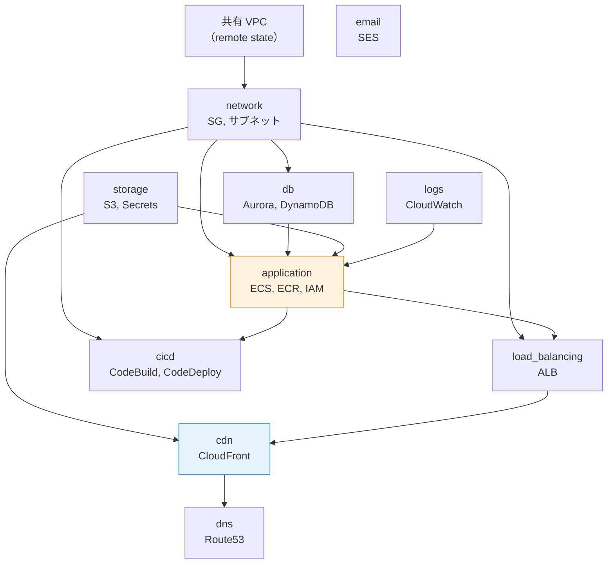
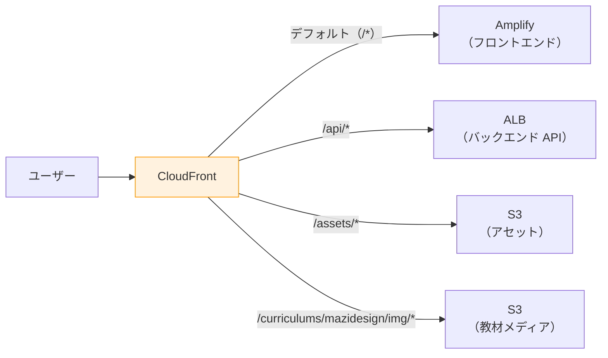

# 6-3-1 Terraform モジュールの読み方

📝 **前提知識**: このセクションは Part 5（インフラストラクチャと CI/CD）の内容を前提としています。

Chapter 6-1 でフロントエンド、Chapter 6-2 でバックエンドのコードを読み解きました。この Chapter では、LMS を支える **インフラのコード** を読みます。フロントエンドとバックエンドのコードが「何を動かすか」を定義するのに対し、インフラのコードは「どこで、どう動かすか」を定義します。

| セクション | テーマ | 種類 |
|---|---|---|
| **6-3-1** | Terraform モジュールの読み方 | 概念 |
| **6-3-2** | CI/CD 設定ファイルと Docker 構成の読み方 | 概念 |

**Chapter ゴール**: LMS のインフラコード（Terraform モジュール・CI/CD 設定・Docker 構成）を読み解く

📖 まず本セクションで Terraform モジュールの構造を読み解き、各モジュールが AWS 上のどのリソースに対応するかを理解します。次のセクション 6-3-2 では CI/CD パイプラインの設定ファイルと Docker 構成を読み解き、コードが本番環境に届くまでの全体像を把握します。

## 🎯 このセクションで学ぶこと

- LMS の `infra/stacks/` ディレクトリ構造と **10 個のモジュール** の役割を理解する
- **`main.tf`** を読んでモジュール間の依存関係を把握する方法を理解する
- **application モジュール**（ECS タスク定義・ECR・IAM）を実際に読み、リソース定義と AWS 上の実体の対応関係を理解する
- **CDN モジュール**（CloudFront）の4つのオリジンとキャッシュ動作を理解する
- **`terraform.tfvars`** による staging / production 環境の差分管理を理解する

Part 5 で学んだ Terraform の概念（HCL 構文、plan → apply → state の動作モデル、モジュール化）を LMS の実コードで確認するセクションです。

---

## 導入: Terraform コードを「読む」とはどういうことか

Part 5 のセクション 5-2 で、Terraform の基本概念を学びました。HCL で `resource` ブロックを書き、`terraform plan` で差分を確認し、`terraform apply` で AWS にリソースを作成する、という流れです。

しかし、LMS のインフラコードを開くと、数十の `.tf` ファイルに数百行の定義が並んでいます。「このコードは AWS 上の何に対応するのか？」「環境ごとの違いはどう管理されているのか？」を素早く把握するには、Terraform コードの読み方のパターンを知っておく必要があります。

### 🧠 先輩エンジニアはこう考える

> Terraform コードを読むとき、最初に見るのは `main.tf` です。ここにモジュールの一覧と依存関係が書かれているので、インフラ全体の構成がわかります。次に見るのは `variables.tf` と `terraform.tfvars`。環境ごとに何が違うのかが一目でわかります。個別のリソース定義は、必要になったときに対応するモジュールに入って読めばいい。つまり、「全体 → 環境差分 → 個別リソース」の順で読むのが効率的です。

---

## `infra/stacks/` のディレクトリマップ

LMS のインフラコードは `infra/stacks/` に集約されています。

```
infra/
├── README.md             # セットアップ手順
├── buildspec.yml         # CodeBuild の設定（6-3-2 で解説）
└── stacks/
    ├── main.tf           # ★ エントリーポイント（モジュール構成）
    ├── variables.tf      # 入力変数の定義
    ├── outputs.tf        # 出力値の定義
    ├── versions.tf       # Terraform / プロバイダーのバージョン制約
    ├── staging/          # staging 環境の設定
    │   └── terraform.tfvars
    ├── production/       # production 環境の設定
    │   └── terraform.tfvars
    └── modules/          # ★ リソース定義の本体
        ├── application/  # ECS, ECR, IAM
        ├── cdn/          # CloudFront
        ├── cicd/         # CodeBuild, CodeDeploy
        ├── db/           # RDS Aurora, DynamoDB
        ├── dns/          # Route53
        ├── email/        # SES
        ├── load_balancing/  # ALB
        ├── logs/         # CloudWatch Logs
        ├── network/      # VPC, セキュリティグループ
        └── storage/      # S3, Secrets Manager
```

### 10 個のモジュールの役割

各モジュールは、Part 5 のセクション 5-1 で学んだ AWS サービスの1つまたは複数に対応します。

| モジュール | AWS サービス | 役割 |
|---|---|---|
| **application** | ECS Fargate, ECR, IAM | コンテナ実行環境（Laravel + Nginx） |
| **cdn** | CloudFront, ACM | コンテンツ配信、SSL 証明書 |
| **cicd** | CodeBuild, CodeDeploy | イメージビルドとデプロイ |
| **db** | Aurora MySQL, DynamoDB | データベース、セッション/キャッシュ |
| **dns** | Route53 | ドメイン管理 |
| **email** | SES | メール送信 |
| **load_balancing** | ALB | ロードバランシング |
| **logs** | CloudWatch Logs | ログ収集 |
| **network** | VPC, Security Groups | ネットワーク、セキュリティ |
| **storage** | S3, Secrets Manager | ファイル保存、シークレット管理 |

🔑 **モジュール名** がそのまま AWS のサービスカテゴリに対応しています。「ECS の設定を変えたい」と思ったら `modules/application/` を、「CloudFront のキャッシュを調整したい」と思ったら `modules/cdn/` を見れば良い、という直感的な構成です。

---

## `main.tf`: インフラの全体設計図

`main.tf` は Terraform プロジェクトのエントリーポイントです。ここにすべてのモジュールの呼び出しと、モジュール間の依存関係が記述されています。

```hcl
# infra/stacks/main.tf（構造を簡略化）

# 命名規則: {プロジェクト名}-{環境名}-new
locals {
  name_prefix = "${var.project_name}-${var.env_name}-new"
}

# 共有リソースからの参照
data "terraform_remote_state" "shared_vpc" {
  # 共有 VPC の情報を取得
}

# ネットワーク
module "network" {
  source      = "./modules/network"
  name_prefix = local.name_prefix
  # ... VPC, セキュリティグループの定義
}

# データベース
module "db" {
  source      = "./modules/db"
  name_prefix = local.name_prefix
  # ... network モジュールの出力を参照
}

# アプリケーション
module "application" {
  source      = "./modules/application"
  name_prefix = local.name_prefix
  # ... db, network, storage モジュールの出力を参照
}

# ロードバランサー
module "load_balancing" {
  source      = "./modules/load_balancing"
  name_prefix = local.name_prefix
  # ... network, application モジュールの出力を参照
}

# CDN
module "cdn" {
  source      = "./modules/cdn"
  name_prefix = local.name_prefix
  # ... load_balancing, storage モジュールの出力を参照
}

# CI/CD
module "cicd" {
  source      = "./modules/cicd"
  name_prefix = local.name_prefix
  # ... application, network モジュールの出力を参照
}

# その他: dns, email, logs, storage
```

**読み方のポイント**:

1. **`locals` ブロック**: `name_prefix` で命名規則を統一しています。たとえば `lms-staging-new-cluster`、`lms-production-new-cluster` のように、すべてのリソース名に環境名が含まれます

2. **`data "terraform_remote_state"`**: 他の Terraform プロジェクト（共有 VPC）の出力を参照しています。LMS のネットワークは独自の VPC ではなく、組織全体で共有する VPC を利用しています

3. **モジュール間の依存関係**: 各 `module` ブロックの引数に、他のモジュールの出力値（`module.network.xxx`、`module.db.xxx` 等）が渡されています。これがモジュール間の依存関係を形成します

### モジュール間の依存関係図



依存の方向は **下位のインフラから上位のアプリケーションへ** 流れています。network（VPC / SG）が土台にあり、その上に db（データベース）と application（コンテナ）が乗り、さらに load_balancing → cdn → dns と積み上がります。

💡 **TIP**: この依存関係は、障害対応時にも役立ちます。「CloudFront が 503 を返している」→ CDN の設定を確認 → ALB の設定を確認 → ECS のタスク状態を確認、と依存の方向を遡ることで原因を切り分けられます。

---

## application モジュール: ECS タスク定義を読む

`modules/application/` は LMS のコンテナ実行環境を定義する、最も重要なモジュールです。

### ECS タスク定義の構造

```hcl
# infra/stacks/modules/application/ecs.tf（構造を簡略化）

# ECS クラスター
resource "aws_ecs_cluster" "app" {
  name = "${var.name_prefix}-cluster"
}

# アプリ用タスク定義（Laravel + Nginx）
resource "aws_ecs_task_definition" "app" {
  family                   = "${var.name_prefix}-app"
  network_mode             = "awsvpc"
  requires_compatibilities = ["FARGATE"]
  cpu                      = var.ecs_task_cpu
  memory                   = var.ecs_task_memory
  execution_role_arn       = aws_iam_role.ecs_execution.arn
  task_role_arn            = aws_iam_role.ecs_task.arn

  container_definitions = jsonencode([
    {
      name  = "nginx"
      image = "${aws_ecr_repository.nginx.repository_url}:latest"
      portMappings = [{
        containerPort = 80
        protocol      = "tcp"
      }]
    },
    {
      name  = "laravel"
      image = "${aws_ecr_repository.laravel.repository_url}:latest"
      environment = [
        { name = "DB_HOST",     value = var.db_host },
        { name = "DB_DATABASE", value = var.db_name },
        { name = "CACHE_STORE", value = "dynamodb" },
        { name = "SESSION_DRIVER", value = "dynamodb" },
        # ... 合計 24 個の環境変数
      ]
      secrets = [
        { name = "DB_PASSWORD", valueFrom = var.db_password_arn },
        { name = "APP_KEY",     valueFrom = var.app_key_arn },
        # ... 合計 6 個のシークレット
      ]
    }
  ])
}

# ECS サービス
resource "aws_ecs_service" "app" {
  name            = "${var.name_prefix}-app-service"
  cluster         = aws_ecs_cluster.app.id
  task_definition = aws_ecs_task_definition.app.arn
  desired_count   = var.env_name == "production" ? 2 : 1

  deployment_controller {
    type = "CODE_DEPLOY"  # Blue/Green デプロイ
  }
}
```

**読み方のポイント**:

1. **1タスク = 2コンテナ**: 1つの ECS タスク定義に Nginx コンテナと Laravel コンテナが含まれています。Part 5 のセクション 5-1 で学んだ「サイドカーパターン」です。Nginx がリクエストを受け、Laravel（PHP-FPM）に転送します

2. **環境変数 vs シークレット**: `environment` に入れる値は平文で保存されますが、`secrets` に入れる値は AWS Secrets Manager から取得されます。パスワードや API キーは `secrets` で管理し、ホスト名やドライバー名は `environment` で管理する、という使い分けです

3. **`desired_count` の環境分岐**: `var.env_name == "production" ? 2 : 1` で、本番は冗長性のために2タスク、それ以外は1タスクに設定しています。HCL の三項演算子による環境分岐です

4. **`CODE_DEPLOY` デプロイ**: Blue/Green デプロイを使用しています。新しいバージョンのタスクが起動し、ヘルスチェックに合格してからトラフィックが切り替わります

### ECR リポジトリ

```hcl
# infra/stacks/modules/application/ecr.tf（構造を簡略化）
resource "aws_ecr_repository" "laravel" {
  name                 = "${var.name_prefix}-laravel"
  image_tag_mutability = "IMMUTABLE"

  lifecycle_policy {
    # 10 世代を超えたイメージは自動削除
  }
}

resource "aws_ecr_repository" "nginx" {
  name                 = "${var.name_prefix}-nginx"
  image_tag_mutability = "IMMUTABLE"
}
```

- **`IMMUTABLE` タグ**: 一度プッシュしたタグを上書きできません。`latest` タグは使わず、デプロイごとにタイムスタンプベースのタグ（例: `20260330120000`）を付けます。これにより、いつでも特定バージョンに戻せます
- **ライフサイクルポリシー**: 古いイメージを自動削除し、ECR のストレージコストを制御します

### IAM ロール

```hcl
# infra/stacks/modules/application/iam.tf（構造を簡略化）

# タスク実行ロール: ECS がコンテナを起動するために必要
resource "aws_iam_role" "ecs_execution" {
  name = "${var.name_prefix}-ecs-execution"
  # ECR からイメージをプル、CloudWatch にログを書き込み
}

# タスクロール: コンテナ内のアプリケーションが使う
resource "aws_iam_role" "ecs_task" {
  name = "${var.name_prefix}-ecs-task"
  # DynamoDB（セッション/キャッシュ）
  # SES（メール送信）
  # S3（ファイル保存）
  # Bedrock（AI モデル呼び出し）
  # Secrets Manager（シークレット取得）
}
```

⚠️ **注意**: **タスク実行ロール** と **タスクロール** は別物です。実行ロールは「ECS がコンテナを起動する」ために使い、タスクロールは「コンテナ内の Laravel アプリケーションが AWS サービスにアクセスする」ために使います。混同するとセキュリティ上の問題が生じます。

---

## CDN モジュール: CloudFront の4つのオリジン

`modules/cdn/` は、LMS のコンテンツ配信を定義しています。

### CloudFront の構成

LMS の CloudFront ディストリビューションは **4つのオリジン** を持ち、URL パスに応じてリクエストを異なるバックエンドに振り分けます。



| パス | オリジン | キャッシュ | 用途 |
|---|---|---|---|
| `/*`（デフォルト） | Amplify | 無効 | Next.js フロントエンド |
| `/api/*` | ALB | 無効 | Laravel API |
| `/assets/*` | S3 | 有効（最適化） | 画像・CSS・JS 等の静的ファイル |
| `/curriculums/mazidesign/img/*` | S3（別バケット） | 有効（最適化） | 教材の画像コンテンツ |

**読み方のポイント**:

- **キャッシュの有無**: API とフロントエンドはキャッシュ無効（常に最新を返す）、静的ファイルはキャッシュ有効（CDN エッジで配信）。Part 5 のセクション 5-1 で学んだ CloudFront のキャッシュ動作がここで設定されています
- **S3 へのアクセス制御**: Origin Access Control（OAC）を使い、CloudFront 経由でのみ S3 にアクセスできるよう制限しています。S3 バケットの直接アクセスは禁止です
- **セキュリティ**: TLS 1.2 以上を必須とし、SNI（Server Name Indication）を使用しています

💡 **TIP**: セクション 6-1-2 で見たフロントエンドの `http()` 関数が `/api/workspaces/:workspaceId/employees` にリクエストを送ると、CloudFront が `/api/*` のルールに基づいて ALB に転送し、ALB が ECS 上の Laravel に届ける、という流れです。フロントエンド → CloudFront → ALB → ECS → Laravel という経路が、Terraform のコードで定義されています。

---

## 環境差分の管理: `terraform.tfvars`

LMS は staging と production の2つの環境を運用しています。環境ごとの設定差分は `terraform.tfvars` で管理されます。

### staging 環境

```hcl
# infra/stacks/staging/terraform.tfvars
env_name           = "staging"
site_sub_domain    = "stag-new"
site_domain        = "coachtech.site"
github_branch_name = "staging"
ecs_task_cpu       = 256
ecs_task_memory    = 512
rds_instance_class = "db.t3.medium"
batch_schedule     = "cron(0 * * * ? *)"    # 毎時
assets_bucket      = "coachtech-lms-bucket-stag"
```

### production 環境

```hcl
# infra/stacks/production/terraform.tfvars
env_name           = "production"
site_sub_domain    = "lms"
site_domain        = "coachtech.site"
github_branch_name = "main"
ecs_task_cpu       = 1024
ecs_task_memory    = 2048
rds_instance_class = "db.t3.medium"
batch_schedule     = "cron(0/5 * * * ? *)"  # 5分ごと
assets_bucket      = "coachtech-lms-bucket"
```

### 環境間の差分比較

| 項目 | staging | production | 理由 |
|---|---|---|---|
| **ECS CPU** | 256 (0.25 vCPU) | 1024 (1 vCPU) | 本番は4倍のコンピューティング |
| **ECS メモリ** | 512 MB | 2048 MB | 本番は4倍のメモリ |
| **バッチスケジュール** | 毎時 | 5分ごと | 本番はリアルタイム性が必要 |
| **GitHub ブランチ** | staging | main | ブランチ戦略に対応 |
| **サブドメイン** | stag-new | lms | URL で環境を区別 |
| **S3 バケット** | -stag | （なし） | 環境ごとに独立 |

🔑 Terraform コードの本体（`main.tf` やモジュール内の `.tf` ファイル）は **staging と production で共通** です。環境ごとに異なるのは `terraform.tfvars` の値だけ。これが Part 5 で学んだ「Infrastructure as Code による環境の一貫性」の実践です。同じコードから staging と production を作るので、「staging で動いたのに production で動かない」という問題が構造的に起きにくくなっています。

### `variables.tf` の役割

```hcl
# infra/stacks/variables.tf（抜粋）
variable "env_name" {
  type        = string
  description = "Environment name (staging/production)"
}

variable "ecs_task_cpu" {
  type        = number
  description = "ECS task CPU units"
}

variable "ecs_task_memory" {
  type        = number
  description = "ECS task memory (MiB)"
}

variable "rds_database_password" {
  type        = string
  description = "RDS database password"
  sensitive   = true
}
```

`variables.tf` は「どんな変数が必要か」を定義し、`terraform.tfvars` が「各環境での具体的な値」を与えます。`sensitive = true` が付いた変数は、`terraform plan` の出力でマスクされます。

---

## Terraform コードを読むための3ステップ

LMS のインフラコードを読むときは、以下の順序で進めると効率的です。

### 1. `main.tf` で全体構成を把握する

モジュールの一覧と依存関係を確認し、「どのモジュールが何を管理しているか」の全体像を掴みます。

### 2. `terraform.tfvars` で環境差分を確認する

staging と production の `terraform.tfvars` を比較し、「環境ごとに何が違うか」を把握します。

### 3. 対象のモジュールに入って個別リソースを読む

変更したい AWS リソースに対応するモジュールのディレクトリに入り、`.tf` ファイルを読みます。

🔑 **この3ステップは、Claude Code に指示を出すときにも使えます。** たとえば「ECS のメモリを増やしたい」という場合、Step 1 で application モジュールを特定し、Step 2 で `terraform.tfvars` の `ecs_task_memory` を確認し、Step 3 で「`production/terraform.tfvars` の `ecs_task_memory` を 2048 から 4096 に変更して」と指示できます。

⚠️ **注意**: LMS のリポジトリでは **`infra/` 配下は編集禁止** がルールです。本番環境に直接影響するため、変更が必要な場合は必ずチームに相談してください。

---

## ✨ まとめ

- LMS のインフラコードは `infra/stacks/` に集約され、**10 個のモジュール** で AWS リソースが管理されている。モジュール名が AWS のサービスカテゴリに対応しており、直感的にナビゲーションできる
- **`main.tf`** がモジュール間の依存関係を定義するエントリーポイントであり、ここを読めばインフラ全体の構成がわかる
- **application モジュール** では、1つの ECS タスクに Nginx + Laravel の2コンテナが含まれ、環境変数とシークレットが分離管理されている
- **CDN モジュール** では、CloudFront が URL パスに応じてフロントエンド（Amplify）、API（ALB）、静的ファイル（S3）にリクエストを振り分けている
- **`terraform.tfvars`** で staging / production の差分を管理し、Terraform コードの本体は環境間で共通。これにより環境の一貫性が構造的に保たれている

---

次のセクションでは、CI/CD パイプラインの設定ファイル（GitHub Actions ワークフロー、buildspec.yml）と Docker 構成（Dockerfile、Docker Compose、Makefile）を読み解き、コードが本番環境に届くまでのデプロイパイプライン全体像を把握します。
