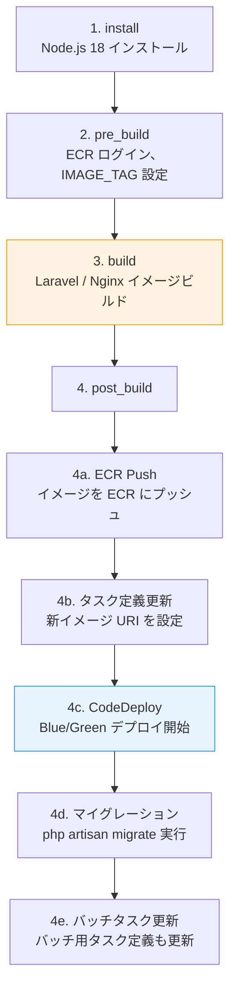
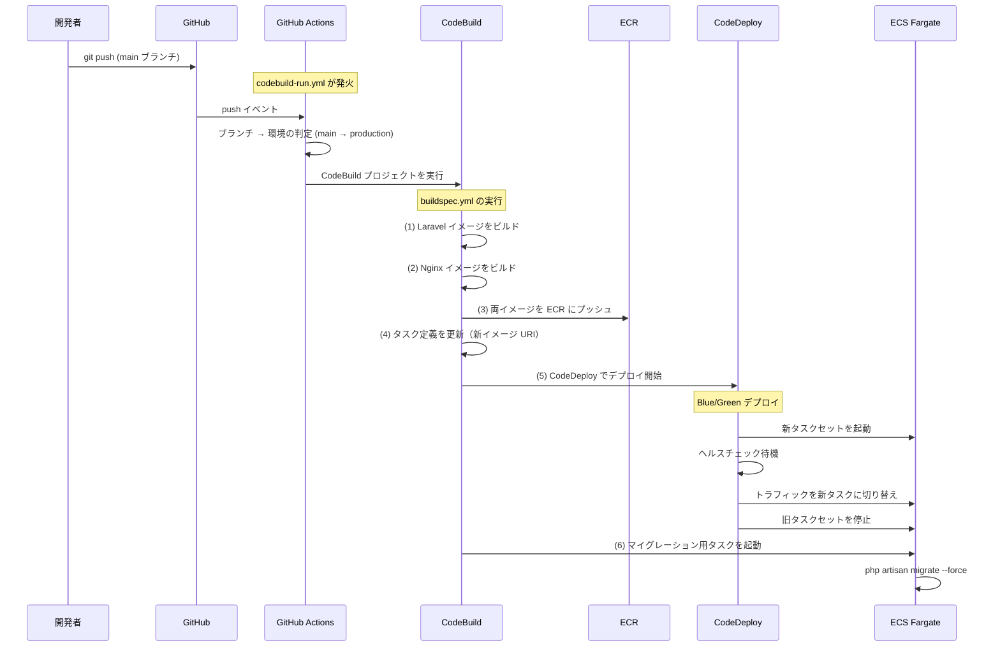

# 6-3-2 CI/CD 設定ファイルと Docker 構成の読み方

📝 **前提知識**: このセクションはセクション 6-3-1（Terraform モジュールの読み方）および Part 5 セクション 5-3（CI/CD パイプライン）の内容を前提としています。

## 🎯 このセクションで学ぶこと

- **GitHub Actions ワークフロー** のトリガー条件とブランチ→環境の対応関係を理解する
- **`buildspec.yml`** の全フェーズ（イメージビルド → ECR Push → タスク定義更新 → CodeDeploy → マイグレーション）を理解する
- **Dockerfile** の本番 vs ローカルの違いと設計意図を理解する
- **Docker Compose と Makefile** によるローカル開発環境の構成を理解する
- コードが本番環境に届くまでの **デプロイパイプライン全体像** を理解する

セクション 6-3-1 で Terraform モジュールが「AWS 上に何を作るか」を理解しました。このセクションでは、「コードの変更がどうやって AWS 上のコンテナに届くのか」を CI/CD パイプラインの設定ファイルで追います。

---

## 導入: 「git push したら本番に反映される」の裏側

日常の開発フローでは、コードを `main` ブランチにマージすれば本番環境に自動デプロイされます。しかし、この「自動」の裏側では、複数のツールが連携して複雑なパイプラインを構成しています。

```
git push → GitHub Actions → CodeBuild → ECR → CodeDeploy → ECS
```

この一連の流れの中で、どの設定ファイルがどのステップを制御しているかを理解しておくと、デプロイが失敗したときに「どこで止まっているか」を素早く特定できます。

### 🧠 先輩エンジニアはこう考える

> デプロイが失敗したとき、「GitHub Actions のログ」「CodeBuild のログ」「CodeDeploy のログ」のどれを見るかで調査速度が全然違います。CI/CD の設定ファイルを一度読んでおけば、「Docker イメージのビルド失敗なら CodeBuild」「タスクが起動しないなら ECS のタスクログ」「ヘルスチェック失敗なら ALB のターゲットグループ」とすぐに切り分けられます。

---

## GitHub Actions ワークフロー

LMS の GitHub Actions ワークフローは `.github/workflows/` に配置されています。デプロイに関係するのは主に2つのワークフローです。

### `codebuild-run.yml`: Docker イメージのビルドとデプロイ

```yaml
# .github/workflows/codebuild-run.yml（構造を簡略化）
name: Run CodeBuild

on:
  push:
    branches:
      - main
      - staging
    paths:
      - 'backend/**'
      - 'docker/*/production/**'

jobs:
  build:
    runs-on: ubuntu-latest
    steps:
      - name: Determine Stack Name
        run: |
          if [ "${{ github.ref_name }}" = "main" ]; then
            echo "STACK_NAME=production" >> $GITHUB_ENV
          else
            echo "STACK_NAME=staging" >> $GITHUB_ENV
          fi

      - name: Configure AWS credentials
        uses: aws-actions/configure-aws-credentials@v4

      - name: Run CodeBuild
        uses: aws-actions/aws-codebuild-run-build@v1
        with:
          project-name: lms-${{ env.STACK_NAME }}-new-ecs-image-build
```

**読み方のポイント**:

1. **トリガー条件**: `main` または `staging` ブランチへの push で、かつ `backend/` または `docker/*/production/` のファイルが変更された場合にのみ実行されます。フロントエンドのみの変更ではこのワークフローは動きません

2. **ブランチ → 環境の対応**: `main` ブランチ → production 環境、`staging` ブランチ → staging 環境。セクション 6-3-1 で見た `terraform.tfvars` の `github_branch` と一致しています

3. **CodeBuild プロジェクトの呼び出し**: `lms-{STACK_NAME}-new-ecs-image-build` という CodeBuild プロジェクト（セクション 6-3-1 の cicd モジュールで定義）を実行します。実際のビルドロジックは CodeBuild 側の `buildspec.yml` で定義されています

### `terraform-stack-apply.yml`: インフラの自動適用

```yaml
# .github/workflows/terraform-stack-apply.yml（構造を簡略化）
name: Terraform Stack Apply

on:
  push:
    branches:
      - main
      - staging
    paths:
      - 'infra/stacks/**'

jobs:
  determine-dir:
    runs-on: ubuntu-latest
    outputs:
      tf_dir: ${{ steps.set-dir.outputs.dir }}
    steps:
      - name: Set working directory
        id: set-dir
        run: |
          if [ "${{ github.ref_name }}" = "main" ]; then
            echo "dir=infra/stacks/production" >> $GITHUB_OUTPUT
          else
            echo "dir=infra/stacks/staging" >> $GITHUB_OUTPUT
          fi

  apply:
    needs: determine-dir
    uses: ./.github/workflows/terraform-apply.yml
    with:
      TF_WORKING_DIR: ${{ needs.determine-dir.outputs.tf_dir }}
```

**読み方のポイント**:

- `infra/stacks/` 配下のファイルが変更された場合にのみ実行されます
- ブランチに応じて `infra/stacks/production` または `infra/stacks/staging` ディレクトリで `terraform apply` を実行します
- 再利用可能ワークフロー（`terraform-apply.yml`）を呼び出すことで、Terraform の init → apply の手順を共通化しています

### ワークフローの使い分け

| ワークフロー | トリガー | 実行内容 |
|---|---|---|
| `codebuild-run.yml` | `backend/` or `docker/*/production/**` の変更 | Docker イメージビルド → デプロイ |
| `terraform-stack-apply.yml` | `infra/stacks/**` の変更 | Terraform apply（インフラ変更） |

つまり、**アプリケーションの変更** と **インフラの変更** で別々のパイプラインが動く仕組みです。日常の開発では `codebuild-run.yml` が頻繁に動き、`terraform-stack-apply.yml` はインフラ構成を変更したときだけ動きます。

---

## `buildspec.yml`: デプロイの全フェーズ

GitHub Actions が CodeBuild を呼び出すと、`infra/buildspec.yml` に定義されたビルド手順が実行されます。このファイルがデプロイの「本体」です。

### 全体フロー



### 各フェーズの詳細

```yaml
# infra/buildspec.yml（構造を簡略化）
version: 0.2

phases:
  install:
    runtime-versions:
      nodejs: 18

  pre_build:
    commands:
      # ECR にログイン
      - aws ecr get-login-password | docker login --username AWS --password-stdin $ECR_REPO_LARAVEL
      # IMAGE_TAG を設定（タイムスタンプベース）
      - IMAGE_TAG=$(date +%Y%m%d%H%M%S)

  build:
    commands:
      # Laravel イメージのビルド
      - docker build -t $ECR_REPO_LARAVEL:$IMAGE_TAG
          -f docker/laravel/production/Dockerfile .
      # Nginx イメージのビルド
      - docker build -t $ECR_REPO_NGINX:$IMAGE_TAG
          -f docker/nginx/production/Dockerfile .

  post_build:
    commands:
      # (4a) ECR にプッシュ
      - docker push $ECR_REPO_LARAVEL:$IMAGE_TAG
      - docker push $ECR_REPO_NGINX:$IMAGE_TAG

      # (4b) 既存のタスク定義を取得し、イメージ URI を更新
      - >
        TASK_DEF=$(aws ecs describe-task-definition
          --task-definition $ECS_TASK_DEFINITION_NAME
          | jq '.taskDefinition.containerDefinitions'
          | jq '(.[] | select(.name == "nginx") | .image)
              = "'$ECR_REPO_NGINX:$IMAGE_TAG'"'
          | jq '(.[] | select(.name == "laravel") | .image)
              = "'$ECR_REPO_LARAVEL:$IMAGE_TAG'"')
      - aws ecs register-task-definition ...

      # (4c) CodeDeploy でデプロイ開始
      - >
        aws deploy create-deployment
          --application-name $CODEDEPLOY_APP_NAME
          --deployment-group-name $CODEDEPLOY_DEPLOYMENT_GROUP_NAME
          --revision '{ "revisionType": "AppSpecContent", ... }'

      # (4d) マイグレーション実行（別タスクとして起動）
      - >
        aws ecs run-task
          --cluster $ECS_CLUSTER_NAME
          --task-definition $ECS_TASK_DEFINITION_NAME
          --overrides '{
            "containerOverrides": [{
              "name": "laravel",
              "command": ["php", "artisan", "migrate", "--force"]
            }]
          }'

      # (4e) バッチ用タスク定義も同様に更新
```

**読み方のポイント**:

1. **イメージタグ戦略**: `IMAGE_TAG=$(date +%Y%m%d%H%M%S)` でタイムスタンプベースのタグを生成します。セクション 6-3-1 で見た ECR の `IMMUTABLE` タグポリシーと組み合わせることで、「いつビルドされたイメージか」が一目でわかります

2. **タスク定義の更新**: `jq` コマンドを使って、既存のタスク定義 JSON からコンテナイメージの URI だけを新しいタグに書き換えます。タスク定義のその他の設定（環境変数、メモリ、CPU 等）はそのまま引き継がれます

3. **マイグレーションの実行**: `aws ecs run-task` で **一時的なタスク** を起動し、`php artisan migrate --force` を実行します。ECS サービスとは別のタスクとして実行するため、マイグレーション中もアプリケーションは通常通り動作し続けます

4. **バッチタスクの更新**: アプリケーションタスク（Web リクエストを処理）とは別に、定期実行用のバッチタスク（`php artisan schedule:run`）があります。両方のタスク定義を同じイメージで更新することで、バージョンの不整合を防ぎます

⚠️ **注意**: マイグレーションはデプロイとほぼ同時に実行されます。マイグレーションで破壊的な変更（カラム削除等）を行う場合は、アプリケーションコードの変更と分けてデプロイする必要があります（Part 5 セクション 5-3 で学んだ「マイグレーションの安全な実行」）。

---

## Dockerfile: 本番 vs ローカルの設計

LMS では、同じアプリケーションに対して **本番用** と **ローカル用** の2種類の Dockerfile を管理しています。

### Laravel の Dockerfile 比較

**本番用**:

```dockerfile
# docker/laravel/production/Dockerfile（主要部分の抜粋）
FROM php:8.1-fpm-bullseye

WORKDIR /var/www/html

# Composer インストール
COPY --from=composer:2.3 /usr/bin/composer /usr/bin/composer

# PHP 拡張: intl, pdo_mysql, zip, bcmath
RUN docker-php-ext-install intl pdo_mysql zip bcmath

# アプリケーションコードをコピー
COPY ./backend /var/www/html

# 本番用 php.ini をコピー
COPY ./docker/php/production/php.ini /usr/local/etc/php/php.ini

# 依存関係インストール（dev 依存は除外）
RUN composer install --no-dev --optimize-autoloader

# ストレージディレクトリの権限設定
RUN chmod -R 755 storage

# キャッシュクリア → キャッシュ生成 → PHP-FPM 起動
CMD php artisan config:clear && php artisan config:cache && php-fpm

EXPOSE 9000
```

**ローカル用**:

```dockerfile
# docker/laravel/local/Dockerfile（主要部分の抜粋）
FROM php:8.1-fpm-bullseye

WORKDIR /var/www/html

COPY --from=composer:2.3 /usr/bin/composer /usr/bin/composer

RUN docker-php-ext-install intl pdo_mysql zip bcmath

# ★ アプリケーションコードはコピーしない（bind mount で共有）
# ★ composer install も実行しない（手動で実行）

CMD php-fpm

EXPOSE 9000
```

| 項目 | 本番用 | ローカル用 | 理由 |
|---|---|---|---|
| **コードの配置** | `COPY ./backend` でイメージに含める | bind mount でホストと共有 | ローカルはファイル変更を即反映 |
| **依存関係** | `composer install --no-dev` | 手動で実行 | ローカルは dev 依存も必要 |
| **php.ini** | `display_errors = off`, メモリ 512M | `display_errors = on`, メモリ 256M | 本番はセキュリティ重視 |
| **起動コマンド** | config:clear → config:cache → php-fpm | php-fpm のみ | 本番はキャッシュで高速化 |

🔑 **本番用 Dockerfile はイメージの中にすべてを含める「自己完結型」** です。一方、**ローカル用は bind mount を前提とした「軽量型」** です。この違いは、本番では「同じイメージから何台でも同じ環境を起動できる」再現性を重視し、ローカルでは「コードを変えたら即座に反映される」開発効率を重視しているためです。

### Nginx の Dockerfile

```dockerfile
# docker/nginx/production/Dockerfile
FROM nginx:1.25-alpine
COPY ./docker/nginx/production/conf.d/app.conf /etc/nginx/conf.d/default.conf
COPY ./backend/public /var/www/html/public
```

Nginx の Dockerfile はシンプルです。設定ファイルと Laravel の `public/` ディレクトリ（CSS / JS / 画像等の静的ファイル）をイメージに含めます。Nginx は Laravel の PHP ファイルを直接実行せず、`/public` 以下の静的ファイルを配信し、それ以外のリクエストを PHP-FPM（Laravel コンテナ）に転送します。

---

## Docker Compose: ローカル開発環境

`docker-compose.yml` は、ローカルで LMS を動かすための全サービスを定義しています。

```yaml
# docker-compose.yml（構造を簡略化）
services:
  app:                    # Laravel（PHP-FPM）
    build: docker/laravel/local
    volumes:
      - ./backend:/var/www/html           # ★ bind mount
      - ./docker/php/local/php.ini:/usr/local/etc/php/php.ini
    environment:
      DB_HOST: db
      DB_DATABASE: laravel
      DB_USERNAME: phper
      DB_PASSWORD: secret

  web:                    # Nginx（リバースプロキシ）
    build: docker/nginx/local
    ports:
      - "${WEB_PUBLISHED_PORT:-80}:80"
    volumes:
      - ./backend/public:/var/www/html/public

  db:                     # MySQL 8.0
    build: docker/mysql
    ports:
      - "${DB_PUBLISHED_PORT:-3306}:3306"
    volumes:
      - db-store:/var/lib/mysql           # 永続ボリューム

  phpmyadmin:             # データベース管理 UI
    image: phpmyadmin/phpmyadmin
    ports:
      - "${PHPMYADMIN_PUBLISHED_PORT:-51081}:80"

  mailpit:                # ローカルメールテスト
    image: axllent/mailpit:latest
    ports:
      - "${MAILPIT_WEB_PORT:-8025}:8025"  # Web UI
      - "${MAILPIT_SMTP_PORT:-1025}:1025" # SMTP
```

**読み方のポイント**:

1. **bind mount**: `./backend:/var/www/html` でホストの `backend/` ディレクトリをコンテナ内にマウントしています。ホスト側でファイルを編集すると、コンテナ内にも即座に反映されます

2. **サービス構成**: 本番環境の構成（Nginx + Laravel + MySQL）に加えて、開発専用のサービス（phpMyAdmin, Mailpit）が含まれています

3. **環境変数のデフォルト値**: `${WEB_PUBLISHED_PORT:-80}` は、環境変数が未設定の場合に 80 を使います。`.env` ファイルでポート番号をカスタマイズできる設計です

### 本番環境との対応

| ローカル | 本番（AWS） | 説明 |
|---|---|---|
| `app` サービス（PHP-FPM） | ECS Fargate（Laravel コンテナ） | Laravel の実行環境 |
| `web` サービス（Nginx） | ECS Fargate（Nginx コンテナ） | リバースプロキシ |
| `db` サービス（MySQL 8.0） | Aurora MySQL | データベース |
| Mailpit | SES | メール送信 |
| phpMyAdmin | — | ローカル専用の管理ツール |
| — | CloudFront | CDN（ローカルでは不要） |
| — | ALB | ロードバランサー（ローカルは1台） |
| — | DynamoDB | セッション/キャッシュ（ローカルはファイル） |

---

## Makefile: 開発コマンドの統一

`Makefile` は、Docker Compose のコマンドをラップして、チーム全体で統一されたコマンド体系を提供します。

```makefile
# Makefile（主要コマンドの抜粋）

# コンテナ管理
up:
	docker compose up -d
stop:
	docker compose stop
down:
	docker compose down

# シェルアクセス
app:
	docker compose exec app bash
web:
	docker compose exec web sh
db:
	docker compose exec db bash

# データベース
migrate:
	docker compose exec app php artisan migrate
fresh:
	docker compose exec app php artisan migrate:fresh --seed
seed:
	docker compose exec app php artisan db:seed

# テスト
test:
	docker compose exec app php artisan test
single-test:
	docker compose exec app php artisan test --filter=$(FILENAME)

# プロジェクト初期化
create-project:
	@make build
	@make up
	@make install
	docker compose exec app php artisan key:generate
	docker compose exec app php artisan storage:link
	@make fresh
```

**読み方のポイント**:

- `make up` / `make stop` / `make app` など、日常の操作が短いコマンドに集約されています
- `make fresh` は「データベースを完全にリセットしてシーダーを実行する」複合コマンドです。開発中にデータベースの状態をリセットしたいときに使います
- `make create-project` は、リポジトリを clone した直後に1回だけ実行するセットアップコマンドです

💡 **TIP**: Part 1 のセクション 1-1 で学んだ Makefile の仕組みが、ここで実践されています。`docker compose exec app php artisan migrate` という長いコマンドを `make migrate` と短縮することで、チーム全員が同じ手順で操作できます。

---

## デプロイパイプライン全体図

ここまで見てきた設定ファイルが、デプロイパイプラインの中でどのように連携するかを全体図にまとめます。



### 各設定ファイルの役割の対応

| ステップ | 設定ファイル | 内容 |
|---|---|---|
| push → ワークフロー発火 | `.github/workflows/codebuild-run.yml` | トリガー条件とブランチ→環境の判定 |
| イメージビルド → デプロイ | `infra/buildspec.yml` | ビルド、プッシュ、タスク定義更新、デプロイ実行 |
| Laravel イメージの内容 | `docker/laravel/production/Dockerfile` | PHP 拡張、依存関係、起動コマンド |
| Nginx イメージの内容 | `docker/nginx/production/Dockerfile` | Nginx 設定、静的ファイル |
| ECS / CodeDeploy の定義 | `infra/stacks/modules/application/ecs.tf` | タスク定義、サービス、デプロイ設定 |
| CodeBuild の定義 | `infra/stacks/modules/cicd/` | ビルドプロジェクト、ロール |

🔑 デプロイパイプラインは **設定ファイルのチェーン** です。GitHub Actions → buildspec.yml → Dockerfile → Terraform という順番で、それぞれの設定ファイルが次のステップに情報を渡しています。問題が起きたときは、このチェーンのどこで止まっているかを特定するのが最初のステップです。

---

## デプロイの失敗を切り分けるためのガイド

| 症状 | 確認箇所 | 設定ファイル |
|---|---|---|
| ワークフローが動かない | GitHub Actions のログ | `codebuild-run.yml` のトリガー条件 |
| イメージビルドが失敗 | CodeBuild のビルドログ | `buildspec.yml` の build フェーズ、Dockerfile |
| ECR へのプッシュが失敗 | CodeBuild のログ | `buildspec.yml` の post_build、IAM ロール |
| タスクが起動しない | ECS のタスクログ、CloudWatch | `ecs.tf` のタスク定義、環境変数 |
| ヘルスチェック失敗 | ALB のターゲットグループ | `load_balancing/` モジュール |
| マイグレーション失敗 | ECS の run-task ログ | `buildspec.yml` のマイグレーションコマンド |

---

## ✨ まとめ

- GitHub Actions ワークフローは **アプリケーション変更**（`codebuild-run.yml`）と **インフラ変更**（`terraform-stack-apply.yml`）で別パイプラインが動き、ブランチに応じて staging / production に振り分けられる
- **`buildspec.yml`** がデプロイの本体で、イメージビルド → ECR プッシュ → タスク定義更新 → CodeDeploy 実行 → マイグレーション実行の全フェーズを制御する
- **Dockerfile** は本番用（自己完結型）とローカル用（bind mount 前提の軽量型）の2種類があり、本番用はセキュリティとパフォーマンス、ローカル用は開発効率を重視している
- **Docker Compose** でローカル開発環境を構成し、**Makefile** でコマンドを統一することで、チーム全員が同じ手順で開発できる
- デプロイパイプラインは GitHub Actions → buildspec.yml → Dockerfile → Terraform という **設定ファイルのチェーン** であり、問題発生時はチェーンのどこで止まっているかを特定することが第一歩

---

この Chapter では、Terraform モジュールの構造（6-3-1）と CI/CD 設定ファイル・Docker 構成（6-3-2）を読み解きました。これでフロントエンド（Chapter 6-1）、バックエンド（Chapter 6-2）、インフラ（Chapter 6-3）の3領域のコードを個別に読む力が揃いました。次の Chapter では、これらの知識を統合し、1つの機能をフロントエンドからインフラまでエンドツーエンドでトレースする方法と、新機能追加時のコード変更箇所の特定手法を学びます。
