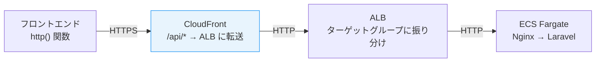
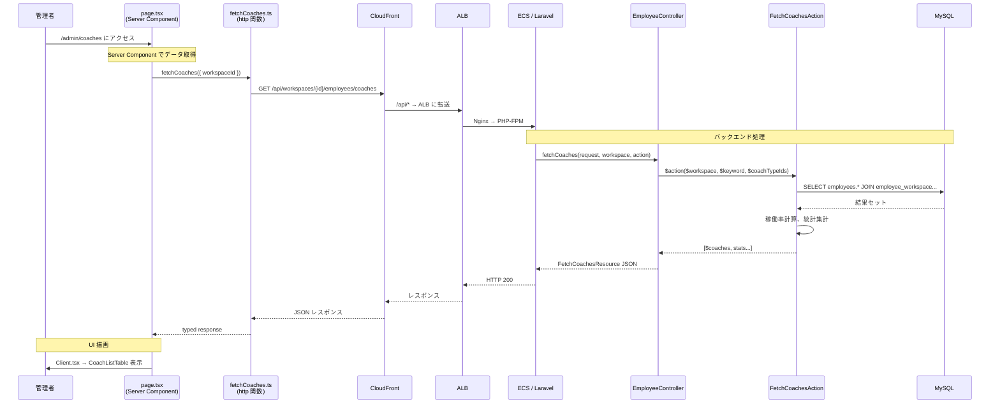

# 6-4-1 リクエストフローのエンドツーエンドトレース

📝 **前提知識**: このセクションはセクション 6-1-2（feature モジュールの構造）およびセクション 6-2-1（リクエストのライフサイクル）の内容を前提としています。

Chapter 6-1〜6-3 では、フロントエンド・バックエンド・インフラのコードを個別に読み解きました。この Chapter では、**1つの機能を選び、ユーザーの操作から画面の更新まで、3つの領域を横断してトレース** します。

| セクション | テーマ | 種類 |
|---|---|---|
| **6-4-1** | リクエストフローのエンドツーエンドトレース | 概念 |
| **6-4-2** | 新機能追加時のコード変更箇所の特定 | 概念 |

**Chapter ゴール**: フロントエンドからインフラまでを横断し、1つの機能がどう実現されているかをエンドツーエンドで追う

📖 まず本セクションで LMS の具体的な機能を1つ選び、UI のクリックからデータベースクエリ、レスポンス、画面更新までの全体フローをトレースします。次のセクション 6-4-2 では、このトレーシング力を活用して、新機能追加時に変更が必要な箇所を特定する方法と CLAUDE.md / AGENTS.md を活用したコードナビゲーション手法を学びます。

## 🎯 このセクションで学ぶこと

- ユーザー操作（UI クリック）から画面更新までの **全体フロー** を、LMS の具体的な機能で1本の線としてトレースする
- フロントエンド（コンポーネント → API 呼び出し）→ ネットワーク（CloudFront → ALB → ECS）→ バックエンド（Controller → UseCase → DB）→ レスポンス → UI 更新の **各層の接続点** を理解する
- 機能トレーシングの **手順とコツ** を身につけ、他の機能にも応用できるようにする

Chapter 6-1〜6-3 で各領域のコードを「横に」読む力を養いました。このセクションでは、その力を統合し、1つの機能を「縦に」貫通して追います。

---

## 導入: 「この機能、どこを見ればいい？」に即答できるか

「コーチ一覧画面に表示されるデータがおかしい」という報告を受けたとき、あなたはどこから調査を始めますか？

Chapter 6-1〜6-3 の知識があれば、「フロントエンドの `features/v2/employee/` か、バックエンドの `UseCases/Employee/` のどちらかだろう」と見当はつきます。しかし、具体的にどのファイルのどの行を追えばいいかは、**実際に1つの機能をエンドツーエンドでトレースした経験** がなければ判断できません。

このセクションでは、**コーチ一覧機能** を題材に、UI のクリックからデータベースクエリまでの全経路を1つずつ追いかけます。

### 🧠 先輩エンジニアはこう考える

> 機能トレーシングは「最も効率的なデバッグ手法」です。問題が起きたとき、リクエストの流れに沿って上流から順に確認していけば、必ずどこかで「期待と違う」箇所が見つかります。逆に、流れを知らないままコードを検索しても、見当違いのファイルを何十個も開くことになります。1つの機能を丁寧にトレースした経験は、他のすべての機能のトレースに応用できます。


---

## トレース対象: コーチ一覧機能

今回トレースするのは **コーチ一覧画面** です。管理者が LMS にログインし、コーチの一覧を表示する機能です。

**機能の概要**:
- 管理者がコーチ一覧ページにアクセスする
- バックエンドからコーチのデータ（名前、優先度、稼働率等）を取得する
- テーブル形式で表示し、キーワード検索やコーチタイプでのフィルタリングができる

この機能を選んだ理由は、以下の3つの層すべてを通過するシンプルかつ完全な例だからです。

| 層 | 関連する Chapter |
|---|---|
| フロントエンド: page.tsx → Client.tsx → CoachListTable → fetchCoaches API | Chapter 6-1 |
| バックエンド: Route → Controller → UseCase → Model → Resource | Chapter 6-2 |
| インフラ: CloudFront → ALB → ECS Fargate | Chapter 6-3 |

---

## フロントエンド層のトレース

ユーザーがブラウザでコーチ一覧ページにアクセスしたところから始めます。

### Step 1: page.tsx — Server Component でのデータ取得

```tsx
// frontend/src/app/v2/employee/[workspaceId]/admin/(main)/coaches/page.tsx
// 以下は主要部分の抜粋です
export default async function CoachesPage({ params, searchParams }) {
  const { workspaceId } = params
  const { keyword, coachTypeIds } = searchParams

  // サーバーサイドで並行してデータ取得
  const [coachesResponse, coachTypes] = await Promise.all([
    fetchCoaches({
      pathParams: { workspaceId },
      queryParams: { keyword, coach_type_ids: coachTypeIds },
    }),
    fetchCoachTypes({ pathParams: { workspaceId } }),
  ])

  return (
    <Client
      coaches={coachesResponse.data}
      coachTypes={coachTypes.data}
      totalWorkRate={coachesResponse.meta.totalWorkRate}
      totalAvailableCount={coachesResponse.meta.totalAvailableCount}
      totalActiveUserCount={coachesResponse.meta.totalActiveUserCount}
    />
  )
}
```

**読み方のポイント**:

- これは **Server Component** です（`'use client'` ディレクティブがない）。セクション 6-1-3 で学んだように、データ取得はサーバーサイドで行われます
- `Promise.all` で `fetchCoaches` と `fetchCoachTypes` を **並行実行** しています。2つの API を順番に呼ぶよりも高速です
- URL パスの `[workspaceId]` は Next.js の Dynamic Route です。`/v2/employee/abc123/admin/coaches` にアクセスすると、`workspaceId = "abc123"` が渡されます
- `searchParams` から検索キーワードとフィルター条件を受け取ります。URL の `?keyword=田中&coachTypeIds=1` がそのまま引数になります

### Step 2: Client.tsx — UI シェルの描画

```tsx
// frontend/src/app/v2/employee/[workspaceId]/admin/(main)/coaches/Client.tsx
// 以下は主要部分の抜粋です
'use client'

export default function Client({
  coaches, coachTypes,
  totalWorkRate, totalAvailableCount, totalActiveUserCount,
}) {
  return (
    <PageLayout title="コーチ一覧">
      {/* 統計カード: 稼働率、総対応可能人数、総担当生徒数 */}
      <div className="grid grid-cols-3 gap-4">
        <StatCard label="稼働率" value={`${totalWorkRate}%`} />
        <StatCard label="総対応可能人数" value={totalAvailableCount} />
        <StatCard label="総担当生徒数" value={totalActiveUserCount} />
      </div>

      {/* コーチ一覧テーブル */}
      <CoachListTable
        coaches={coaches}
        coachTypes={coachTypes}
      />
    </PageLayout>
  )
}
```

- `'use client'` が宣言されているので **Client Component** です。ブラウザ上で実行されます
- page.tsx から受け取ったデータを表示するだけで、自身ではデータ取得を行いません
- `CoachListTable` コンポーネント（`features/v2/employee/components/`）にテーブルの描画を委譲しています

### Step 3: CoachListTable — テーブル表示とインタラクション

```tsx
// frontend/src/features/v2/employee/components/CoachListTable.tsx
// 以下は主要部分の抜粋です
export function CoachListTable({ coaches, coachTypes }) {
  // 検索キーワード（500ms デバウンス付き）
  // コーチタイプフィルター
  // ソート（優先度、稼働率、コスト等）

  return (
    <Table>
      <TableHeader>
        {/* コーチタイプ | 名前 | 優先度 | コスト | 対応可能人数 | 担当生徒数 | 稼働率 */}
      </TableHeader>
      <TableBody>
        {coaches.map((coach) => (
          <TableRow key={coach.id} onClick={() => navigateToDetail(coach.id)}>
            <TableCell>{coach.activeWorkspace.coachType?.name}</TableCell>
            <TableCell>{coach.name}</TableCell>
            <TableCell>{coach.activeWorkspace.priority.label}</TableCell>
            <TableCell>{coach.activeWorkspace.wages}</TableCell>
            <TableCell>{coach.activeWorkspace.userCapacity}</TableCell>
            <TableCell>{coach.activeUsersCount}</TableCell>
            <TableCell>{coach.workRate}%</TableCell>
          </TableRow>
        ))}
      </TableBody>
    </Table>
  )
}
```

- セクション 6-1-2 で学んだ feature の `components/` に配置されています
- `coach.activeWorkspace.priority.label` のように、バックエンドの Resource が返したネストされたデータ構造をそのまま使っています
- 検索はデバウンス付き（500ms）で、ユーザーがタイピングを止めてから API を呼び出します

### Step 4: fetchCoaches — API 関数

```typescript
// frontend/src/features/v2/employee/api/fetchCoaches.ts
// 以下は主要部分の抜粋です
export type FetchCoachesHttpDocument = HttpDocument<
  { workspaceId: string },                              // PathParams
  { keyword?: string; coach_type_ids?: string[] },      // QueryParams
  undefined,                                             // RequestBody
  {
    data: {
      id: string
      avatar: string
      name: string
      activeWorkspace: {
        id: string
        userCapacity: number
        wages: number
        priority: { value: number; label: string }
        coachType: { id: string; name: string }
      }
      activeUsersCount: number
      workRate: number
    }[]
    meta: {
      totalWorkRate: number
      totalAvailableCount: number
      totalActiveUserCount: number
    }
  }
>

export function fetchCoaches(
  params: FetchCoachesHttpDocument['params'],
  options?: FetchCoachesHttpDocument['options'],
) {
  return http<FetchCoachesHttpDocument>(
    `/api/workspaces/:workspaceId/employees/coaches`,
    'GET',
    params,
    options,
  )
}
```

- セクション 6-1-2 で学んだ **HttpDocument パターン** がここで使われています
- `Response` 型の構造に注目してください。`data` 配列の各オブジェクトが `activeWorkspace` をネストして持ち、その中に `priority`（value + label）と `coachType` が含まれています。この構造は、バックエンドの Resource が返す JSON と1対1で対応しています
- `meta` にはテーブル上部に表示する統計情報（稼働率、総対応可能人数、総担当生徒数）が含まれています

ここまでがフロントエンド層です。`http()` 関数が `/api/workspaces/:workspaceId/employees/coaches` にリクエストを送信します。

---

## ネットワーク層の通過

フロントエンドから送信されたリクエストは、以下の経路でバックエンドに到達します。



- **CloudFront**: セクション 6-3-1 で見た `/api/*` のキャッシュ動作ルールにより、API リクエストはキャッシュされず、そのまま ALB に転送されます
- **ALB**: ターゲットグループに登録された ECS タスクにリクエストを振り分けます。本番環境では2つのタスクが稼働しているため、ラウンドロビンで分散されます
- **ECS Fargate**: Nginx コンテナがリクエストを受け、Laravel コンテナ（PHP-FPM）に転送します

この経路は、セクション 6-3-1 の Terraform コードで定義されたインフラの上を通過しています。日常の開発ではこの経路を意識する必要はありませんが、「レスポンスが遅い」「タイムアウトする」といった問題が起きたときに、どの層で遅延が発生しているかを切り分けるために理解しておくことが重要です。

---

## バックエンド層のトレース

リクエストが ECS 上の Laravel に到達してからの流れを追います。

### Step 5: Route — エンドポイントの特定

```php
// backend/routes/api.php（該当部分）
Route::middleware('auth:sanctum')->group(function () {
    Route::prefix('workspaces/{workspace}')->group(function () {
        // ...
        Route::get('/employees/coaches', [EmployeeController::class, 'fetchCoaches']);
    });
});
```

`GET /api/workspaces/{workspace}/employees/coaches` が `EmployeeController` の `fetchCoaches` メソッドにルーティングされます。`auth:sanctum` ミドルウェアにより、認証されたリクエストのみが通過します。

### Step 6: Controller — リクエストの受け口

```php
// backend/app/Http/Controllers/EmployeeController.php
public function fetchCoaches(
    FetchCoachesRequest $request,
    Workspace $workspace,
    FetchCoachesAction $action
) {
    [$coaches, $totalAvailableCount, $totalActiveUserCount, $totalWorkRate]
        = $action($workspace, $request->keyword, $request->coach_type_ids);

    return FetchCoachesResource::make($coaches)
        ->withMeta([
            'totalWorkRate' => $totalWorkRate,
            'totalAvailableCount' => $totalAvailableCount,
            'totalActiveUserCount' => $totalActiveUserCount,
        ]);
}
```

- セクション 6-2-1 で学んだ Controller パターンと同じ構造です。3〜5 行の薄い Controller で、ビジネスロジックは `FetchCoachesAction` に委譲しています
- `FetchCoachesAction` は **4つの値をタプルで返す** パターンを使っています。コーチのコレクションに加え、統計情報（`totalAvailableCount`, `totalActiveUserCount`, `totalWorkRate`）も返します
- `FetchCoachesResource::make($coaches)->withMeta(...)` で、データ配列と統計情報を分離してレスポンスに含めています

### Step 7: FormRequest — 入力バリデーション

```php
// backend/app/Http/Requests/Employee/FetchCoachesRequest.php
class FetchCoachesRequest extends BaseFormRequest
{
    public function rules()
    {
        return [
            'keyword' => 'string|nullable',
            'coach_type_ids' => 'array|nullable',
            'coach_type_ids.*' => 'exists:coach_types,id',
        ];
    }
}
```

- `keyword` は文字列（省略可能）
- `coach_type_ids` は配列で、各要素が `coach_types` テーブルに存在する ID であることを検証します。存在しない ID が渡された場合は 422 エラーが返ります

### Step 8: UseCase（Action）— ビジネスロジックの本体

```php
// backend/app/UseCases/Employee/FetchCoachesAction.php（主要部分の抜粋）
class FetchCoachesAction
{
    public function __invoke(
        Workspace $workspace,
        ?string $keyword,
        ?array $coachTypeIds = null
    ) {
        // (1) コーチを検索するクエリを構築
        $query = Employee::query()
            ->with(['activeWorkspace.coachType'])
            ->join('employee_workspace', function ($join) use ($workspace) {
                $join->on('employees.id', '=', 'employee_workspace.employee_id')
                    ->where('employee_workspace.workspace_id', $workspace->id)
                    ->where('employee_workspace.is_active', true);
            })
            ->where('employees.role', Employee::ROLE_COACH)
            ->select('employees.*');

        // (2) キーワード検索（名前・メールアドレス）
        SearchHelper::applyNameEmailSearch($query, $keyword);

        // (3) コーチタイプでフィルタリング
        if (!empty($coachTypeIds)) {
            $query->whereIn('employee_workspace.coach_type_id', $coachTypeIds);
        }

        // (4) 担当生徒数をカウント
        $query->withCount([
            'activeMatchings as active_users_count' => function ($query) use ($workspace) {
                $query->whereHas('user.userWorkspaces', function ($q) use ($workspace) {
                    $q->where('workspace_id', $workspace->id)
                        ->where('is_active', true);
                });
            }
        ]);

        // (5) 優先度 → コスト順にソート
        $coaches = $query->orderByRaw('
            CASE employee_workspace.priority
                WHEN 1 THEN 1    -- 最優先
                WHEN 5 THEN 2    -- 優先
                WHEN 9 THEN 3    -- 普通
                WHEN 0 THEN 4    -- 未設定
                WHEN 13 THEN 5   -- マッチング不可
                ELSE 6
            END ASC
        ')->orderBy('employee_workspace.wages', 'desc')->get();

        // (6) 各コーチの稼働率を計算
        $coaches->each(function ($coach) {
            $userCapacity = $coach->activeWorkspace->user_capacity ?? 0;
            $activeUsersCount = $coach->active_users_count ?? 0;
            $coach->work_rate = $userCapacity > 0
                ? round(($activeUsersCount / $userCapacity) * 100, 1)
                : 0;
        });

        // (7) 全体統計を計算（未設定・マッチング不可を除外）
        $matchableCoaches = $coaches->filter(/* 省略 */);
        $totalAvailableCount = $matchableCoaches->sum(/* 省略 */);
        $totalActiveUserCount = $matchableCoaches->sum('active_users_count');
        $totalWorkRate = /* 省略 */;

        return [$coaches, $totalAvailableCount, $totalActiveUserCount, $totalWorkRate];
    }
}
```

**この Action がやっていることを7つのステップで分解します**:

| ステップ | やっていること | 使う技術 |
|---|---|---|
| (1) | コーチロールの従業員を Workspace スコープで取得 | JOIN + WHERE + Eager Loading |
| (2) | キーワードで名前・メール検索 | SearchHelper（共通ユーティリティ） |
| (3) | コーチタイプでフィルタリング | whereIn |
| (4) | 各コーチの担当生徒数をカウント | withCount + サブクエリ |
| (5) | 優先度（Enum 値）→ コスト順にソート | orderByRaw + CASE 式 |
| (6) | 各コーチの稼働率を計算 | Collection の each |
| (7) | 全体統計（合計稼働率等）を計算 | Collection の filter + sum |

🔑 **ここが重要**: この Action の中に、セクション 6-2-2 で学んだ複数の概念が集約されています。

- **マルチテナント**: `$workspace->id` でスコープ（ステップ 1）
- **Enum**: `Employee::ROLE_COACH`、`priority` の整数値によるソート（ステップ 5）
- **リレーション**: `activeWorkspace.coachType` の Eager Loading（ステップ 1）、`activeMatchings` のカウント（ステップ 4）

### Step 9: Resource — レスポンス変換

```php
// backend/app/Http/Resources/Employee/FetchCoachesResource.php（主要部分の抜粋）
class FetchCoachesResource extends BaseResourceCollection
{
    public function toArray($request)
    {
        return $this->collection->map(function ($coach) {
            return [
                'id' => $coach->id,
                'avatar' => $coach->avatar,
                'name' => $coach->fullName,
                'activeWorkspace' => [
                    'id' => $coach->activeWorkspace->id,
                    'userCapacity' => $coach->activeWorkspace->user_capacity,
                    'wages' => $coach->activeWorkspace->wages,
                    'priority' => [
                        'value' => $coach->activeWorkspace->priority->value,
                        'label' => $coach->activeWorkspace->priority->label(),
                    ],
                    'coachType' => $coach->activeWorkspace->coachType ? [
                        'id' => $coach->activeWorkspace->coachType->id,
                        'name' => $coach->activeWorkspace->coachType->name,
                    ] : null,
                ],
                'activeUsersCount' => $coach->active_users_count,
                'workRate' => $coach->work_rate,
            ];
        });
    }
}
```

- **Enum の展開**: `priority` を `{ value: 1, label: "最優先" }` の形で返しています。Enum の整数値だけでなく、`label()` メソッドで日本語ラベルも含めることで、フロントエンドで追加の変換が不要になります
- この JSON 構造が、Step 4 で見たフロントエンドの `FetchCoachesHttpDocument['response']` と完全に対応しています

---

## 全体フロー図

ここまでのトレースを1枚の図にまとめます。



---

## 機能トレーシングの手順

今回のトレースで使った手順を、他の機能にも応用できるように整理します。

### 1. URL からフロントエンドのページを特定する

`app/` ディレクトリの構造が URL に対応しているので、URL パスからページファイルを特定します。

```
URL: /v2/employee/{workspaceId}/admin/coaches
→ ファイル: frontend/src/app/v2/employee/[workspaceId]/admin/(main)/coaches/page.tsx
```

### 2. page.tsx から API 関数を特定する

Server Component で呼ばれている `fetch*` 関数を確認します。import 文からファイルパスがわかります。

### 3. API 関数の URL からバックエンドの Route を特定する

`http()` 関数の第1引数（URL パス）を `routes/api.php` で検索します。

### 4. Route から Controller → Action を追う

Route 定義の `[Controller::class, 'method']` から Controller を開き、メソッドの引数に注入されている Action を確認します。

### 5. Action のクエリを読んでビジネスロジックを理解する

Action の `__invoke()` メソッドを読み、「何のデータを、どんな条件で、どう処理しているか」を把握します。

🔑 **この5ステップは、LMS のどの機能にも共通で使えます。** カリキュラム一覧、テスト管理、チャット、面談予約など、すべての機能がこの構造に従っています。

---

## ✨ まとめ

- コーチ一覧機能のトレースにより、**UI クリック → page.tsx → fetchCoaches → CloudFront → ALB → ECS → Controller → Action → DB → Resource → JSON → UI 更新** の全経路を確認した
- フロントエンドの HttpDocument 型（Step 4）とバックエンドの Resource（Step 9）が **JSON 構造で1対1に対応** しており、これが型安全な API 通信の土台になっている
- UseCase（Action）にビジネスロジックが集約されており、マルチテナントスコープ、Enum によるソート、リレーションのカウント、統計計算がすべて1つの `__invoke()` メソッドで行われている
- 機能トレーシングの5ステップ（URL → page.tsx → API 関数 → Route → Controller → Action）は、LMS のどの機能にも共通で応用できる

---

次のセクションでは、このトレーシング力を活用して、新機能追加時にフロントエンド・バックエンド・インフラで変更が必要な箇所を特定する方法と、CLAUDE.md / AGENTS.md を活用したコードナビゲーション手法を学びます。
