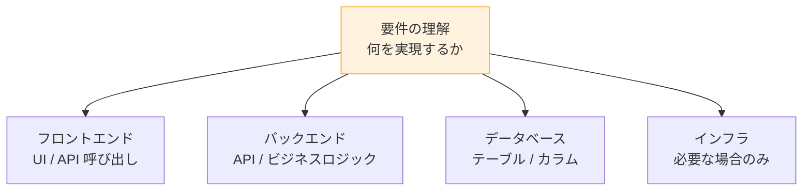
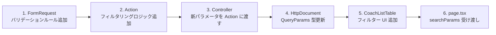
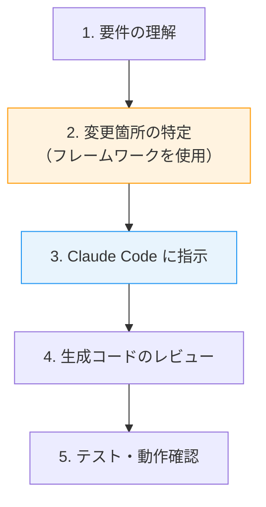

# 6-4-2 新機能追加時のコード変更箇所の特定

📝 **前提知識**: このセクションはセクション 6-4-1（リクエストフローのエンドツーエンドトレース）の内容を前提としています。

## 🎯 このセクションで学ぶこと

- 新機能の要件から **フロントエンド・バックエンド・インフラの変更箇所を体系的に洗い出す** フレームワークを理解する
- 「コーチ一覧に新しいフィルター項目を追加する」実例で、具体的な変更ファイルと変更内容を特定する
- **CLAUDE.md / AGENTS.md / .claude/rules/** を活用したコードナビゲーション手法を理解する
- **Claude Code との協働** による、変更箇所の特定から実装指示までのワークフローを理解する

セクション 6-4-1 で1つの機能をエンドツーエンドでトレースしました。このセクションでは、そのトレーシング力を「新機能追加」という実務タスクに応用します。

---

## 導入: 新機能の要件を受け取ったとき、最初にやること

「コーチ一覧画面に、コーチの稼働率でフィルタリングできる機能を追加してほしい」

この要件を受け取ったとき、コードを書き始める前にやるべきことがあります。それは **変更箇所の特定** です。フロントエンドのどのファイルを変更するか、バックエンドに新しいパラメータを追加するか、インフラの変更は必要か。これらを事前に洗い出すことで、作業の全体像を把握し、漏れのない実装が可能になります。

### 🧠 先輩エンジニアはこう考える

> 新機能の実装で最も避けたいのは「フロントエンドは作ったけど、バックエンドの API パラメータを追加し忘れた」という類のミスです。LMS は Clean Architecture で層が分かれているので、1つの機能変更が複数の層に波及します。実装に入る前に「どの層の何を変えるか」をリストアップしておけば、こうした漏れは防げます。

---

## 変更箇所の特定フレームワーク

新機能を追加するとき、以下の **4つの層** を順にチェックします。



### 各層でのチェック項目

| 層 | チェック項目 | 変更の例 |
|---|---|---|
| **フロントエンド** | UI コンポーネントの変更は必要か？ | フィルター UI の追加 |
| | API 関数の型定義（HttpDocument）を更新するか？ | QueryParams にパラメータ追加 |
| | 新しいフックが必要か？ | フィルター状態管理のフック |
| **バックエンド** | Route の追加・変更は必要か？ | 新エンドポイントの追加 |
| | FormRequest にバリデーションルールを追加するか？ | 新パラメータのバリデーション |
| | Action のビジネスロジックを変更するか？ | クエリ条件の追加 |
| | Resource のレスポンス形式を変更するか？ | 新しいフィールドの追加 |
| **データベース** | マイグレーションは必要か？ | 新カラムの追加 |
| | シーダーの更新は必要か？ | マスターデータの追加 |
| **インフラ** | 新しい AWS リソースが必要か？ | S3 バケット、SQS キュー等 |
| | 環境変数の追加が必要か？ | 外部 API キー等 |

💡 **TIP**: ほとんどの機能追加では、フロントエンドとバックエンドの変更で済みます。データベースの変更が必要になるのは新しいデータを保存する場合、インフラの変更が必要になるのは新しい AWS サービスを使う場合に限られます。

---

## 実例: コーチ一覧に「稼働率フィルター」を追加する

セクション 6-4-1 でトレースしたコーチ一覧機能に、「稼働率 80% 以上のコーチだけを表示する」フィルター機能を追加する場合を考えてみましょう。

### 変更箇所の洗い出し

フレームワークに沿って各層をチェックします。

**フロントエンド**:

| ファイル | 変更内容 |
|---|---|
| `features/v2/employee/api/fetchCoaches.ts` | HttpDocument の `QueryParams` に `min_work_rate?: number` を追加 |
| `features/v2/employee/components/CoachListTable.tsx` | フィルター UI（スライダーまたは入力欄）を追加 |
| `app/.../coaches/page.tsx` | `searchParams` から `min_work_rate` を受け取り API に渡す |

**バックエンド**:

| ファイル | 変更内容 |
|---|---|
| `Http/Requests/Employee/FetchCoachesRequest.php` | `rules()` に `'min_work_rate' => 'numeric|nullable|min:0|max:100'` を追加 |
| `UseCases/Employee/FetchCoachesAction.php` | `__invoke()` の引数に `?float $minWorkRate` を追加し、稼働率計算後にフィルタリング |
| `Http/Controllers/EmployeeController.php` | `fetchCoaches` メソッドの Action 呼び出しに `$request->min_work_rate` を追加 |

**データベース**: 変更なし（稼働率は既存データから計算される値なので、新しいカラムは不要）

**インフラ**: 変更なし

### 変更の依存関係

変更には順序があります。バックエンドの API パラメータが先にないと、フロントエンドから値を送っても受け取れません。



🔑 **バックエンドを先に、フロントエンドを後に** 実装するのが安全です。バックエンドの API が完成していれば、フロントエンドは型定義に従って確実に実装できます。

---

## CLAUDE.md / AGENTS.md によるコードナビゲーション

LMS リポジトリには、コードの構造と規約を説明するドキュメントが階層的に配置されています。新機能の実装前にこれらを参照することで、「どこに何を書くべきか」を素早く判断できます。

### ドキュメントの階層構造

```
lms/
├── CLAUDE.md              # プロジェクト全体の概要と開発ルール
├── AGENTS.md              # コーディングルールの案内
├── .claude/rules/         # 詳細な実装ルール（17+ ファイル）
│   ├── backend-overview.md
│   ├── backend-http.md
│   ├── backend-usecases.md
│   ├── backend-models.md
│   ├── frontend-overview.md
│   ├── frontend-features.md
│   └── ...
├── frontend/
│   ├── AGENTS.md          # フロントエンドのディレクトリガイド
│   └── CLAUDE.md          # フロントエンドの技術スタック・パターン
└── backend/
    ├── AGENTS.md          # バックエンドのディレクトリガイド
    └── CLAUDE.md          # バックエンドの実装パターン
```

### 各ドキュメントの使い分け

| ドキュメント | いつ使うか | わかること |
|---|---|---|
| **`CLAUDE.md`**（ルート） | プロジェクト全体を把握したいとき | 技術スタック、開発コマンド、ブランチ戦略 |
| **`AGENTS.md`**（ルート） | 実装ルールの場所を知りたいとき | バックエンド/フロントエンドの詳細ガイドへの案内 |
| **`.claude/rules/`** | 具体的な実装パターンを確認したいとき | Controller の書き方、Model の規約、feature の構成等 |
| **`frontend/AGENTS.md`** | フロントエンドのどのディレクトリを変更するか知りたいとき | ページ実装、UI コンポーネント、feature、フック等の場所 |
| **`backend/AGENTS.md`** | バックエンドのどのディレクトリを変更するか知りたいとき | HTTP 層、UseCase、Model、Service 等の場所 |

### ナビゲーションの実践例

「コーチ一覧に稼働率フィルターを追加する」場合のドキュメント参照フロー:

1. **`backend/AGENTS.md`** を開く → 「HTTP 層」のガイドを確認
2. **`.claude/rules/backend-http.md`** を開く → Controller / FormRequest の実装規約を確認
3. **`.claude/rules/backend-usecases.md`** を開く → Action の引数追加パターンを確認
4. **`frontend/AGENTS.md`** を開く → 「ドメインロジック」のガイドを確認
5. **`.claude/rules/frontend-features.md`** を開く → API 関数と HttpDocument の規約を確認

---

## Claude Code との協働ワークフロー

変更箇所を特定したら、Claude Code に実装を指示します。ここで Part 6 全体で学んだ知識が活きます。

### ワークフロー



### 具体的な指示の例

**悪い指示**（コードベースの理解がない場合）:

> コーチ一覧に稼働率フィルターを追加して

この指示だと、Claude Code はどのファイルを変更すべきか、どのパターンに従うべきかを自分で調べる必要があります。

**良い指示**（Part 6 の知識がある場合）:

> コーチ一覧に稼働率の最低値でフィルタリングする機能を追加してください。
>
> 変更箇所:
> - `FetchCoachesRequest` に `min_work_rate`（numeric, nullable, 0〜100）のバリデーションを追加
> - `FetchCoachesAction` の `__invoke()` に `?float $minWorkRate` 引数を追加し、稼働率計算後に `$coaches->filter()` でフィルタリング
> - `EmployeeController::fetchCoaches` で `$request->min_work_rate` を Action に渡す
> - `FetchCoachesHttpDocument` の `QueryParams` に `min_work_rate?: number` を追加
> - `CoachListTable` にスライダーまたは入力欄を追加し、URL の searchParams で値を管理

🔑 **コードベースの構造と命名規約を理解していれば、具体的なファイル名とパターンを含む指示が出せます。** Claude Code は CLAUDE.md や AGENTS.md を自動的に読み込むので、指示の精度と生成コードの品質が大きく向上します。

### 指示のテンプレート

新機能を Claude Code に依頼するときの汎用テンプレートです。

```
[機能の説明]

変更箇所:
- バックエンド:
  - FormRequest: [バリデーションルール]
  - Action: [ビジネスロジックの変更]
  - Controller: [Action への引数の受け渡し]
  - Resource: [レスポンスの変更（必要な場合）]
- フロントエンド:
  - HttpDocument: [型の変更]
  - Component: [UI の変更]
  - page.tsx: [データフローの変更]
- データベース: [マイグレーション（必要な場合）]

既存のパターンに従ってください。
```

「既存のパターンに従ってください」の一言で、Claude Code は `.claude/rules/` のルールと既存コードのパターンを参照して実装します。Part 6 で学んだ構造の理解が、この一言を可能にしています。

---

## 変更箇所の特定を支える3つの知識

ここまでの内容を振り返ると、変更箇所の特定に必要な知識は3つに集約されます。

| 知識 | 学んだ Chapter | 活用場面 |
|---|---|---|
| **各層の構造と役割** | 6-1（FE）、6-2（BE）、6-3（インフラ） | どの層に変更が必要かを判断する |
| **エンドツーエンドの接続** | 6-4-1 | 変更の波及範囲を見積もる |
| **ドキュメントの活用** | 6-4-2（本セクション） | 具体的な実装パターンを確認する |

この3つの知識は、コーチ一覧機能に限らず、LMS のあらゆる機能に応用できます。カリキュラム管理、テスト管理、チャット、面談予約、申請処理など、すべての機能が同じアーキテクチャパターンに従っているからです。

---

## ✨ まとめ

- 新機能追加時は **フロントエンド → バックエンド → データベース → インフラ** の4層を体系的にチェックし、変更箇所を事前に洗い出す
- 変更の実装は **バックエンド（API）を先に、フロントエンド（UI）を後に** 行うのが安全
- LMS リポジトリの **CLAUDE.md / AGENTS.md / .claude/rules/** を階層的に参照することで、各層の実装規約を素早く確認できる
- Claude Code への指示は、**具体的なファイル名・パターン名・変更内容** を含めることで精度が大幅に向上する
- 変更箇所の特定に必要な3つの知識（各層の構造、エンドツーエンドの接続、ドキュメントの活用）は、LMS のすべての機能に共通で応用できる

---

Part 6 全体を通じて、LMS のフロントエンド（Chapter 6-1）、バックエンド（Chapter 6-2）、インフラ（Chapter 6-3）のコードを個別に読み解き、最後に機能トレーシング（Chapter 6-4）でそれらを横断的に繋げました。

この教材全体（Part 1〜6）を振り返ると、Part 1 で開発環境とワークフローを整え、Part 2〜3 でフロントエンドの概念体系を構築し、Part 4 でバックエンド応用パターンを理解し、Part 5 でインフラの全体像を把握しました。そして Part 6 で、これらの知識を LMS の実コードで統合しました。

あなたは今、LMS のコードベースを「どこに何があるか」「どんなパターンで書かれているか」「どう繋がっているか」という3つの軸で理解しています。この理解を土台に、Claude Code と協働して LMS の開発を1人で進めてください。コードを読む力は、書く力の土台です。
